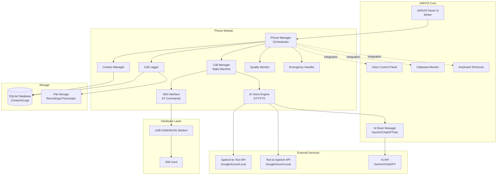

# Design Document: JARVIS Phone Call AI

## Overview

The JARVIS Phone Call AI feature integrates cellular telephony capabilities into the JARVIS AI assistant system, enabling voice-based phone communication with AI-powered conversation handling. This design addresses the integration of hardware (USB GSM/3G/4G modems with SIM cards), real-time voice processing (speech recognition and synthesis), AI conversation management, and call state orchestration within the existing JARVIS Python/tkinter architecture.

### Core Capabilities

1. **Hardware Integration**: USB modem detection, SIM card initialization, and AT command-based telephony control
2. **Call Management**: Bidirectional call handling (outgoing/incoming) with state machine-based session management
3. **AI Voice Conversations**: Real-time speech-to-text, AI response generation, and text-to-speech synthesis during active calls
4. **Manual Control**: User override capabilities with AI mode toggling, mute, hold, and manual text input
5. **Data Persistence**: Call recording, transcription, logging, and contact management with encryption
6. **System Integration**: Seamless integration with existing JARVIS modules (AI brains, voice control, clipboard monitoring, keyboard shortcuts)

### Design Goals

- **Reliability**: Graceful error handling and automatic recovery from hardware/network failures
- **Security**: End-to-end encryption for recordings, contacts, and sensitive call data
- **Performance**: Low-latency voice processing (<500ms response time) for natural conversation flow
- **Extensibility**: Modular architecture supporting multiple modem types and AI backends
- **User Experience**: Intuitive UI with real-time status updates and minimal configuration requirements

## Architecture

### System Architecture Diagram



### Call Flow Diagram

```mermaid
sequenceDiagram
    participant User
    participant UI as JARVIS UI
    participant PM as Phone Manager
    participant CM as Call Manager
    participant SI as SIM Interface
    participant AV as AI Voice Engine
    participant AI as AI Brain
    
    User->>UI: Click Call Button
    UI->>PM: initiate_call(phone_number)
    PM->>CM: create_call_session()
    CM->>SI: send_at_command("ATD<number>;")
    SI-->>CM: RING status
    CM-->>UI: Update status: "Dialing..."
    
    SI-->>CM: CONNECT status
    CM->>AV: start_voice_processing()
    CM-->>UI: Update status: "Connected"
    
    loop During Call
        AV->>AV: capture_audio()
        AV->>AV: speech_to_text()
        AV->>AI: generate_response(text)
        AI-->>AV: response_text
        AV->>AV: text_to_speech()
        AV->>SI: transmit_audio()
    end
    
    User->>UI: Click End Call
    UI->>CM: terminate_call()
    CM->>SI: send_at_command("ATH")
    CM->>AV: stop_voice_processing()
    CM-->>UI: Update status: "Disconnected"
```

### Component Interaction Patterns

1. **Event-Driven Architecture**: Hardware events (incoming calls, signal changes) trigger callbacks
2. **Producer-Consumer Pattern**: Audio streaming uses queues for buffering between capture and processing
3. **State Machine Pattern**: Call states managed through explicit state transitions with validation
4. **Observer Pattern**: UI components subscribe to call state changes for real-time updates
5. **Strategy Pattern**: Pluggable AI backends and voice engines for flexibility

## Components and Interfaces

### 1. Phone Manager (Orchestrator)

**Responsibility**: Central coordinator for all phone module operations

**Key Methods**:
```python
class PhoneManager:
    def initialize() -> bool
    def shutdown() -> None
    def get_status() -> PhoneStatus
    def handle_user_command(command: str, params: dict) -> CommandResult
    def register_event_listener(event_type: str, callback: Callable) -> None
```

**Dependencies**: CallManager, SIMInterface, ContactManager, CallLogger, QualityMonitor, EmergencyHandler

**Integration Points**:
- JARVIS UI: Receives user commands, sends status updates
- Voice Control: Processes voice commands for phone operations
- Clipboard Monitor: Detects copied phone numbers
- Keyboard Shortcuts: Handles quick dial shortcuts

### 2. SIM Interface

**Responsibility**: Hardware abstraction layer for USB modem communication

**Key Methods**:
```python
class SIMInterface:
    def detect_device() -> Optional[DeviceInfo]
    def initialize_modem(port: str, baudrate: int = 115200) -> bool
    def send_at_command(command: str, timeout: float = 5.0) -> ATResponse
    def read_sim_info() -> SIMInfo
    def unlock_sim(pin: str) -> bool
    def get_signal_strength() -> int  # 0-31 or 99 for unknown
    def get_network_info() -> NetworkInfo
    def register_unsolicited_handler(pattern: str, callback: Callable) -> None
```

**AT Commands Used**:
- `AT`: Test command
- `ATI`: Device information
- `AT+CPIN?`: Check PIN status
- `AT+CPIN=<pin>`: Enter PIN
- `AT+CSQ`: Signal quality
- `AT+COPS?`: Network operator
- `ATD<number>;`: Dial voice call
- `ATA`: Answer call
- `ATH`: Hang up call
- `AT+CLCC`: List current calls
- `AT+CMGS`: Send SMS
- `AT+CMGR`: Read SMS

**Hardware Support**:
- Primary: python-gsmmodem library for standard AT command interface
- Fallback: Direct pyserial communication for custom implementations
- Supported devices: USB GSM/3G/4G modems with standard AT command set

### 3. Call Manager

**Responsibility**: Call session lifecycle and state management

**State Machine**:
```
IDLE → DIALING → RINGING → CONNECTED → DISCONNECTED
       ↓                      ↓
     FAILED                 ON_HOLD
```

**Key Methods**:
```python
class CallManager:
    def initiate_call(phone_number: str, ai_mode: bool = True) -> CallSession
    def answer_call(call_id: str) -> bool
    def reject_call(call_id: str) -> bool
    def end_call(call_id: str) -> bool
    def hold_call(call_id: str) -> bool
    def resume_call(call_id: str) -> bool
    def toggle_mute(call_id: str) -> bool
    def get_active_calls() -> List[CallSession]
    def merge_calls(call_ids: List[str]) -> ConferenceSession
```

**Call Session Model**:
```python
@dataclass
class CallSession:
    call_id: str
    phone_number: str
    direction: CallDirection  # OUTGOING, INCOMING
    state: CallState
    ai_mode_enabled: bool
    start_time: datetime
    end_time: Optional[datetime]
    duration: timedelta
    recording_path: Optional[str]
    transcript_path: Optional[str]
    quality_metrics: QualityMetrics
```

### 4. AI Voice Engine

**Responsibility**: Real-time speech processing and AI conversation handling

**Key Methods**:
```python
class AIVoiceEngine:
    def start_processing(call_session: CallSession) -> None
    def stop_processing() -> None
    def set_ai_mode(enabled: bool) -> None
    def send_manual_message(text: str) -> None
    def get_conversation_context() -> List[ConversationTurn]
    def configure_voice_settings(settings: VoiceSettings) -> None
```

**Audio Pipeline**:
```
Modem Audio → Audio Capture → VAD → STT → AI Brain → TTS → Audio Playback → Modem Audio
              (sounddevice)   (WebRTC)  (API)  (Gemini)  (API)  (sounddevice)
```

**Speech-to-Text Integration**:
- Primary: Google Speech-to-Text API (high accuracy, cloud-based)
- Alternative: Azure Speech Services
- Offline: Vosk or Whisper (local processing for privacy)
- Library: `realtimestt` for low-latency streaming recognition

**Text-to-Speech Integration**:
- Primary: Google Text-to-Speech API
- Alternative: Azure Speech Services, ElevenLabs
- Offline: pyttsx3 (local synthesis)
- Bengali Support: Google TTS with bn-IN language code

**Voice Activity Detection (VAD)**:
- Library: `webrtcvad` for detecting speech vs silence
- Silence threshold: 1.5 seconds before triggering AI response
- Prevents interrupting user mid-sentence

**Conversation Context Management**:
```python
@dataclass
class ConversationTurn:
    timestamp: datetime
    speaker: Speaker  # USER, AI
    audio_segment: Optional[bytes]
    transcript: str
    confidence: float
```

### 5. Contact Manager

**Responsibility**: Contact storage, retrieval, and management

**Key Methods**:
```python
class ContactManager:
    def add_contact(name: str, phone_number: str, notes: str = "") -> Contact
    def update_contact(contact_id: str, **kwargs) -> bool
    def delete_contact(contact_id: str) -> bool
    def search_contacts(query: str) -> List[Contact]
    def get_contact_by_number(phone_number: str) -> Optional[Contact]
    def import_from_csv(file_path: str) -> ImportResult
    def export_to_csv(file_path: str) -> bool
    def get_favorites() -> List[Contact]
    def set_favorite(contact_id: str, is_favorite: bool) -> bool
```

**Data Model**:
```python
@dataclass
class Contact:
    contact_id: str
    name: str
    phone_number: str
    normalized_number: str  # E.164 format
    notes: str
    is_favorite: bool
    created_at: datetime
    updated_at: datetime
    call_count: int
    last_call_date: Optional[datetime]
```

**Database Schema**:
```sql
CREATE TABLE contacts (
    contact_id TEXT PRIMARY KEY,
    name TEXT NOT NULL,
    phone_number TEXT NOT NULL,
    normalized_number TEXT NOT NULL,
    notes TEXT,
    is_favorite INTEGER DEFAULT 0,
    created_at TIMESTAMP DEFAULT CURRENT_TIMESTAMP,
    updated_at TIMESTAMP DEFAULT CURRENT_TIMESTAMP,
    call_count INTEGER DEFAULT 0,
    last_call_date TIMESTAMP
);

CREATE INDEX idx_contacts_name ON contacts(name);
CREATE INDEX idx_contacts_number ON contacts(normalized_number);
CREATE INDEX idx_contacts_favorite ON contacts(is_favorite);
```

### 6. Call Logger

**Responsibility**: Call recording, transcription, and historical data management

**Key Methods**:
```python
class CallLogger:
    def start_recording(call_session: CallSession) -> str  # Returns recording_path
    def stop_recording(call_session: CallSession) -> None
    def save_transcript(call_session: CallSession, transcript: List[ConversationTurn]) -> str
    def log_call_metadata(call_session: CallSession) -> None
    def get_call_history(filters: CallHistoryFilters) -> List[CallLogEntry]
    def get_call_statistics(period: TimePeriod) -> CallStatistics
    def compress_old_recordings(days_threshold: int = 30) -> int
    def delete_old_recordings(days_threshold: int) -> int
```

**Recording Format**:
- Audio: WAV format, 16-bit PCM, 16kHz sample rate, mono
- Filename: `call_{call_id}_{timestamp}_{phone_number}.wav`
- Encryption: AES-256-GCM with user-specific key
- Storage: Organized by year/month directories

**Database Schema**:
```sql
CREATE TABLE call_logs (
    call_id TEXT PRIMARY KEY,
    phone_number TEXT NOT NULL,
    contact_id TEXT,
    direction TEXT NOT NULL,  -- 'OUTGOING' or 'INCOMING'
    start_time TIMESTAMP NOT NULL,
    end_time TIMESTAMP,
    duration INTEGER,  -- seconds
    ai_mode_enabled INTEGER DEFAULT 1,
    recording_path TEXT,
    transcript_path TEXT,
    call_quality TEXT,  -- 'EXCELLENT', 'GOOD', 'FAIR', 'POOR'
    failure_reason TEXT,
    created_at TIMESTAMP DEFAULT CURRENT_TIMESTAMP,
    FOREIGN KEY (contact_id) REFERENCES contacts(contact_id)
);

CREATE INDEX idx_call_logs_time ON call_logs(start_time DESC);
CREATE INDEX idx_call_logs_number ON call_logs(phone_number);
CREATE INDEX idx_call_logs_contact ON call_logs(contact_id);
```

### 7. Quality Monitor

**Responsibility**: Real-time call quality assessment and diagnostics

**Key Methods**:
```python
class QualityMonitor:
    def start_monitoring(call_session: CallSession) -> None
    def stop_monitoring() -> QualityMetrics
    def get_current_quality() -> QualityLevel
    def get_quality_metrics() -> QualityMetrics
    def detect_audio_issues() -> List[AudioIssue]
```

**Quality Metrics**:
```python
@dataclass
class QualityMetrics:
    average_volume: float  # dB
    peak_volume: float
    noise_level: float
    signal_to_noise_ratio: float
    clarity_score: float  # 0.0-1.0
    echo_detected: bool
    distortion_detected: bool
    packet_loss_rate: float
    jitter: float  # ms
    latency: float  # ms
```

**Quality Levels**:
- EXCELLENT: SNR > 30dB, no issues detected
- GOOD: SNR 20-30dB, minor issues
- FAIR: SNR 10-20dB, noticeable issues
- POOR: SNR < 10dB, severe issues

### 8. Emergency Handler

**Responsibility**: Priority handling for emergency calls

**Key Methods**:
```python
class EmergencyHandler:
    def is_emergency_number(phone_number: str) -> bool
    def initiate_emergency_call(phone_number: str) -> CallSession
    def get_emergency_numbers(country_code: str) -> List[str]
    def set_emergency_location(location: Location) -> None
```

**Emergency Numbers by Country**:
- US/Canada: 911
- UK/EU: 112, 999
- India: 112
- Australia: 000
- Universal: 112 (GSM standard)

**Special Handling**:
- Bypass all confirmation dialogs
- Disable AI mode automatically
- Never auto-delete recordings
- Attempt call even with low/no signal
- Display location information if available

## Data Models

### Configuration Model

```python
@dataclass
class PhoneConfiguration:
    # Hardware
    modem_port: Optional[str]
    modem_baudrate: int = 115200
    auto_detect_modem: bool = True
    
    # SIM Card
    sim_pin: Optional[str]
    auto_unlock: bool = False
    
    # Call Settings
    default_ai_mode: bool = True
    auto_answer_enabled: bool = False
    auto_answer_delay: int = 3  # seconds
    call_recording_enabled: bool = True
    
    # AI Settings
    ai_personality: str = "professional"
    ai_greeting_message: str = "Hello, this is JARVIS assistant."
    ai_response_style: str = "conversational"
    ai_brain_preference: str = "gemini"
    
    # Voice Settings
    stt_provider: str = "google"
    tts_provider: str = "google"
    voice_language: str = "en-US"
    voice_gender: str = "neutral"
    speech_rate: float = 1.0
    
    # Quality Settings
    vad_aggressiveness: int = 2  # 0-3
    silence_threshold: float = 1.5  # seconds
    audio_sample_rate: int = 16000
    
    # Privacy Settings
    encryption_enabled: bool = True
    recording_retention_days: int = 90
    auto_compress_days: int = 30
    
    # Integration
    clipboard_monitoring: bool = True
    voice_commands_enabled: bool = True
```

### SMS Model

```python
@dataclass
class SMSMessage:
    message_id: str
    phone_number: str
    contact_id: Optional[str]
    direction: MessageDirection  # SENT, RECEIVED
    content: str
    timestamp: datetime
    delivery_status: DeliveryStatus  # PENDING, SENT, DELIVERED, FAILED
    ai_generated: bool = False
```

**Database Schema**:
```sql
CREATE TABLE sms_messages (
    message_id TEXT PRIMARY KEY,
    phone_number TEXT NOT NULL,
    contact_id TEXT,
    direction TEXT NOT NULL,
    content TEXT NOT NULL,
    timestamp TIMESTAMP NOT NULL,
    delivery_status TEXT DEFAULT 'PENDING',
    ai_generated INTEGER DEFAULT 0,
    FOREIGN KEY (contact_id) REFERENCES contacts(contact_id)
);

CREATE INDEX idx_sms_timestamp ON sms_messages(timestamp DESC);
CREATE INDEX idx_sms_number ON sms_messages(phone_number);
```

### Scheduled Call Model

```python
@dataclass
class ScheduledCall:
    schedule_id: str
    phone_number: str
    contact_id: Optional[str]
    scheduled_time: datetime
    recurrence: Optional[RecurrencePattern]
    ai_mode_enabled: bool
    custom_greeting: Optional[str]
    status: ScheduleStatus  # PENDING, COMPLETED, FAILED, CANCELLED
    created_at: datetime
```

## Error Handling

### Error Categories

1. **Hardware Errors**
   - Modem not detected
   - SIM card not inserted
   - SIM card locked (PIN required)
   - Device disconnected during operation

2. **Network Errors**
   - No signal
   - Network registration failed
   - Call connection timeout
   - Call dropped (signal loss)

3. **API Errors**
   - STT service unavailable
   - TTS service unavailable
   - AI service timeout
   - Rate limit exceeded

4. **Application Errors**
   - Invalid phone number format
   - Contact not found
   - Recording storage full
   - Database corruption

### Error Handling Strategy

```python
class PhoneError(Exception):
    """Base exception for phone module"""
    def __init__(self, message: str, error_code: str, recoverable: bool = True):
        self.message = message
        self.error_code = error_code
        self.recoverable = recoverable
        super().__init__(message)

class HardwareError(PhoneError):
    """Hardware-related errors"""
    pass

class NetworkError(PhoneError):
    """Network-related errors"""
    pass

class APIError(PhoneError):
    """External API errors"""
    pass
```

### Recovery Mechanisms

1. **Automatic Reconnection**
   - Retry modem connection every 10 seconds
   - Maximum 6 attempts (1 minute total)
   - Exponential backoff for API retries

2. **Graceful Degradation**
   - If STT fails: Switch to manual mode, notify user
   - If TTS fails: Display text response only
   - If AI fails: Use fallback responses or manual mode

3. **State Preservation**
   - Save call state before critical operations
   - Checkpoint conversation context every 30 seconds
   - Enable recovery after application restart

4. **User Notification**
   - Display error messages with specific reasons
   - Suggest corrective actions
   - Provide troubleshooting wizard for common issues

### Logging Strategy

```python
# Log levels and usage
logging.DEBUG: Detailed AT commands, audio buffer states
logging.INFO: Call state transitions, user actions
logging.WARNING: Recoverable errors, quality degradation
logging.ERROR: Failed operations, API errors
logging.CRITICAL: Hardware failures, data corruption

# Log format
[timestamp] [level] [component] [call_id] message
```

## Testing Strategy

### Testing Approach

This feature involves extensive hardware integration, real-time audio processing, and external service dependencies. The testing strategy focuses on:

1. **Unit Tests**: Pure logic components (phone number validation, state transitions, data models)
2. **Integration Tests**: Component interactions with mocked hardware/services
3. **System Tests**: End-to-end workflows with real hardware (manual testing)
4. **Mock-Based Tests**: External API interactions (STT, TTS, AI services)

**Property-Based Testing is NOT applicable** for this feature because:
- Core functionality involves hardware I/O and real-time audio streaming
- Most operations are side-effect heavy (making calls, recording audio)
- External service dependencies make behavior non-deterministic
- UI rendering and state management don't benefit from PBT

### Unit Testing

**Test Coverage Areas**:

1. **Phone Number Validation**
   - Valid formats: domestic, international, with/without country codes
   - Invalid formats: too short, too long, invalid characters
   - Edge cases: emergency numbers, special service numbers

2. **Call State Machine**
   - Valid state transitions
   - Invalid state transitions (should raise errors)
   - State persistence and recovery

3. **Contact Management**
   - CRUD operations
   - Search functionality with partial matching
   - Duplicate detection
   - CSV import/export

4. **Data Models**
   - Serialization/deserialization
   - Validation rules
   - Default values

**Example Unit Tests**:
```python
def test_phone_number_validation():
    assert validate_phone_number("+1234567890") == True
    assert validate_phone_number("123") == False
    assert validate_phone_number("abc") == False

def test_call_state_transitions():
    session = CallSession(state=CallState.IDLE)
    session.transition_to(CallState.DIALING)  # Valid
    assert session.state == CallState.DIALING
    
    with pytest.raises(InvalidStateTransition):
        session.transition_to(CallState.ON_HOLD)  # Invalid from DIALING

def test_contact_search():
    contacts = [
        Contact(name="John Doe", phone_number="1234567890"),
        Contact(name="Jane Smith", phone_number="0987654321")
    ]
    results = search_contacts(contacts, "john")
    assert len(results) == 1
    assert results[0].name == "John Doe"
```

### Integration Testing

**Test Coverage Areas**:

1. **SIM Interface with Mock Modem**
   - AT command sending/receiving
   - Unsolicited response handling
   - Error recovery

2. **Call Manager with Mock SIM Interface**
   - Call initiation flow
   - Incoming call handling
   - Multi-call management

3. **AI Voice Engine with Mock APIs**
   - Audio pipeline flow
   - STT/TTS integration
   - AI response generation
   - Conversation context management

4. **Database Operations**
   - Call logging
   - Contact management
   - Query performance

**Example Integration Tests**:
```python
@pytest.fixture
def mock_sim_interface():
    interface = Mock(spec=SIMInterface)
    interface.send_at_command.return_value = ATResponse(success=True, data="OK")
    return interface

def test_call_initiation_flow(mock_sim_interface):
    call_manager = CallManager(sim_interface=mock_sim_interface)
    session = call_manager.initiate_call("+1234567890")
    
    assert session.state == CallState.DIALING
    mock_sim_interface.send_at_command.assert_called_with("ATD+1234567890;")
    
def test_ai_voice_pipeline_with_mocks():
    mock_stt = Mock(return_value="Hello, how are you?")
    mock_ai = Mock(return_value="I'm doing well, thank you!")
    mock_tts = Mock(return_value=b"audio_data")
    
    engine = AIVoiceEngine(stt=mock_stt, ai=mock_ai, tts=mock_tts)
    engine.process_audio_chunk(b"audio_input")
    
    mock_stt.assert_called_once()
    mock_ai.assert_called_once_with("Hello, how are you?")
    mock_tts.assert_called_once_with("I'm doing well, thank you!")
```

### System Testing (Manual)

**Test Scenarios**:

1. **Hardware Setup**
   - Connect USB modem
   - Insert SIM card
   - Verify detection and initialization
   - Test PIN unlock

2. **Outgoing Call Flow**
   - Dial a number
   - Verify call connection
   - Test AI conversation
   - Toggle AI mode during call
   - End call
   - Verify recording saved

3. **Incoming Call Flow**
   - Receive a call
   - Accept call
   - Test AI greeting
   - Verify conversation handling
   - End call

4. **Multi-Call Scenario**
   - Active call + incoming call
   - Hold/resume functionality
   - Conference call merging

5. **Error Scenarios**
   - Disconnect modem during call
   - Lose network signal
   - API service unavailable
   - Verify graceful degradation

6. **SMS Testing**
   - Send SMS
   - Receive SMS
   - AI auto-response

7. **Emergency Call**
   - Dial emergency number
   - Verify priority handling
   - Verify AI mode disabled

### Performance Testing

**Metrics to Measure**:

1. **Latency**
   - STT processing time: < 300ms
   - AI response generation: < 2s
   - TTS synthesis: < 500ms
   - Total response time: < 3s

2. **Audio Quality**
   - Sample rate: 16kHz
   - Bit depth: 16-bit
   - Buffer size: 1024 samples
   - Latency: < 100ms

3. **Resource Usage**
   - CPU usage during call: < 30%
   - Memory usage: < 500MB
   - Disk I/O for recording: < 10MB/min

4. **Database Performance**
   - Contact search: < 100ms for 10,000 contacts
   - Call history query: < 200ms for 100,000 records

### Security Testing

**Test Areas**:

1. **Encryption**
   - Verify recordings encrypted at rest
   - Verify contact database encrypted
   - Test key management

2. **Authentication**
   - Verify PIN protection for sensitive operations
   - Test session timeout

3. **Data Privacy**
   - Verify no data leakage to logs
   - Test data anonymization for cloud services
   - Verify secure deletion

### Test Automation

**Tools and Frameworks**:
- pytest: Unit and integration testing
- pytest-mock: Mocking framework
- pytest-asyncio: Async test support
- coverage.py: Code coverage measurement
- tox: Multi-environment testing

**CI/CD Integration**:
- Run unit tests on every commit
- Run integration tests on pull requests
- Generate coverage reports
- Fail build if coverage < 80%

**Test Organization**:
```
tests/
├── unit/
│   ├── test_phone_validation.py
│   ├── test_call_state_machine.py
│   ├── test_contact_manager.py
│   └── test_data_models.py
├── integration/
│   ├── test_sim_interface.py
│   ├── test_call_manager.py
│   ├── test_ai_voice_engine.py
│   └── test_database.py
├── fixtures/
│   ├── mock_modem.py
│   ├── mock_apis.py
│   └── test_data.py
└── conftest.py
```

### Test Data Management

**Mock Data**:
- Sample contacts (100 entries)
- Sample call logs (1000 entries)
- Sample audio files (various formats)
- Sample AT command responses

**Test Databases**:
- In-memory SQLite for unit tests
- Temporary file-based SQLite for integration tests
- Cleanup after each test

## Implementation Notes

### Technology Stack

**Core Libraries**:
- `python-gsmmodem`: GSM modem control and AT commands
- `pyserial`: Serial port communication
- `sounddevice`: Audio capture and playback
- `numpy`: Audio data processing
- `realtimestt`: Real-time speech-to-text
- `pyttsx3` or `gTTS`: Text-to-speech
- `webrtcvad`: Voice activity detection
- `cryptography`: AES encryption for recordings
- `sqlite3`: Database management
- `tkinter`: UI integration

**External APIs**:
- Google Speech-to-Text API
- Google Text-to-Speech API
- Gemini/ChatGPT API (via existing JARVIS integration)

### Development Phases

**Phase 1: Hardware Integration (Week 1-2)**
- SIM interface implementation
- AT command library
- Device detection and initialization
- Basic call initiation/termination

**Phase 2: Audio Pipeline (Week 3-4)**
- Audio capture/playback
- STT/TTS integration
- Voice activity detection
- Audio recording

**Phase 3: AI Integration (Week 5-6)**
- AI voice engine
- Conversation context management
- AI mode toggling
- Manual control

**Phase 4: Data Management (Week 7-8)**
- Contact manager
- Call logger
- Database schema
- Encryption

**Phase 5: UI Integration (Week 9-10)**
- JARVIS panel integration
- Real-time status updates
- Call history UI
- Settings panel

**Phase 6: Advanced Features (Week 11-12)**
- Multi-call management
- SMS integration
- Quality monitoring
- Emergency handling
- Call scheduling

**Phase 7: Testing & Polish (Week 13-14)**
- Comprehensive testing
- Bug fixes
- Performance optimization
- Documentation

### Security Considerations

1. **Data Encryption**
   - Use AES-256-GCM for recordings
   - Derive encryption key from user password using PBKDF2
   - Store encrypted key in secure keyring

2. **Secure Communication**
   - Use HTTPS for all API calls
   - Validate SSL certificates
   - Implement request signing for sensitive operations

3. **Access Control**
   - Require authentication for accessing recordings
   - Implement role-based permissions
   - Log all access attempts

4. **Data Retention**
   - Implement configurable retention policies
   - Secure deletion (overwrite before delete)
   - Audit trail for deletions

5. **Privacy Protection**
   - Anonymize data before sending to cloud services
   - Provide opt-out for cloud processing
   - Clear privacy policy and consent

### Performance Optimization

1. **Audio Processing**
   - Use circular buffers for audio streaming
   - Implement adaptive buffer sizing
   - Optimize VAD parameters for latency

2. **Database**
   - Index frequently queried columns
   - Use prepared statements
   - Implement connection pooling
   - Periodic VACUUM for SQLite

3. **API Calls**
   - Implement request batching where possible
   - Use connection keep-alive
   - Cache TTS results for common phrases
   - Implement retry with exponential backoff

4. **Memory Management**
   - Stream large audio files instead of loading entirely
   - Implement LRU cache for contacts
   - Periodic garbage collection for long-running calls

### Extensibility Points

1. **Pluggable AI Backends**
   - Abstract AI interface
   - Support multiple AI providers
   - Runtime switching

2. **Custom Voice Engines**
   - Abstract STT/TTS interfaces
   - Support local and cloud providers
   - Language-specific optimizations

3. **Modem Drivers**
   - Abstract modem interface
   - Support vendor-specific commands
   - Automatic driver selection

4. **UI Themes**
   - Customizable UI components
   - Theme support
   - Accessibility features

### Deployment Considerations

1. **Dependencies**
   - Provide requirements.txt
   - Document system dependencies (PortAudio, etc.)
   - Create installation script

2. **Configuration**
   - Default configuration file
   - Environment variable support
   - Configuration validation

3. **Documentation**
   - User guide
   - API documentation
   - Troubleshooting guide
   - Hardware compatibility list

4. **Updates**
   - Version checking
   - Automatic updates for non-breaking changes
   - Migration scripts for database schema changes

---

**Design Document Version**: 1.0  
**Last Updated**: 2025  
**Status**: Ready for Implementation
