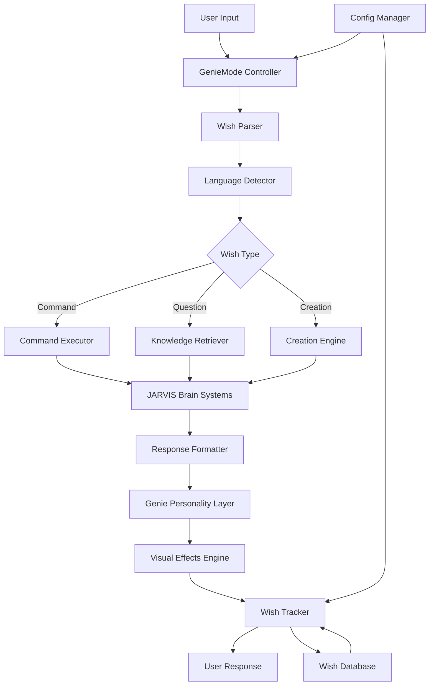
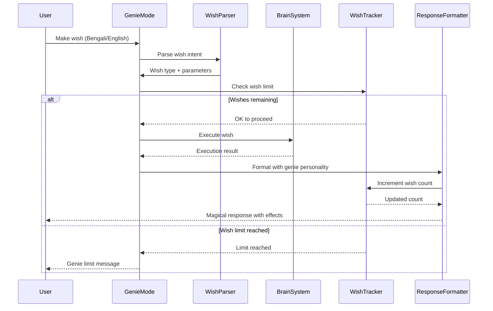

# Design Document: Aladdin's Genie Mode (আলাদিনের জিনের মোড)

## Overview

The Aladdin's Genie Mode transforms JARVIS into a magical genie that grants user wishes with personality, visual effects, and natural language understanding in both Bengali and English. This feature integrates seamlessly with JARVIS's existing brain systems (SuperBrain, OfflineBrain, AutonomousSystem) to provide a delightful, magical user experience where users can make wishes and JARVIS responds like the genie from Aladdin's lamp - complete with emojis, special formatting, wish tracking, and configurable wish limits.

## Architecture



## Main Algorithm/Workflow



## Components and Interfaces

### Component 1: GenieMode Controller

**Purpose**: Main orchestrator for genie mode functionality, manages wish lifecycle and coordinates between all subsystems.

**Interface**:
```python
class GenieMode:
    """Main controller for Aladdin's Genie Mode"""
    
    def __init__(self, brain_system, config: GenieConfig):
        """Initialize genie mode with brain system and configuration"""
        pass
    
    def activate_genie_mode(self) -> dict:
        """Activate genie mode and return welcome message"""
        pass
    
    def deactivate_genie_mode(self) -> dict:
        """Deactivate genie mode and return farewell message"""
        pass
    
    def process_wish(self, user_input: str) -> dict:
        """Process user wish and return magical response"""
        pass
    
    def get_genie_status(self) -> dict:
        """Get current genie mode status and wish count"""
        pass
    
    def reset_wishes(self) -> dict:
        """Reset wish counter (admin function)"""
        pass
```

**Responsibilities**:
- Coordinate wish processing pipeline
- Manage genie mode activation/deactivation
- Interface with JARVIS brain systems
- Enforce wish limits and rules
- Coordinate response formatting

### Component 2: Wish Parser

**Purpose**: Parse and understand user wishes in natural language (Bengali/English), extract intent and parameters.

**Interface**:
```python
class WishParser:
    """Parse user wishes and extract intent"""
    
    def parse_wish(self, user_input: str) -> WishIntent:
        """Parse user input and return wish intent"""
        pass
    
    def detect_language(self, text: str) -> str:
        """Detect if text is Bengali, English, or mixed"""
        pass
    
    def extract_wish_type(self, text: str) -> str:
        """Extract wish type (command, question, creation, etc.)"""
        pass
    
    def extract_parameters(self, text: str, wish_type: str) -> dict:
        """Extract parameters based on wish type"""
        pass
```

**Responsibilities**:
- Natural language understanding
- Language detection (Bengali/English/Mixed)
- Intent classification
- Parameter extraction
- Handle wish keywords and phrases

### Component 3: Wish Tracker

**Purpose**: Track wishes granted, enforce limits, maintain wish history and statistics.

**Interface**:
```python
class WishTracker:
    """Track wishes and enforce limits"""
    
    def __init__(self, db_path: str, config: GenieConfig):
        """Initialize wish tracker with database and config"""
        pass
    
    def can_grant_wish(self) -> tuple[bool, str]:
        """Check if wish can be granted, return (allowed, message)"""
        pass
    
    def record_wish(self, wish: WishRecord) -> None:
        """Record a granted wish"""
        pass
    
    def get_wish_count(self) -> int:
        """Get current wish count"""
        pass
    
    def get_remaining_wishes(self) -> int:
        """Get remaining wishes (returns -1 for unlimited)"""
        pass
    
    def reset_wish_count(self) -> None:
        """Reset wish counter"""
        pass
    
    def get_wish_history(self, limit: int = 10) -> list[WishRecord]:
        """Get recent wish history"""
        pass
    
    def get_statistics(self) -> dict:
        """Get wish statistics"""
        pass
```

**Responsibilities**:
- Wish counting and limit enforcement
- Wish history persistence
- Statistics generation
- Database management
- Configurable limits (3 wishes, unlimited, custom)

### Component 4: Genie Personality Layer

**Purpose**: Add magical genie personality to responses with emojis, special formatting, and character.

**Interface**:
```python
class GeniePersonality:
    """Add genie personality to responses"""
    
    def format_greeting(self, language: str) -> str:
        """Format genie greeting message"""
        pass
    
    def format_wish_granted(self, response: str, language: str) -> str:
        """Format wish granted response with genie flair"""
        pass
    
    def format_wish_denied(self, reason: str, language: str) -> str:
        """Format wish denied message"""
        pass
    
    def format_farewell(self, language: str) -> str:
        """Format genie farewell message"""
        pass
    
    def add_magical_effects(self, text: str) -> str:
        """Add visual effects (emojis, sparkles, etc.)"""
        pass
    
    def get_random_genie_phrase(self, context: str, language: str) -> str:
        """Get random genie phrase for context"""
        pass
```

**Responsibilities**:
- Personality injection
- Bilingual responses (Bengali/English)
- Emoji and visual effects
- Genie-themed phrases
- Response beautification

### Component 5: Visual Effects Engine

**Purpose**: Generate visual effects for magical responses (ASCII art, animations, special formatting).

**Interface**:
```python
class VisualEffects:
    """Generate visual effects for genie responses"""
    
    def create_lamp_animation(self) -> str:
        """Create ASCII art of Aladdin's lamp"""
        pass
    
    def create_sparkle_effect(self, text: str) -> str:
        """Add sparkle effects around text"""
        pass
    
    def create_wish_banner(self, wish_number: int, total: int) -> str:
        """Create banner showing wish count"""
        pass
    
    def create_magic_border(self, text: str) -> str:
        """Create decorative border around text"""
        pass
    
    def animate_wish_granting(self) -> str:
        """Create wish granting animation"""
        pass
```

**Responsibilities**:
- ASCII art generation
- Text decoration
- Animation sequences
- Visual feedback
- Themed graphics

### Component 6: Config Manager

**Purpose**: Manage genie mode configuration (wish limits, personality settings, language preferences).

**Interface**:
```python
class GenieConfig:
    """Configuration for genie mode"""
    
    wish_limit: int  # -1 for unlimited, 3 for classic, or custom number
    unlimited_mode: bool
    default_language: str  # 'en', 'bn', or 'auto'
    personality_level: str  # 'minimal', 'moderate', 'maximum'
    visual_effects: bool
    save_history: bool
    
    def load_config(self, config_path: str) -> None:
        """Load configuration from file"""
        pass
    
    def save_config(self, config_path: str) -> None:
        """Save configuration to file"""
        pass
    
    def update_setting(self, key: str, value: any) -> None:
        """Update a configuration setting"""
        pass
    
    def reset_to_defaults(self) -> None:
        """Reset configuration to defaults"""
        pass
