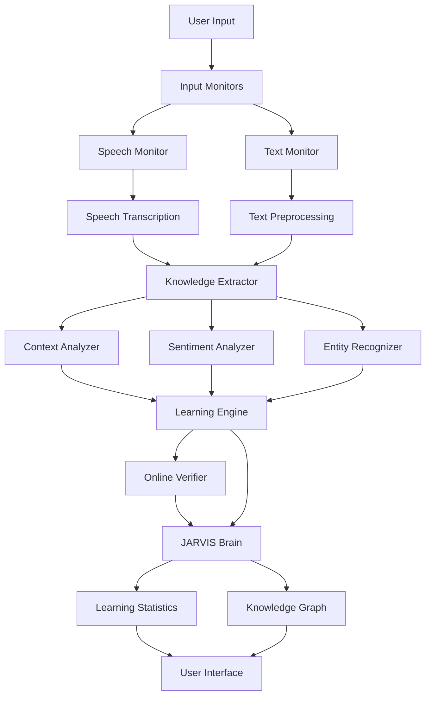
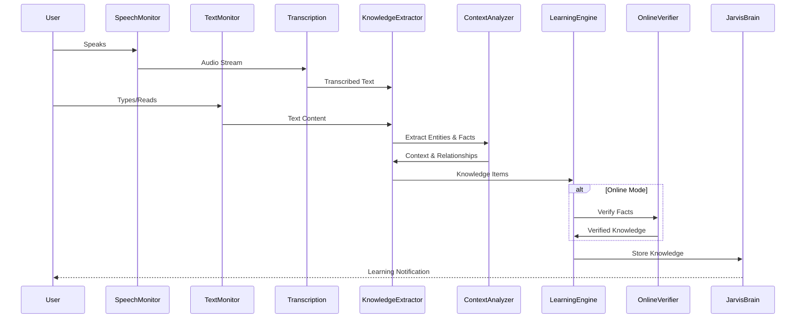

# Design Document: Auto-Learning from Speech and Text

## Overview

This document describes the technical design for JARVIS Auto-Learning System that automatically learns from spoken conversations and written text while online. The system continuously monitors speech and text, extracts knowledge, understands context, and stores learned information in the JARVIS brain. This creates a self-improving AI that becomes smarter with every interaction, learning vocabulary, facts, concepts, patterns, and social context automatically.

## Architecture



## Main Algorithm/Workflow



## Components and Interfaces

### Component 1: Speech Monitor

**Purpose**: Continuously monitors and captures speech input

**Interface**:
```python
class SpeechMonitor:
    def start_monitoring(self) -> bool
    def stop_monitoring(self) -> bool
    def on_speech_detected(self, callback: Callable) -> None
    def get_audio_stream(self) -> AudioStream
    def set_noise_threshold(self, threshold: float) -> None
```

**Responsibilities**:
- Detect speech in real-time
- Capture audio from microphone or system
- Filter background noise
- Trigger transcription when speech detected

### Component 2: Auto Transcription

**Purpose**: Converts speech to text automatically

**Interface**:
```python
class AutoTranscription:
    def transcribe_realtime(self, audio: AudioStream) -> str
    def transcribe_offline(self, audio: AudioStream) -> str
    def transcribe_online(self, audio: AudioStream) -> str
    def set_language(self, language: str) -> None
    def get_confidence(self) -> float
```

**Responsibilities**:
- Convert speech to text in real-time
- Support English and Bengali
- Use offline and online engines
- Identify speakers

### Component 3: Text Monitor

**Purpose**: Monitors text from various sources

**Interface**:
```python
class TextMonitor:
    def monitor_chat(self) -> None
    def monitor_applications(self, app_list: List[str]) -> None
    def monitor_web_pages(self) -> None
    def monitor_documents(self) -> None
    def on_text_detected(self, callback: Callable) -> None
    def exclude_sensitive_content(self, patterns: List[str]) -> None
```

**Responsibilities**:
- Monitor chat messages
- Monitor application text
- Monitor web content
- Exclude sensitive data

### Component 4: Knowledge Extractor

**Purpose**: Extracts meaningful knowledge from text

**Interface**:
```python
class KnowledgeExtractor:
    def extract_from_text(self, text: str) -> List[KnowledgeItem]
    def extract_entities(self, text: str) -> List[Entity]
    def extract_facts(self, text: str) -> List[Fact]
    def extract_relationships(self, text: str) -> List[Relationship]
    def extract_code(self, text: str) -> List[CodeSnippet]
    def calculate_confidence(self, item: KnowledgeItem) -> float
```

**Responsibilities**:
- Extract facts and concepts
- Identify entities and relationships
- Extract code and technical content
- Assign confidence scores

### Component 5: Context Analyzer

**Purpose**: Understands conversation context

**Interface**:
```python
class ContextAnalyzer:
    def analyze_context(self, text: str, history: List[str]) -> Context
    def resolve_pronouns(self, text: str, context: Context) -> str
    def detect_topic_change(self, current: str, previous: str) -> bool
    def link_qa_pairs(self, question: str, answer: str) -> QAPair
    def maintain_session_context(self) -> Context
```

**Responsibilities**:
- Maintain conversation history
- Resolve pronouns and references
- Detect topic changes
- Link questions and answers

### Component 6: Learning Engine

**Purpose**: Processes and stores learned knowledge

**Interface**:
```python
class LearningEngine:
    def learn(self, knowledge: KnowledgeItem) -> bool
    def verify_knowledge(self, knowledge: KnowledgeItem) -> bool
    def merge_duplicate(self, k1: KnowledgeItem, k2: KnowledgeItem) -> KnowledgeItem
    def update_confidence(self, knowledge_id: str, score: float) -> None
    def build_knowledge_graph(self) -> KnowledgeGraph
    def get_learning_stats(self) -> LearningStats
```

**Responsibilities**:
- Store knowledge in JARVIS brain
- Verify and merge duplicates
- Build knowledge graph
- Track learning statistics

## Data Models

### Model 1: KnowledgeItem

```python
class KnowledgeItem:
    id: str
    content: str
    type: KnowledgeType  # FACT, CONCEPT, RELATIONSHIP, PATTERN, CODE
    source: str  # SPEECH, TEXT, WEB
    language: str  # en, bn
    confidence: float  # 0.0 to 1.0
    context: Context
    entities: List[Entity]
    timestamp: datetime
    verified: bool
    usage_count: int
```

**Validation Rules**:
- confidence must be between 0.0 and 1.0
- content must be non-empty
- type must be valid enum value

### Model 2: Context

```python
class Context:
    session_id: str
    topic: str
    participants: List[str]
    history: List[str]
    entities: Dict[str, Entity]
    sentiment: Sentiment
    timestamp: datetime
```

**Validation Rules**:
- session_id must be unique
- history must be ordered by timestamp

### Model 3: Entity

```python
class Entity:
    name: str
    type: EntityType  # PERSON, PLACE, DATE, CONCEPT, CODE
    value: str
    confidence: float
    mentions: List[Mention]
```

**Validation Rules**:
- name must be non-empty
- type must be valid enum

## Algorithmic Pseudocode

### Main Learning Algorithm

```pascal
ALGORITHM autoLearnFromInput(input)
INPUT: input of type UserInput (speech or text)
OUTPUT: learned of type List[KnowledgeItem]

BEGIN
  learned ← []
  
  // Step 1: Get text from input
  IF input.type = SPEECH THEN
    text ← autoTranscription.transcribe_realtime(input.audio)
  ELSE
    text ← input.text
  END IF
  
  ASSERT text IS NOT NULL AND length(text) > 0
  
  // Step 2: Extract knowledge
  knowledgeItems ← knowledgeExtractor.extract_from_text(text)
  context ← contextAnalyzer.analyze_context(text, sessionHistory)
  
  // Step 3: Process each knowledge item
  FOR each item IN knowledgeItems DO
    // Add context
    item.context ← context
    
    // Verify if online
    IF isOnline() THEN
      verified ← onlineVerifier.verify(item)
      item.verified ← verified
      IF verified THEN
        item.confidence ← item.confidence * 1.2  // Boost confidence
      END IF
    END IF
    
    // Store in brain
    success ← learningEngine.learn(item)
    
    IF success THEN
      learned.append(item)
      notifyUser(item)
    END IF
  END FOR
  
  ASSERT learned.size() >= 0
  
  RETURN learned
END
```

**Preconditions:**
- input is valid (speech or text)
- System is initialized

**Postconditions:**
- All valid knowledge is stored
- User is notified of learning

### Knowledge Extraction Algorithm

```pascal
ALGORITHM extractKnowledge(text, context)
INPUT: text of type string, context of type Context
OUTPUT: items of type List[KnowledgeItem]

BEGIN
  items ← []
  
  // Extract entities
  entities ← entityRecognizer.extract(text)
  
  // Extract facts
  sentences ← splitIntoSentences(text)
  
  FOR each sentence IN sentences DO
    // Check if it's a fact
    IF isFact(sentence) THEN
      fact ← createKnowledgeItem(
        content=sentence,
        type=FACT,
        entities=extractEntitiesFromSentence(sentence, entities)
      )
      fact.confidence ← calculateConfidence(fact, context)
      items.append(fact)
    END IF
    
    // Check if it's a definition
    IF isDefinition(sentence) THEN
      concept ← extractConcept(sentence)
      definition ← extractDefinition(sentence)
      item ← createKnowledgeItem(
        content=definition,
        type=CONCEPT,
        entities=[concept]
      )
      items.append(item)
    END IF
  END FOR
  
  // Extract code if present
  codeBlocks ← extractCodeBlocks(text)
  FOR each code IN codeBlocks DO
    item ← createKnowledgeItem(
      content=code,
      type=CODE,
      entities=extractCodeEntities(code)
    )
    items.append(item)
  END FOR
  
  RETURN items
END
```

## Key Functions with Formal Specifications

### Function 1: transcribe_realtime()

**Preconditions:**
- Audio stream is valid and active
- Speech recognition engine is initialized

**Postconditions:**
- Returns transcribed text
- Confidence score is calculated
- No audio data is lost

### Function 2: extract_from_text()

**Preconditions:**
- Text is non-empty
- Language is supported

**Postconditions:**
- Returns list of knowledge items
- Each item has confidence score
- All entities are identified

### Function 3: learn()

**Preconditions:**
- Knowledge item is valid
- JARVIS brain is accessible

**Postconditions:**
- Knowledge is stored in database
- Knowledge graph is updated
- Statistics are incremented

## Correctness Properties

### Property 1: No Knowledge Loss
**Statement**: ∀ valid knowledge k extracted, ∃ stored knowledge s in JARVIS_Brain where s.content = k.content

**Meaning**: All valid extracted knowledge is stored in the brain.

### Property 2: Confidence Monotonicity
**Statement**: ∀ knowledge k, when verified online, k.confidence_after ≥ k.confidence_before

**Meaning**: Online verification never decreases confidence.

### Property 3: Context Consistency
**Statement**: ∀ knowledge items k1, k2 in same session, k1.context.session_id = k2.context.session_id

**Meaning**: All knowledge from same session shares session context.

## Error Handling

### Error Scenario 1: Transcription Failure
**Response**: Retry with alternative engine, log error, continue monitoring

### Error Scenario 2: Storage Full
**Response**: Archive old knowledge, compress data, notify user

### Error Scenario 3: Network Unavailable
**Response**: Queue online verification, continue offline learning

## Testing Strategy

### Unit Tests:
- Test each component independently
- Test knowledge extraction accuracy
- Test context resolution
- Test confidence calculation

### Integration Tests:
- Test end-to-end learning flow
- Test online verification
- Test multi-language support

### Property Tests:
- Test no knowledge loss property
- Test confidence monotonicity
- Test context consistency

## Performance Considerations

- CPU usage < 10% during monitoring
- RAM usage < 500MB
- Real-time transcription (no lag)
- Text processing < 1 second
- Knowledge storage < 2 seconds

## Dependencies

- **speech_recognition**: Speech to text
- **pyttsx3**: Text to speech feedback
- **spacy**: NLP and entity recognition
- **transformers**: Advanced NLP models
- **googletrans**: Translation
- **requests**: Online verification
- **sqlite3**: Knowledge storage
- **networkx**: Knowledge graph

## Security Considerations

- Encrypt all stored conversations
- Exclude passwords and sensitive data
- Provide privacy controls
- Allow knowledge deletion
- No unauthorized transmission
