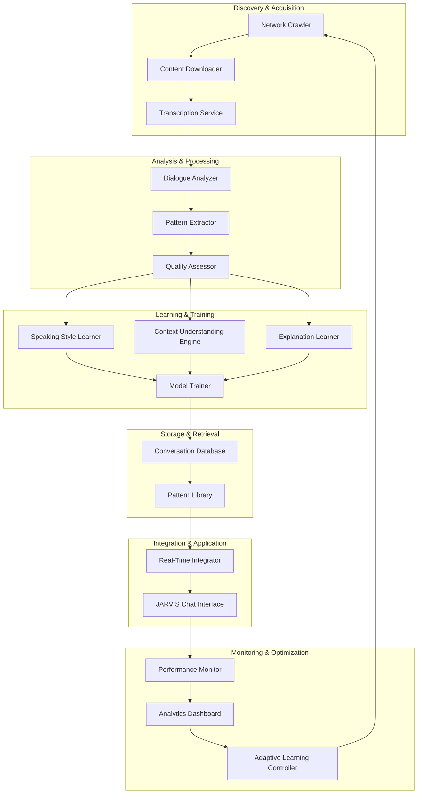

# Design Document: JARVIS Online Conversation Learning System

## Overview

The JARVIS Online Conversation Learning System is a comprehensive platform that enables JARVIS to continuously improve its communication abilities by learning from real-world conversations available on the internet. The system discovers, downloads, analyzes, and learns from conversations across multiple online platforms (YouTube, podcasts, forums, Reddit, Twitter), extracting communication patterns, speaking styles, and explanation techniques to enhance JARVIS's natural language capabilities.

### Key Capabilities

- **Multi-Source Conversation Discovery**: Automated discovery and download of conversations from diverse online platforms
- **Intelligent Transcription**: Audio/video to text conversion with speaker identification and timing preservation
- **Pattern Analysis**: Deep analysis of dialogue structure, speaking styles, and communication effectiveness
- - **Multi-Model Learning**: Training of specialized models for speaking, understanding, and explaining
- **Real-Time Integration**: Immediate application of learned patterns to improve ongoing conversations
- **Continuous Improvement**: Self-sustaining learning cycle with quality assessment and adaptive learning rates

### Design Goals

1. **Naturalness**: Enable JARVIS to communicate as naturally as humans do
2. **Adaptability**: Learn and apply different communication styles based on context
3. **Efficiency**: Process thousands of conversations daily without impacting system performance
4. **Quality**: Prioritize learning from high-quality, effective conversations
5. **Ethics**: Respect privacy, copyright, and ethical boundaries in data collection
6. **Scalability**: Support continuous growth in conversation corpus and model sophistication

## Architecture

### System Architecture

The system follows a pipeline architecture with six major stages:



### Component Responsibilities

#### 1. Network Crawler
- Discover conversation sources across multiple platforms
- Identify high-quality conversation sources
- Respect rate limits and terms of service
- Filter inappropriate content
- Maintain source diversity

#### 2. Content Downloader
- Acquire conversation content from identified sources
- Manage bandwidth usage (max 50% of available)
- Schedule downloads during off-peak hours
- Resume interrupted downloads
- Compress downloaded content

#### 3. Transcription Service
- Convert audio/video to text with speaker identification
- Integrate with transcription APIs (YouTube, Google, Azure)
- Achieve 90%+ transcription accuracy
- Preserve timing information
- Support English and Bengali

#### 4. Dialogue Analyzer
- Understand conversation structure and flow
- Identify dialogue turns and speaker changes
- Extract question-answer pairs
- Map conversation flow and topic transitions

#### 5. Pattern Extractor
- Extract reusable communication patterns
- Identify speaking styles
- Extract explanation techniques
- Detect emotional patterns
- Build pattern library with 1,000+ patterns

#### 6. Quality Assessor
- Evaluate conversation quality and effectiveness
- Rate clarity, completeness, engagement
- Filter low-quality conversations
- Provide quality metrics for adaptive learning

#### 7-16. Additional Components
- Speaking Style Learner, Context Understanding Engine, Explanation Learner
- Model Trainer, Conversation Database, Pattern Library
- Real-Time Integrator, Performance Monitor, Analytics Dashboard
- Adaptive Learning Controller

## Components and Interfaces

### Core Data Models

```python
@dataclass
class ConversationSource:
    """Represents a source of conversations."""
    id: str
    platform: Platform
    url: str
    title: str
    author: str
    published_date: datetime
    language: Language
    estimated_quality: float
    topic_tags: List[str]
    content_type: ContentType  # video, audio, text
    
@dataclass
class Conversation:
    """Represents a downloaded and processed conversation."""
    id: str
    source: ConversationSource
    transcript: Transcript
    turns: List[DialogueTurn]
    quality_metrics: QualityMetrics
    patterns: List[Pattern]
    metadata: Dict[str, Any]
    
@dataclass
class DialogueTurn:
    """Represents a single turn in a conversation."""
    speaker_id: str
    text: str
    timestamp: float
    turn_type: TurnType  # question, answer, statement, response
    emotional_tone: EmotionalTone
    
@dataclass
class Pattern:
    """Represents a reusable communication pattern."""
    id: str
    pattern_type: PatternType
    context: str
    structure: str
    effectiveness_score: float
    usage_count: int
    examples: List[str]
```

### Network Crawler Interface

```python
class NetworkCrawler:
    def search_platform(self, platform: Platform, topic: str, 
                       max_results: int = 100) -> List[ConversationSource]:
        """Search platform for conversation sources."""
        
    def assess_source_quality(self, source: ConversationSource) -> float:
        """Assess quality of a conversation source (0-100)."""
        
    def filter_inappropriate(self, sources: List[ConversationSource]) -> List[ConversationSource]:
        """Filter out inappropriate or low-quality sources."""
```

### Transcription Service Interface

```python
class TranscriptionService:
    def transcribe(self, content: MediaContent, 
                  language: Language = Language.ENGLISH) -> Transcript:
        """Transcribe audio/video content to text."""
        
    def identify_speakers(self, transcript: Transcript) -> SpeakerMap:
        """Identify and label different speakers."""
        
    def validate_accuracy(self, transcript: Transcript) -> float:
        """Validate transcription accuracy (0.0-1.0)."""
```

### Model Trainer Interface

```python
class ModelTrainer:
    def train_speaking_model(self, conversations: List[Conversation]) -> SpeakingModel:
        """Train model for natural response generation."""
        
    def train_understanding_model(self, conversations: List[Conversation]) -> UnderstandingModel:
        """Train model for intent extraction."""
        
    def train_explanation_model(self, conversations: List[Conversation]) -> ExplanationModel:
        """Train model for clear explanations."""
        
    def evaluate_model(self, model: Model, test_data: List[Conversation]) -> ModelMetrics:
        """Evaluate model performance."""
```

## Data Models

### Conversation Storage Schema

```sql
-- Conversations table
CREATE TABLE conversations (
    id VARCHAR(36) PRIMARY KEY,
    source_id VARCHAR(36) NOT NULL,
    platform VARCHAR(50) NOT NULL,
    title TEXT NOT NULL,
    author VARCHAR(255),
    published_date TIMESTAMP,
    downloaded_date TIMESTAMP DEFAULT CURRENT_TIMESTAMP,
    language VARCHAR(10) NOT NULL,
    quality_score FLOAT,
    content_type VARCHAR(20),
    transcript_text TEXT,
    metadata JSONB,
    INDEX idx_platform (platform),
    INDEX idx_quality (quality_score),
    INDEX idx_language (language),
    INDEX idx_published (published_date)
);

-- Dialogue turns table
CREATE TABLE dialogue_turns (
    id VARCHAR(36) PRIMARY KEY,
    conversation_id VARCHAR(36) NOT NULL,
    speaker_id VARCHAR(100),
    turn_order INT NOT NULL,
    text TEXT NOT NULL,
    timestamp_start FLOAT,
    timestamp_end FLOAT,
    turn_type VARCHAR(20),
    emotional_tone VARCHAR(20),
    FOREIGN KEY (conversation_id) REFERENCES conversations(id) ON DELETE CASCADE,
    INDEX idx_conversation (conversation_id),
    INDEX idx_turn_type (turn_type)
);

-- Patterns table
CREATE TABLE patterns (
    id VARCHAR(36) PRIMARY KEY,
    pattern_type VARCHAR(50) NOT NULL,
    context TEXT,
    structure TEXT NOT NULL,
    effectiveness_score FLOAT,
    usage_count INT DEFAULT 0,
    created_date TIMESTAMP DEFAULT CURRENT_TIMESTAMP,
    last_used TIMESTAMP,
    examples JSONB,
    metadata JSONB,
    INDEX idx_type (pattern_type),
    INDEX idx_effectiveness (effectiveness_score)
);

-- Pattern usage tracking
CREATE TABLE pattern_usage (
    id VARCHAR(36) PRIMARY KEY,
    pattern_id VARCHAR(36) NOT NULL,
    conversation_id VARCHAR(36),
    used_date TIMESTAMP DEFAULT CURRENT_TIMESTAMP,
    success_score FLOAT,
    FOREIGN KEY (pattern_id) REFERENCES patterns(id) ON DELETE CASCADE,
    INDEX idx_pattern (pattern_id),
    INDEX idx_date (used_date)
);

-- Model training history
CREATE TABLE model_training_history (
    id VARCHAR(36) PRIMARY KEY,
    model_type VARCHAR(50) NOT NULL,
    training_date TIMESTAMP DEFAULT CURRENT_TIMESTAMP,
    conversations_count INT,
    training_duration_seconds INT,
    accuracy_score FLOAT,
    naturalness_score FLOAT,
    model_version VARCHAR(20),
    metadata JSONB,
    INDEX idx_model_type (model_type),
    INDEX idx_training_date (training_date)
);

-- Quality metrics table
CREATE TABLE quality_metrics (
    id VARCHAR(36) PRIMARY KEY,
    conversation_id VARCHAR(36) NOT NULL,
    clarity_score FLOAT,
    completeness_score FLOAT,
    effectiveness_score FLOAT,
    overall_quality FLOAT,
    assessed_date TIMESTAMP DEFAULT CURRENT_TIMESTAMP,
    FOREIGN KEY (conversation_id) REFERENCES conversations(id) ON DELETE CASCADE,
    INDEX idx_conversation (conversation_id),
    INDEX idx_overall_quality (overall_quality)
);
```

### In-Memory Data Structures

```python
class ConversationCache:
    """LRU cache for frequently accessed conversations."""
    def __init__(self, max_size: int = 1000):
        self.cache: OrderedDict[str, Conversation] = OrderedDict()
        self.max_size = max_size
        
    def get(self, conversation_id: str) -> Optional[Conversation]:
        """Retrieve conversation from cache."""
        if conversation_id in self.cache:
            self.cache.move_to_end(conversation_id)
            return self.cache[conversation_id]
        return None
        
    def put(self, conversation: Conversation) -> None:
        """Add conversation to cache with LRU eviction."""
        if len(self.cache) >= self.max_size:
            self.cache.popitem(last=False)
        self.cache[conversation.id] = conversation

class PatternIndex:
    """Fast pattern retrieval by type and context."""
    def __init__(self):
        self.by_type: Dict[PatternType, List[Pattern]] = defaultdict(list)
        self.by_context: Dict[str, List[Pattern]] = defaultdict(list)
        self.by_effectiveness: List[Pattern] = []
        
    def add_pattern(self, pattern: Pattern) -> None:
        """Add pattern to all indices."""
        self.by_type[pattern.pattern_type].append(pattern)
        self.by_context[pattern.context].append(pattern)
        bisect.insort(self.by_effectiveness, pattern, 
                     key=lambda p: -p.effectiveness_score)
        
    def find_by_type(self, pattern_type: PatternType) -> List[Pattern]:
        """Find patterns by type."""
        return self.by_type[pattern_type]
        
    def find_by_context(self, context: str, top_k: int = 10) -> List[Pattern]:
        """Find most effective patterns for context."""
        candidates = self.by_context.get(context, [])
        return sorted(candidates, key=lambda p: -p.effectiveness_score)[:top_k]
```


## Error Handling

### Error Categories

#### 1. Network and Download Errors
- Connection timeouts → Retry with exponential backoff (max 3 attempts)
- Rate limit exceeded → Wait for retry_after period with jitter
- Content unavailable (404, 403) → Skip and mark source unavailable
- Bandwidth throttling → Pause downloads until bandwidth available
- Incomplete downloads → Resume from last checkpoint

#### 2. Transcription Errors
- Low audio quality → Try alternative transcription service
- Unsupported language → Skip content
- API failures → Retry with exponential backoff (max 5 attempts)
- Accuracy below threshold (<90%) → Mark for manual review or skip

#### 3. Analysis and Processing Errors
- Malformed conversation structure → Attempt repair, skip if fails
- Pattern extraction failures → Continue without patterns (optional)
- Quality assessment errors → Use default quality score
- Database write failures → Retry 3 times, then queue for later

#### 4. Model Training Errors
- Insufficient training data → Postpone training until threshold met
- Training convergence failure → Adjust hyperparameters and retry
- Model evaluation errors → Keep previous model version
- Resource exhaustion → Reduce batch size or cleanup old data

#### 5. Integration and Runtime Errors
- Model loading failures → Fall back to previous version or rule-based system
- Pattern retrieval errors → Continue without patterns
- Real-time integration failures → Disable temporarily (15 min)
- Performance degradation → Reduce processing rate, clear caches

### Error Recovery Strategies

**Retry Policies:**
- Exponential backoff with jitter for transient failures
- Circuit breaker pattern for external API calls
- Graceful degradation when components fail

**Data Integrity:**
- Transactional database operations with rollback
- Data validation before storage
- Periodic integrity checks


## Testing Strategy

### Why Property-Based Testing Does NOT Apply

This feature is **NOT suitable for property-based testing** because:

1. **External Service Integration**: The system heavily relies on external services (YouTube API, transcription APIs, web crawlers). These test external service behavior, not our code's logic. Testing whether "YouTube returns videos" doesn't vary meaningfully with our input.

2. **Infrastructure and Configuration**: Database schemas, storage management, network bandwidth control are infrastructure concerns best tested with integration tests and smoke tests, not property tests.

3. **Machine Learning Training**: Model training outcomes depend on data quality, hyperparameters, and stochastic processes. There are no universal properties like "for any training data X, accuracy Y holds."

4. **Side-Effect Heavy Operations**: Most operations are side-effect driven (downloading files, storing to database, updating models) without clear input/output properties to test.

5. **Non-Deterministic Behavior**: Web crawling results, transcription quality, and pattern extraction vary based on external factors, not just our inputs.

**Therefore, we use:**
- **Unit tests** for pure functions (pattern matching, quality scoring, text processing)
- **Integration tests** for external services and database operations (1-3 examples each)
- **End-to-end tests** for complete workflows
- **Performance tests** for resource usage and throughput
- **Mock-based tests** for isolated component testing

### Unit Testing

**Coverage Areas:**
- Text processing: dialogue parsing, speaker identification, pattern matching
- Data validation: input validation, schema validation
- Quality scoring: clarity, completeness, effectiveness calculations
- Utility functions: URL parsing, date handling, language detection

**Example Tests:**
```python
def test_extract_qa_pairs():
    """Test Q&A pair extraction from dialogue turns."""
    turns = [
        DialogueTurn(speaker="A", text="What is Python?", turn_type=TurnType.QUESTION),
        DialogueTurn(speaker="B", text="Python is a programming language.", turn_type=TurnType.ANSWER),
    ]
    qa_pairs = DialogueAnalyzer().extract_qa_pairs(turns)
    assert len(qa_pairs) == 1
    assert qa_pairs[0].question.text == "What is Python?"

def test_quality_threshold_filtering():
    """Test filtering conversations by quality threshold."""
    conversations = create_mixed_quality_conversations()
    filtered = QualityAssessor().filter_by_quality(conversations, threshold=0.7)
    assert all(c.quality_metrics.overall_quality >= 0.7 for c in filtered)
```

### Integration Testing

**Coverage Areas:**
- YouTube API integration (search, download)
- Transcription service APIs (Google, Azure)
- Database operations (store, retrieve, query)
- File system operations (download, compress, archive)
- Rate limiting and error handling

**Example Tests:**
```python
@pytest.mark.integration
def test_youtube_search():
    """Test YouTube API search returns valid sources."""
    sources = NetworkCrawler().search_platform(Platform.YOUTUBE, "python tutorial", max_results=10)
    assert len(sources) > 0
    assert all(s.platform == Platform.YOUTUBE for s in sources)

@pytest.mark.integration
def test_conversation_storage():
    """Test storing and retrieving conversations from database."""
    conversation = create_test_conversation()
    ConversationDatabase().store_conversation(conversation)
    retrieved = ConversationDatabase().get_conversation(conversation.id)
    assert retrieved.id == conversation.id
```

### End-to-End Testing

**Coverage Areas:**
- Complete learning pipeline: Discover → Download → Transcribe → Analyze → Learn → Apply
- Model training workflow: Collect → Train → Evaluate → Deploy
- Real-time integration: Learn → Update → Improve

**Example Tests:**
```python
@pytest.mark.e2e
def test_complete_learning_cycle():
    """Test full pipeline from discovery to conversation improvement."""
    system = ConversationLearningSystem()
    
    # Discover and download
    sources = system.discover_conversations("python tutorial", limit=5)
    conversations = system.download_and_process(sources)
    
    # Analyze and learn
    patterns = system.extract_patterns(conversations)
    system.update_models(patterns)
    
    # Verify improvement
    initial_quality = system.measure_conversation_quality()
    time.sleep(60)  # Allow integration
    improved_quality = system.measure_conversation_quality()
    assert improved_quality > initial_quality
```

### Performance Testing

**Coverage Areas:**
- CPU usage (< 20% during learning)
- Memory usage (< 1GB for processing)
- Processing throughput (100 conversations/hour)
- Database query performance
- Bandwidth management (< 50% of available)

**Example Tests:**
```python
@pytest.mark.performance
def test_processing_throughput():
    """Test system processes 100 conversations per hour."""
    system = ConversationLearningSystem()
    conversations = create_test_conversations(count=100)
    
    start_time = time.time()
    system.process_conversations(conversations)
    duration = time.time() - start_time
    
    assert duration < 3600  # Less than 1 hour

@pytest.mark.performance
def test_resource_usage():
    """Test CPU and memory stay within limits."""
    system = ConversationLearningSystem()
    monitor = ResourceMonitor()
    
    system.start_learning()
    time.sleep(300)  # Monitor for 5 minutes
    
    assert monitor.max_cpu_usage < 0.20
    assert monitor.max_memory_usage < 1024 * 1024 * 1024  # 1GB
```

### Mock-Based Testing

**Coverage Areas:**
- External API mocking (YouTube, transcription services)
- Database mocking for unit tests
- File system mocking
- Network mocking

**Example Tests:**
```python
@patch('youtube_api.search')
def test_crawler_with_mock(mock_search):
    """Test crawler logic with mocked YouTube API."""
    mock_search.return_value = [create_mock_video()]
    
    crawler = NetworkCrawler()
    sources = crawler.search_platform(Platform.YOUTUBE, "test", max_results=10)
    
    assert len(sources) > 0
    mock_search.assert_called_once()
```

### Test Data Management

**Test Data Sources:**
- Small corpus of real conversations (with permission)
- Synthetic conversations for edge cases
- Multilingual test data (English, Bengali)
- Various quality levels (high, medium, low)

**Test Data Storage:**
- Separate test database
- Version-controlled test fixtures
- Automated test data generation

