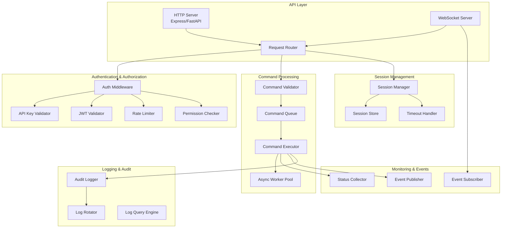

# Design Document: Jarvis-Cheng Bot Integration

## Overview

This design document specifies the architecture and implementation approach for enabling external systems (such as Jarvis or other AI assistants) to control and interact with Cheng Bot through a secure, programmatic API interface.

### Purpose

The Jarvis-Cheng Bot Integration feature provides a RESTful HTTP API and WebSocket interface that allows external systems to:
- Execute Cheng Bot commands remotely
- Monitor Cheng Bot's operational status in real-time
- Receive event notifications for file changes, command completions, and errors
- Maintain persistent sessions for efficient multi-command workflows

### Scope

**In Scope:**
- HTTP REST API for command submission and status queries
- WebSocket API for real-time bidirectional communication
- Authentication and authorization mechanisms (API keys and JWT tokens)
- Command execution engine with async support
- Session management with timeout handling
- Real-time event streaming to subscribed clients
- Operation logging and audit trail
- Security controls including input validation, sandboxing, and rate limiting
- Command schema validation and discovery

**Out of Scope:**
- Graphical user interface for API management
- Custom protocol implementations beyond HTTP/WebSocket
- Integration with specific external systems (implementation is generic)
- Distributed deployment across multiple Cheng Bot instances

### Key Design Decisions

1. **Protocol Choice**: HTTP REST for synchronous operations, WebSocket for real-time streaming
   - Rationale: Industry-standard protocols with broad client library support
   
2. **Authentication Strategy**: Dual support for API keys (simple) and JWT tokens (stateless, expirable)
   - Rationale: API keys for simple integrations, JWT for enterprise scenarios requiring token rotation
   
3. **Async Command Execution**: Commands exceeding 5 seconds execute asynchronously with status polling
   - Rationale: Prevents HTTP timeout issues and allows clients to manage long-running operations
   
4. **Event-Driven Architecture**: WebSocket-based pub/sub for real-time notifications
   - Rationale: Eliminates polling overhead and provides immediate feedback to external systems
   
5. **Security-First Design**: Input validation, command sandboxing, and permission-based access control
   - Rationale: External API is a high-risk attack surface requiring defense-in-depth

## Architecture

### System Context

```mermaid
graph TB
    ExtSys[External System<br/>Jarvis/AI Assistant]
    API[Control API Layer]
    Auth[Authentication Service]
    CmdExec[Command Executor]
    StatusMon[Status Monitor]
    EventBus[Event Bus]
    OpLog[Operation Log]
    Cheng BotCore[Cheng Bot Core<br/>File System, Tools, Agents]
    
    ExtSys -->|HTTP/WebSocket| API
    API --> Auth
    API --> CmdExec
    API --> StatusMon
    API --> EventBus
    CmdExec --> Cheng BotCore
    CmdExec --> OpLog
    StatusMon --> Cheng BotCore
    EventBus --> ExtSys
    CmdExec --> EventBus
```

### Component Architecture



### Technology Stack

**Backend Framework:**
- **Option 1 (Python)**: FastAPI with uvicorn (async support, automatic OpenAPI docs)
- **Option 2 (Node.js)**: Express with Socket.io (mature ecosystem, good WebSocket support)
- **Recommendation**: FastAPI for type safety, async support, and automatic API documentation

**WebSocket Library:**
- **Python**: `websockets` or `python-socketio`
- **Node.js**: `socket.io` or `ws`

**Authentication:**
- API Key storage: In-memory cache with file-based persistence
- JWT: `PyJWT` (Python) or `jsonwebtoken` (Node.js)

**Session Storage:**
- In-memory with Redis as optional backend for distributed scenarios

**Logging:**
- Structured logging with `structlog` (Python) or `winston` (Node.js)
- Log rotation with `logrotate` or built-in rotation

**Command Queue:**
- In-memory queue with `asyncio.Queue` (Python) or `bull` (Node.js with Redis)

## Components and Interfaces

### 1. Control API Layer

**Responsibilities:**
- Expose HTTP REST endpoints for command submission and queries
- Expose WebSocket endpoints for real-time communication
- Route requests to appropriate handlers
- Handle protocol-level concerns (CORS, compression, etc.)

**HTTP Endpoints:**

```
POST   /api/v1/commands              - Submit a command for execution
GET    /api/v1/commands/{id}         - Get command execution status
GET    /api/v1/commands/{id}/output  - Get command output
DELETE /api/v1/commands/{id}         - Cancel a running command

GET    /api/v1/status                - Get Cheng Bot operational status
GET    /api/v1/health                - Health check endpoint

POST   /api/v1/sessions              - Create a new session
GET    /api/v1/sessions/{id}         - Get session details
DELETE /api/v1/sessions/{id}         - Close a session

GET    /api/v1/schema                - Get command schema
GET    /api/v1/schema/{command_type} - Get schema for specific command

GET    /api/v1/logs                  - Query operation logs
```

**WebSocket Endpoints:**

```
WS /api/v1/ws                        - WebSocket connection for real-time events
```

**Interface:**

```python
class ControlAPI:
    def __init__(self, auth_service: AuthenticationService, 
                 command_executor: CommandExecutor,
                 status_monitor: StatusMonitor,
                 session_manager: SessionManager):
        pass
    
    async def submit_command(self, request: CommandRequest) -> CommandResponse:
        """Submit a command for execution"""
        pass
    
    async def get_command_status(self, command_id: str) -> CommandStatus:
        """Get status of a command"""
        pass
    
    async def get_system_status(self) -> SystemStatus:
        """Get Cheng Bot's operational status"""
        pass
    
    async def create_session(self, client_id: str) -> Session:
        """Create a new session"""
        pass
    
    async def close_session(self, session_id: str) -> None:
        """Close an existing session"""
        pass
```

### 2. Authentication Service

**Responsibilities:**
- Validate API keys and JWT tokens
- Enforce rate limiting per client
- Maintain whitelist of authorized clients
- Log authentication attempts

**Interface:**

```python
class AuthenticationService:
    def __init__(self, api_key_store: APIKeyStore, 
                 jwt_secret: str,
                 rate_limiter: RateLimiter):
        pass
    
    async def authenticate_api_key(self, api_key: str) -> Optional[ClientIdentity]:
        """Validate API key and return client identity"""
        pass
    
    async def authenticate_jwt(self, token: str) -> Optional[ClientIdentity]:
        """Validate JWT token and return client identity"""
        pass
    
    async def check_rate_limit(self, client_id: str) -> bool:
        """Check if client has exceeded rate limit"""
        pass
    
    async def is_whitelisted(self, client_id: str) -> bool:
        """Check if client is in whitelist"""
        pass

class ClientIdentity:
    client_id: str
    permissions: List[Permission]
    rate_limit: int  # requests per minute
```

**API Key Format:**
```
cheng_bot_<environment>_<random_32_chars>
Example: cheng_bot_prod_a7f3d9e2b1c4f8a6d3e9b2c1f4a8d6e3
```

**JWT Claims:**
```json
{
  "sub": "client_id",
  "iat": 1234567890,
  "exp": 1234571490,
  "permissions": ["read", "write", "execute"],
  "rate_limit": 100
}
```

### 3. Command Executor

**Responsibilities:**
- Validate incoming commands against schema
- Execute commands synchronously or asynchronously
- Manage command queue and worker pool
- Return execution results and errors
- Enforce security constraints

**Interface:**

```python
class CommandExecutor:
    def __init__(self, command_queue: CommandQueue,
                 worker_pool: WorkerPool,
                 security_validator: SecurityValidator,
                 event_publisher: EventPublisher):
        pass
    
    async def execute_command(self, command: Command, 
                             session: Session) -> CommandResult:
        """Execute a command and return result"""
        pass
    
    async def execute_async(self, command: Command, 
                           session: Session) -> str:
        """Queue command for async execution, return command_id"""
        pass
    
    async def get_command_result(self, command_id: str) -> Optional[CommandResult]:
        """Get result of async command"""
        pass
    
    async def cancel_command(self, command_id: str) -> bool:
        """Cancel a running command"""
        pass

class Command:
    command_type: str  # "read_file", "write_file", "execute_shell", etc.
    parameters: Dict[str, Any]
    timeout: int  # seconds
    
class CommandResult:
    command_id: str
    status: str  # "success", "failure", "partial", "timeout"
    output: Any
    error: Optional[str]
    duration_ms: int
    modified_files: List[str]
```

**Supported Command Types:**

```python
COMMAND_TYPES = {
    "read_file": {
        "parameters": {"path": "string"},
        "permissions": ["read"]
    },
    "write_file": {
        "parameters": {"path": "string", "content": "string"},
        "permissions": ["write"]
    },
    "execute_shell": {
        "parameters": {"command": "string", "cwd": "string"},
        "permissions": ["execute"]
    },
    "search_code": {
        "parameters": {"query": "string", "pattern": "string"},
        "permissions": ["read"]
    },
    "analyze_code": {
        "parameters": {"path": "string", "analysis_type": "string"},
        "permissions": ["read"]
    },
    "list_directory": {
        "parameters": {"path": "string", "recursive": "boolean"},
        "permissions": ["read"]
    }
}
```

### 4. Status Monitor

**Responsibilities:**
- Track Cheng Bot's operational state (idle, busy, error)
- Monitor active operations and progress
- Report system resource usage
- Broadcast state change events
- Provide health check information

**Interface:**

```python
class StatusMonitor:
    def __init__(self, event_publisher: EventPublisher):
        pass
    
    async def get_status(self) -> SystemStatus:
        """Get current system status"""
        pass
    
    async def get_active_operations(self) -> List[Operation]:
        """Get list of active operations"""
        pass
    
    async def get_resource_usage(self) -> ResourceUsage:
        """Get CPU, memory usage"""
        pass
    
    async def health_check(self) -> HealthStatus:
        """Perform health check"""
        pass
    
    def on_state_change(self, callback: Callable[[SystemState], None]):
        """Register callback for state changes"""
        pass

class SystemStatus:
    state: str  # "idle", "busy", "error"
    active_operations: int
    queued_commands: int
    uptime_seconds: int
    
class ResourceUsage:
    cpu_percent: float
    memory_mb: float
    memory_percent: float
    
class HealthStatus:
    healthy: bool
    checks: Dict[str, bool]  # {"api": True, "executor": True, "storage": True}
    message: str
```

### 5. Session Manager

**Responsibilities:**
- Create and manage client sessions
- Maintain session context across commands
- Handle session timeouts
- Clean up resources on session close
- Support concurrent sessions

**Interface:**

```python
class SessionManager:
    def __init__(self, session_store: SessionStore,
                 timeout_seconds: int = 1800):
        pass
    
    async def create_session(self, client_id: str) -> Session:
        """Create a new session"""
        pass
    
    async def get_session(self, session_id: str) -> Optional[Session]:
        """Retrieve existing session"""
        pass
    
    async def close_session(self, session_id: str) -> None:
        """Close session and cleanup"""
        pass
    
    async def refresh_session(self, session_id: str) -> None:
        """Reset session timeout"""
        pass
    
    async def cleanup_expired_sessions(self) -> int:
        """Remove expired sessions, return count"""
        pass

class Session:
    session_id: str
    client_id: str
    created_at: datetime
    last_activity: datetime
    context: Dict[str, Any]  # Persistent context across commands
    permissions: List[Permission]
```

### 6. Event Publisher/Subscriber

**Responsibilities:**
- Publish events to subscribed clients
- Manage client subscriptions
- Buffer events during disconnections
- Support selective event filtering

**Interface:**

```python
class EventPublisher:
    def __init__(self):
        pass
    
    async def publish(self, event: Event) -> None:
        """Publish event to all subscribers"""
        pass
    
    async def publish_to_client(self, client_id: str, event: Event) -> None:
        """Publish event to specific client"""
        pass

class EventSubscriber:
    def __init__(self, event_publisher: EventPublisher):
        pass
    
    async def subscribe(self, client_id: str, 
                       event_types: List[str]) -> None:
        """Subscribe client to event types"""
        pass
    
    async def unsubscribe(self, client_id: str, 
                         event_types: List[str]) -> None:
        """Unsubscribe from event types"""
        pass
    
    async def get_buffered_events(self, client_id: str) -> List[Event]:
        """Get events buffered during disconnection"""
        pass

class Event:
    event_type: str  # "file_changed", "command_completed", "error", "state_changed"
    timestamp: datetime
    data: Dict[str, Any]
    client_id: Optional[str]  # None for broadcast events
```

**Event Types:**

```python
EVENT_TYPES = {
    "file_changed": {
        "data": {"path": "string", "change_type": "string"}
    },
    "command_completed": {
        "data": {"command_id": "string", "status": "string", "duration_ms": "int"}
    },
    "error": {
        "data": {"error_code": "string", "message": "string", "context": "object"}
    },
    "state_changed": {
        "data": {"old_state": "string", "new_state": "string"}
    }
}
```

### 7. Operation Logger

**Responsibilities:**
- Log all commands received and executed
- Record execution results and duration
- Persist logs to disk with rotation
- Support log queries by various criteria
- Maintain audit trail for security

**Interface:**

```python
class OperationLogger:
    def __init__(self, log_dir: str, 
                 max_size_mb: int = 100,
                 retention_days: int = 30):
        pass
    
    async def log_command(self, command: Command, 
                         client_id: str,
                         session_id: str) -> None:
        """Log command received"""
        pass
    
    async def log_result(self, command_id: str, 
                        result: CommandResult) -> None:
        """Log command result"""
        pass
    
    async def query_logs(self, filters: LogFilters) -> List[LogEntry]:
        """Query logs with filters"""
        pass
    
    async def rotate_logs(self) -> None:
        """Rotate logs if size exceeded"""
        pass

class LogFilters:
    start_time: Optional[datetime]
    end_time: Optional[datetime]
    client_id: Optional[str]
    command_type: Optional[str]
    status: Optional[str]
    
class LogEntry:
    timestamp: datetime
    command_id: str
    client_id: str
    session_id: str
    command_type: str
    parameters: Dict[str, Any]
    status: str
    duration_ms: int
    error: Optional[str]
```

### 8. Security Validator

**Responsibilities:**
- Validate file paths to prevent directory traversal
- Sanitize shell commands to prevent injection
- Enforce permission-based access control
- Limit shell commands to safe whitelist
- Log security violations

**Interface:**

```python
class SecurityValidator:
    def __init__(self, allowed_commands: List[str],
                 workspace_root: str):
        pass
    
    def validate_file_path(self, path: str, 
                          permissions: List[Permission]) -> ValidationResult:
        """Validate file path is safe and authorized"""
        pass
    
    def validate_shell_command(self, command: str,
                               permissions: List[Permission]) -> ValidationResult:
        """Validate shell command is safe"""
        pass
    
    def sanitize_input(self, input_str: str) -> str:
        """Sanitize user input"""
        pass
    
    def check_permission(self, required: Permission,
                        granted: List[Permission]) -> bool:
        """Check if permission is granted"""
        pass

class ValidationResult:
    valid: bool
    error_message: Optional[str]
    sanitized_value: Optional[str]

class Permission(Enum):
    READ = "read"
    WRITE = "write"
    EXECUTE = "execute"
    ADMIN = "admin"
```

**Security Rules:**

1. **Path Validation:**
   - Resolve to absolute path
   - Check if within workspace root
   - Reject paths with `..`, symbolic links outside workspace
   
2. **Shell Command Whitelist:**
   ```python
   ALLOWED_COMMANDS = [
       "ls", "cat", "grep", "find", "git",
       "npm", "pip", "python", "node",
       "pytest", "jest", "cargo", "go"
   ]
   ```
   
3. **Command Sanitization:**
   - Remove shell metacharacters: `; | & $ ( ) < > \` \n`
   - Validate command is in whitelist
   - Reject commands with suspicious patterns

## Data Models

### Command Request/Response

```python
class CommandRequest:
    command_type: str
    parameters: Dict[str, Any]
    timeout: int = 30
    async_execution: bool = False
    session_id: Optional[str] = None

class CommandResponse:
    command_id: str
    status: str  # "success", "failure", "partial", "timeout", "queued"
    output: Optional[Any]
    error: Optional[ErrorDetail]
    duration_ms: int
    modified_files: List[str]
    request_id: str  # For tracing

class ErrorDetail:
    error_code: str
    message: str
    details: Dict[str, Any]
```

### Session Data

```python
class SessionData:
    session_id: str
    client_id: str
    created_at: datetime
    last_activity: datetime
    timeout_seconds: int
    context: Dict[str, Any]
    permissions: List[str]
    active: bool
```

### Status Data

```python
class SystemStatusData:
    state: str  # "idle", "busy", "error"
    active_operations: int
    queued_commands: int
    connected_clients: int
    uptime_seconds: int
    resource_usage: ResourceUsageData
    last_error: Optional[str]

class ResourceUsageData:
    cpu_percent: float
    memory_mb: float
    memory_percent: float
    disk_usage_percent: float
```

### Log Entry Data

```python
class LogEntryData:
    timestamp: str  # ISO 8601
    log_id: str
    command_id: str
    client_id: str
    session_id: str
    command_type: str
    parameters: Dict[str, Any]
    status: str
    duration_ms: int
    error: Optional[str]
    modified_files: List[str]
```

### Event Data

```python
class EventData:
    event_id: str
    event_type: str
    timestamp: str  # ISO 8601
    data: Dict[str, Any]
    client_id: Optional[str]
```

## Error Handling

### Error Categories

1. **Authentication Errors (401)**
   - Invalid API key
   - Expired JWT token
   - Missing credentials

2. **Authorization Errors (403)**
   - Insufficient permissions
   - Rate limit exceeded
   - Client not whitelisted

3. **Validation Errors (400)**
   - Invalid command schema
   - Malformed JSON
   - Invalid parameters

4. **Resource Errors (404)**
   - Session not found
   - Command not found
   - File not found

5. **Execution Errors (500)**
   - Command execution failed
   - Internal server error
   - Timeout

6. **Capacity Errors (503)**
   - System overloaded
   - Queue full
   - Too many concurrent operations

### Error Response Format

```json
{
  "error": {
    "code": "INVALID_COMMAND",
    "message": "Command type 'invalid_cmd' is not supported",
    "details": {
      "command_type": "invalid_cmd",
      "supported_types": ["read_file", "write_file", "execute_shell"]
    },
    "request_id": "req_abc123",
    "timestamp": "2024-01-15T10:30:00Z"
  }
}
```

### Error Handling Strategy

1. **Graceful Degradation:**
   - Command failures do not terminate sessions
   - Partial results returned when possible
   - System continues operating after errors

2. **Retry Logic:**
   - Exponential backoff for transient failures
   - Maximum 3 retry attempts
   - Configurable retry policy per command type

3. **Circuit Breaker:**
   - Open circuit after 5 consecutive failures
   - Half-open state after 30 seconds
   - Close circuit after 2 successful requests

4. **Timeout Handling:**
   - Default timeout: 30 seconds
   - Long-running commands: 5 minutes
   - Async commands: No timeout (client polls)

5. **Error Logging:**
   - All errors logged with full context
   - Stack traces for internal errors
   - Security violations logged separately

## Testing Strategy

### Testing Approach

This feature is primarily **infrastructure and orchestration code** involving API endpoints, authentication, session management, and event streaming. Property-based testing is **not appropriate** for this feature. Instead, we will use:

1. **Integration Tests** - Test API endpoints end-to-end
2. **Mock-Based Unit Tests** - Test command validation and execution logic
3. **Example-Based Tests** - Test authentication flows and error handling
4. **Load Tests** - Verify performance requirements

### Unit Tests

**Authentication Service:**
- Valid API key authentication succeeds
- Invalid API key authentication fails
- Expired JWT token is rejected
- Valid JWT token with correct claims succeeds
- Rate limiting blocks excessive requests
- Whitelist enforcement works correctly

**Command Validator:**
- Valid commands pass schema validation
- Invalid commands fail with descriptive errors
- Missing required parameters are detected
- Type mismatches are caught
- Unknown command types are rejected

**Security Validator:**
- Directory traversal attempts are blocked (`../../etc/passwd`)
- Shell injection attempts are sanitized (`; rm -rf /`)
- Paths outside workspace are rejected
- Whitelisted commands are allowed
- Non-whitelisted commands are blocked
- Permission checks enforce access control

**Session Manager:**
- Session creation assigns unique ID
- Session timeout after inactivity period
- Expired sessions are cleaned up
- Session context persists across commands
- Concurrent sessions are supported

**Command Executor:**
- Synchronous commands execute and return results
- Async commands return command_id immediately
- Command queue processes in FIFO order
- Failed commands return error details
- Timeout commands are terminated
- Modified files are tracked

### Integration Tests

**API Endpoint Tests:**
- `POST /api/v1/commands` executes command and returns result
- `GET /api/v1/commands/{id}` returns command status
- `GET /api/v1/status` returns system status within 100ms
- `POST /api/v1/sessions` creates session
- `DELETE /api/v1/sessions/{id}` closes session
- `GET /api/v1/schema` returns command schemas
- `GET /api/v1/logs` queries operation logs

**WebSocket Tests:**
- Client connects and receives connection confirmation
- File change events are broadcast to subscribed clients
- Command completion events are sent
- Error events are delivered
- Client can subscribe/unsubscribe from event types
- Buffered events delivered after reconnection

**Authentication Flow Tests:**
- Request without credentials returns 401
- Request with invalid API key returns 401
- Request with valid API key succeeds
- Request with expired JWT returns 401
- Request with valid JWT succeeds
- Rate limit exceeded returns 429

**End-to-End Workflow Tests:**
- External system authenticates, creates session, executes commands, receives events, closes session
- Multiple concurrent sessions from different clients
- Long-running async command execution and polling
- Error recovery after command failure

### Load Tests

**Performance Requirements:**
- API handles 100 requests/second
- Status checks complete within 50ms
- Command execution starts within 500ms
- System supports 10 concurrent command executions
- Queue supports 1000 pending commands
- System handles 50 concurrent WebSocket connections

**Load Test Scenarios:**
- Ramp up to 100 req/s over 60 seconds
- Sustained 100 req/s for 5 minutes
- Burst traffic: 200 req/s for 30 seconds
- Concurrent command execution: 20 simultaneous commands
- WebSocket stress: 100 connected clients with event streaming

### Security Tests

**Penetration Testing:**
- Directory traversal attacks blocked
- Command injection attempts sanitized
- SQL injection (if database used) prevented
- XSS attacks (if HTML rendered) prevented
- CSRF protection (if stateful sessions)
- Rate limiting prevents DoS

**Authorization Tests:**
- Read-only client cannot write files
- Write permission required for file modifications
- Execute permission required for shell commands
- Admin permission required for system operations
- Permission escalation attempts blocked

### Test Coverage Goals

- Unit test coverage: >80%
- Integration test coverage: >70%
- Critical paths (authentication, command execution): 100%
- Error handling paths: >90%

### Test Automation

- Unit tests run on every commit (CI/CD)
- Integration tests run on pull requests
- Load tests run nightly
- Security tests run weekly
- Manual penetration testing quarterly

## Implementation Notes

### Phase 1: Core API (Week 1-2)
- HTTP server setup with basic routing
- Authentication middleware (API key only)
- Command validator and executor (read_file, write_file)
- Basic error handling
- Operation logging

### Phase 2: Session & Async (Week 3)
- Session management
- Async command execution
- Command queue and worker pool
- Status monitoring

### Phase 3: WebSocket & Events (Week 4)
- WebSocket server
- Event publisher/subscriber
- Real-time event streaming
- Event buffering

### Phase 4: Security & Performance (Week 5)
- JWT authentication
- Security validator
- Rate limiting
- Circuit breaker
- Performance optimization

### Phase 5: Testing & Documentation (Week 6)
- Comprehensive test suite
- Load testing
- API documentation (OpenAPI/Swagger)
- Client SDK examples

### Configuration

```yaml
# config.yaml
api:
  host: "0.0.0.0"
  port: 8080
  cors_origins: ["*"]
  
authentication:
  api_key_file: ".cheng_bot/api_keys.json"
  jwt_secret: "${JWT_SECRET}"
  jwt_expiration_hours: 24
  rate_limit_per_minute: 100
  
sessions:
  timeout_minutes: 30
  max_concurrent: 100
  
commands:
  default_timeout_seconds: 30
  max_async_timeout_seconds: 300
  queue_size: 1000
  worker_pool_size: 10
  
logging:
  log_dir: ".cheng_bot/logs"
  max_size_mb: 100
  retention_days: 30
  
security:
  workspace_root: "."
  allowed_shell_commands: ["ls", "cat", "grep", "git", "npm", "pip"]
  enforce_whitelist: true
```

### Deployment Considerations

1. **Standalone Mode**: API runs within Cheng Bot process
2. **Separate Process**: API runs as separate service (recommended for production)
3. **Reverse Proxy**: Use nginx/traefik for SSL termination and load balancing
4. **Monitoring**: Integrate with Prometheus/Grafana for metrics
5. **Logging**: Forward logs to centralized logging (ELK, Splunk)

### Future Enhancements

- GraphQL API as alternative to REST
- gRPC support for high-performance scenarios
- Webhook support for push notifications
- Command batching for efficiency
- Distributed deployment with Redis backend
- Multi-tenancy support
- API versioning and deprecation strategy
- Client SDKs for Python, JavaScript, Go
- Admin dashboard for API management

---

**Document Version:** 1.0  
**Last Updated:** 2024-01-15  
**Status:** Ready for Review
