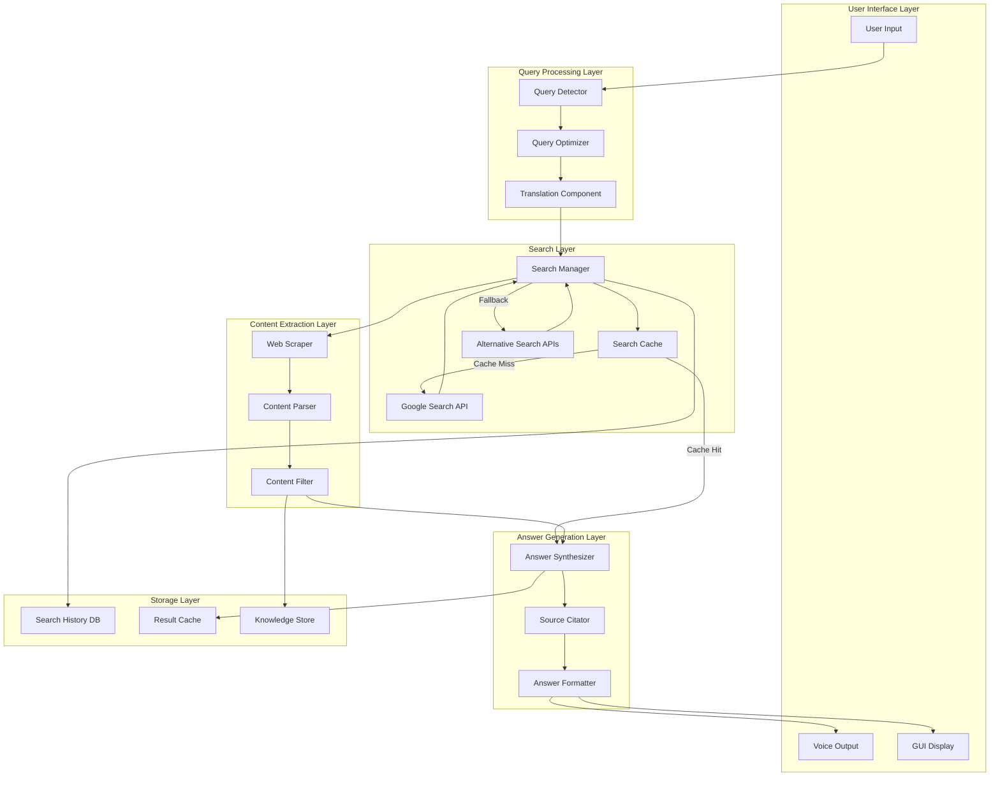

# Design Document: Jarvis Google Search Integration

## Overview

This design document outlines the architecture and implementation strategy for integrating Google Search into Jarvis, enabling real-time information retrieval from the web. The system automatically detects when web search is needed, queries Google, extracts content from result URLs, synthesizes answers from multiple sources, and presents information with proper citations.

## Design Goals

1. **Seamless Integration**: Web search feels natural and automatic within conversations
2. **Fast Response**: Search results and answers delivered within 5-10 seconds
3. **High Quality**: Accurate, relevant, and well-sourced information
4. **Multi-Language**: Support for Bengali and English queries and results
5. **User Control**: Users can trigger, refine, or disable web search
6. **Privacy**: Secure and private search with no data leakage

## Architecture

### System Architecture Diagram



### Component Descriptions

#### 1. Query Detector

**Purpose**: Automatically detect when a user query requires web search

**Implementation**:
```python
class QueryDetector:
    def __init__(self):
        self.trigger_keywords = [
            # English
            "latest", "current", "recent", "today", "this week", "this month",
            "what's new", "breaking news", "search google", "google it",
            "search the web", "look up", "find information about",
            
            # Bengali
            "সর্বশেষ", "বর্তমান", "সাম্প্রতিক", "আজকের", "এই সপ্তাহের",
            "গুগলে সার্চ", "ওয়েবে খুঁজো", "তথ্য খুঁজে দাও"
        ]
        
        self.time_indicators = [
            "today", "yesterday", "this week", "this month", "this year",
            "আজ", "গতকাল", "এই সপ্তাহে", "এই মাসে"
        ]
        
        self.explicit_commands = [
            "search google", "google search", "web search", "search for",
            "গুগল সার্চ", "ওয়েব সার্চ", "খুঁজে দাও"
        ]
    
    def should_search_web(self, query: str, context: dict) -> tuple[bool, str]:
        """
        Determine if query requires web search.
        
        Returns:
            (should_search, reason)
        """
        query_lower = query.lower()
        
        # Explicit search commands
        for cmd in self.explicit_commands:
            if cmd in query_lower:
                return (True, "explicit_command")
        
        # Time-sensitive queries
        for indicator in self.time_indicators:
            if indicator in query_lower:
                return (True, "time_sensitive")
        
        # Trigger keywords
        for keyword in self.trigger_keywords:
            if keyword in query_lower:
                return (True, "trigger_keyword")
        
        # Check if query is about current events
        if self._is_current_event_query(query):
            return (True, "current_event")
        
        # Check if Jarvis's knowledge is insufficient
        if context.get("confidence", 1.0) < 0.5:
            return (True, "low_confidence")
        
        return (False, "no_trigger")
    
    def _is_current_event_query(self, query: str) -> bool:
        """Check if query is about current events."""
        current_event_patterns = [
            r"what.*happening",
            r"latest.*news",
            r"current.*price",
            r"weather.*today",
            r"stock.*price",
        ]
        import re
        for pattern in current_event_patterns:
            if re.search(pattern, query.lower()):
                return True
        return False
```

#### 2. Query Optimizer

**Purpose**: Transform user queries into effective search queries

**Implementation**:
```python
class QueryOptimizer:
    def __init__(self):
        self.stopwords = set([
            "the", "a", "an", "is", "are", "was", "were", "what", "how",
            "tell", "me", "about", "please", "can", "you", "jarvis"
        ])
    
    def optimize_query(self, user_query: str, context: dict) -> str:
        """
        Convert user question into optimized search query.
        
        Args:
            user_query: Original user question
            context: Conversation context for additional context
            
        Returns:
            Optimized search query string
        """
        # Remove filler words
        query = self._remove_stopwords(user_query)
        
        # Extract key terms
        key_terms = self._extract_key_terms(query)
        
        # Add temporal context
        query = self._add_temporal_context(query, user_query)
        
        # Add location context if relevant
        query = self._add_location_context(query, context)
        
        # Add conversation context
        query = self._add_conversation_context(query, context)
        
        return query
    
    def _remove_stopwords(self, query: str) -> str:
        """Remove common stopwords."""
        words = query.lower().split()
        filtered = [w for w in words if w not in self.stopwords]
        return " ".join(filtered)
    
    def _extract_key_terms(self, query: str) -> list[str]:
        """Extract important keywords."""
        # Use NLP or simple heuristics
        words = query.split()
        # Prioritize nouns, verbs, adjectives
        return words  # Simplified
    
    def _add_temporal_context(self, query: str, original: str) -> str:
        """Add time context to query."""
        if "today" in original.lower():
            return f"{query} {datetime.now().strftime('%Y-%m-%d')}"
        elif "this week" in original.lower():
            return f"{query} {datetime.now().strftime('%Y week %W')}"
        elif "latest" in original.lower() or "recent" in original.lower():
            return f"{query} {datetime.now().year}"
        return query
    
    def _add_location_context(self, query: str, context: dict) -> str:
        """Add location context if relevant."""
        if "weather" in query.lower() or "local" in query.lower():
            location = context.get("user_location", "")
            if location:
                return f"{query} {location}"
        return query
    
    def _add_conversation_context(self, query: str, context: dict) -> str:
        """Add relevant context from conversation history."""
        # If query is a follow-up question, add context
        if len(query.split()) < 3:  # Short query, likely follow-up
            prev_topic = context.get("previous_topic", "")
            if prev_topic:
                return f"{prev_topic} {query}"
        return query
```

#### 3. Search Manager

**Purpose**: Coordinate search across multiple APIs with caching and fallback

**Implementation**:
```python
class SearchManager:
    def __init__(self):
        self.cache = SearchCache()
        self.google_api = GoogleSearchAPI()
        self.fallback_apis = [
            DuckDuckGoAPI(),
            BingAPI(),
        ]
        self.history = SearchHistory()
    
    async def search(self, query: str, num_results: int = 10) -> list[SearchResult]:
        """
        Perform web search with caching and fallback.
        
        Args:
            query: Optimized search query
            num_results: Number of results to return
            
        Returns:
            List of SearchResult objects
        """
        # Check cache first
        cached = self.cache.get(query)
        if cached and not self._is_stale(cached):
            print(f"✅ Using cached results for: {query}")
            return cached
        
        # Try primary API (Google)
        try:
            results = await self.google_api.search(query, num_results)
            self.cache.set(query, results)
            self.history.add(query, results)
            return results
        except APIError as e:
            print(f"⚠️ Google Search API error: {e}")
            
            # Try fallback APIs
            for api in self.fallback_apis:
                try:
                    results = await api.search(query, num_results)
                    self.cache.set(query, results)
                    self.history.add(query, results)
                    return results
                except APIError:
                    continue
            
            # All APIs failed
            raise SearchError("All search APIs unavailable")
    
    def _is_stale(self, cached_results: CachedResults) -> bool:
        """Check if cached results are too old."""
        age = datetime.now() - cached_results.timestamp
        return age > timedelta(hours=1)
```

#### 4. Web Scraper

**Purpose**: Extract detailed content from search result URLs

**Implementation**:
```python
class WebScraper:
    def __init__(self):
        self.session = httpx.AsyncClient(
            timeout=10.0,
            headers={"User-Agent": "Mozilla/5.0 (compatible; JarvisBot/1.0)"}
        )
        self.parser = ContentParser()
    
    async def scrape_url(self, url: str) -> ScrapedContent:
        """
        Extract content from a URL.
        
        Args:
            url: Website URL to scrape
            
        Returns:
            ScrapedContent object with extracted text and metadata
        """
        try:
            # Fetch HTML
            response = await self.session.get(url)
            response.raise_for_status()
            html = response.text
            
            # Parse content
            content = self.parser.parse(html, url)
            
            # Filter and clean
            content = self._filter_boilerplate(content)
            
            return content
            
        except httpx.HTTPError as e:
            print(f"⚠️ Failed to scrape {url}: {e}")
            return ScrapedContent(url=url, error=str(e))
    
    async def scrape_multiple(self, urls: list[str], max_concurrent: int = 3) -> list[ScrapedContent]:
        """Scrape multiple URLs concurrently."""
        semaphore = asyncio.Semaphore(max_concurrent)
        
        async def scrape_with_limit(url):
            async with semaphore:
                return await self.scrape_url(url)
        
        tasks = [scrape_with_limit(url) for url in urls]
        results = await asyncio.gather(*tasks, return_exceptions=True)
        
        # Filter out exceptions
        return [r for r in results if isinstance(r, ScrapedContent)]
    
    def _filter_boilerplate(self, content: ScrapedContent) -> ScrapedContent:
        """Remove navigation, ads, and boilerplate."""
        # Use readability algorithm or heuristics
        # Remove elements with common boilerplate classes
        boilerplate_selectors = [
            "nav", "header", "footer", ".advertisement", ".sidebar",
            ".menu", ".navigation", "#comments"
        ]
        # Implementation details...
        return content
```

#### 5. Answer Synthesizer

**Purpose**: Combine information from multiple sources into a coherent answer

**Implementation**:
```python
class AnswerSynthesizer:
    def __init__(self, brain: JarvisBrain):
        self.brain = brain
        self.citator = SourceCitator()
    
    async def synthesize(self, query: str, search_results: list[SearchResult], 
                        scraped_content: list[ScrapedContent]) -> Answer:
        """
        Synthesize answer from search results and scraped content.
        
        Args:
            query: Original user query
            search_results: List of search results with snippets
            scraped_content: List of scraped content from URLs
            
        Returns:
            Answer object with synthesized text and citations
        """
        # Combine all text sources
        all_text = self._combine_sources(search_results, scraped_content)
        
        # Generate answer using AI brain
        prompt = self._create_synthesis_prompt(query, all_text)
        answer_text = await self.brain.generate(prompt)
        
        # Extract and format citations
        citations = self.citator.extract_citations(answer_text, search_results, scraped_content)
        
        # Format final answer
        answer = Answer(
            text=answer_text,
            citations=citations,
            sources=search_results,
            confidence=self._calculate_confidence(search_results, scraped_content)
        )
        
        return answer
    
    def _combine_sources(self, search_results: list[SearchResult], 
                        scraped_content: list[ScrapedContent]) -> str:
        """Combine all text sources into a single context."""
        combined = []
        
        # Add search result snippets
        for i, result in enumerate(search_results[:5]):
            combined.append(f"Source {i+1} ({result.title}):\n{result.snippet}\n")
        
        # Add scraped content
        for i, content in enumerate(scraped_content[:3]):
            if content.text:
                # Take first 1000 characters
                text_preview = content.text[:1000]
                combined.append(f"\nDetailed content from {content.url}:\n{text_preview}\n")
        
        return "\n".join(combined)
    
    def _create_synthesis_prompt(self, query: str, sources_text: str) -> str:
        """Create prompt for AI to synthesize answer."""
        prompt = f"""Based on the following web search results, provide a comprehensive answer to the user's question.

User Question: {query}

Web Search Results:
{sources_text}

Instructions:
1. Provide a clear, accurate answer based on the search results
2. Combine information from multiple sources when relevant
3. Cite sources using [Source N] notation
4. If sources conflict, mention both perspectives
5. Keep the answer concise but complete (200-300 words)
6. Use the same language as the user's question

Answer:"""
        return prompt
    
    def _calculate_confidence(self, search_results: list[SearchResult], 
                             scraped_content: list[ScrapedContent]) -> float:
        """Calculate confidence score for the answer."""
        # Factors: number of sources, source quality, consistency
        num_sources = len(search_results) + len(scraped_content)
        source_quality = self._assess_source_quality(search_results)
        
        confidence = min(1.0, (num_sources / 10) * source_quality)
        return confidence
    
    def _assess_source_quality(self, results: list[SearchResult]) -> float:
        """Assess quality of sources."""
        authoritative_domains = [".edu", ".gov", ".org"]
        quality_score = 0.0
        
        for result in results:
            # Check domain authority
            if any(domain in result.url for domain in authoritative_domains):
                quality_score += 0.2
            
            # Check if recent
            if result.published_date:
                age_days = (datetime.now() - result.published_date).days
                if age_days < 30:
                    quality_score += 0.1
        
        return min(1.0, quality_score / len(results))
```

### Data Models

#### SearchResult
```python
@dataclass
class SearchResult:
    title: str
    url: str
    snippet: str
    published_date: Optional[datetime]
    source_name: str
    rank: int
    
@dataclass
class ScrapedContent:
    url: str
    title: str
    text: str
    headings: list[str]
    links: list[str]
    metadata: dict
    extracted_at: datetime
    error: Optional[str] = None

@dataclass
class Answer:
    text: str
    citations: list[Citation]
    sources: list[SearchResult]
    confidence: float
    generated_at: datetime

@dataclass
class Citation:
    source_number: int
    source_name: str
    url: str
    title: str
    published_date: Optional[datetime]
```

### Integration with Jarvis

```python
class JarvisWithWebSearch:
    def __init__(self):
        self.brain = JarvisBrain()
        self.query_detector = QueryDetector()
        self.query_optimizer = QueryOptimizer()
        self.search_manager = SearchManager()
        self.web_scraper = WebScraper()
        self.answer_synthesizer = AnswerSynthesizer(self.brain)
    
    async def process_query(self, user_query: str, context: dict) -> str:
        """
        Process user query with automatic web search when needed.
        """
        # Detect if web search is needed
        should_search, reason = self.query_detector.should_search_web(user_query, context)
        
        if should_search:
            print(f"🔍 Triggering web search (reason: {reason})")
            return await self._search_and_answer(user_query, context)
        else:
            # Use regular AI brain
            return await self.brain.generate(user_query)
    
    async def _search_and_answer(self, user_query: str, context: dict) -> str:
        """
        Perform web search and generate answer.
        """
        # Optimize query
        search_query = self.query_optimizer.optimize_query(user_query, context)
        print(f"🔍 Searching Google for: {search_query}")
        
        # Search
        search_results = await self.search_manager.search(search_query, num_results=10)
        print(f"✅ Found {len(search_results)} results")
        
        # Scrape top results
        top_urls = [r.url for r in search_results[:5]]
        print(f"📄 Extracting content from top {len(top_urls)} results...")
        scraped_content = await self.web_scraper.scrape_multiple(top_urls)
        print(f"✅ Extracted content from {len(scraped_content)} websites")
        
        # Synthesize answer
        print(f"🤖 Generating answer...")
        answer = await self.answer_synthesizer.synthesize(
            user_query, search_results, scraped_content
        )
        
        # Format response with citations
        response = self._format_response(answer)
        return response
    
    def _format_response(self, answer: Answer) -> str:
        """Format answer with citations."""
        response = answer.text + "\n\n"
        
        if answer.citations:
            response += "📚 **Sources:**\n"
            for i, citation in enumerate(answer.citations, 1):
                date_str = citation.published_date.strftime("%Y-%m-%d") if citation.published_date else "Date unknown"
                response += f"{i}. **{citation.source_name}** - {citation.title} ({date_str})\n"
                response += f"   🔗 {citation.url}\n"
        
        response += f"\n💡 Confidence: {answer.confidence:.0%}"
        return response
```

## Implementation Plan

### Phase 1: Core Search Integration (Week 1)
1. Set up Google Custom Search API or SerpAPI
2. Implement QueryDetector
3. Implement QueryOptimizer
4. Implement SearchManager with caching
5. Test basic search functionality

### Phase 2: Content Extraction (Week 2)
1. Implement WebScraper with BeautifulSoup/Playwright
2. Implement ContentParser
3. Implement content filtering and cleaning
4. Test scraping on various website types

### Phase 3: Answer Synthesis (Week 3)
1. Implement AnswerSynthesizer
2. Implement SourceCitator
3. Integrate with JarvisBrain
4. Test answer quality and accuracy

### Phase 4: Integration and Polish (Week 4)
1. Integrate with Jarvis main system
2. Add voice command support
3. Add GUI display for search results
4. Implement search history and caching
5. Add Bengali language support
6. Testing and bug fixes

## Testing Strategy

### Unit Tests
- Query detection accuracy
- Query optimization effectiveness
- Search API integration
- Content extraction accuracy
- Answer synthesis quality

### Integration Tests
- End-to-end search flow
- Multi-language support
- Error handling and fallback
- Cache functionality

### Manual Tests
- Real-world queries
- Voice command integration
- GUI display
- Performance under load

## Performance Considerations

- **Caching**: 1-hour cache for search results
- **Concurrent Scraping**: Max 3 concurrent requests
- **Timeouts**: 10 seconds per URL scrape
- **Rate Limiting**: Respect API limits
- **Async Operations**: Use asyncio for parallel processing

## Security and Privacy

- HTTPS for all requests
- No logging of sensitive queries
- Respect robots.txt
- User-agent identification
- Privacy settings for search history

## API Options

### Option 1: Google Custom Search API
- **Pros**: Official, reliable, good results
- **Cons**: 100 queries/day free, then paid
- **Cost**: $5 per 1000 queries after free tier

### Option 2: SerpAPI
- **Pros**: Easy to use, good documentation
- **Cons**: Paid service
- **Cost**: $50/month for 5000 searches

### Option 3: DuckDuckGo API (Unofficial)
- **Pros**: Free, no API key needed
- **Cons**: Unofficial, may break
- **Cost**: Free

### Recommendation
Start with **DuckDuckGo** for development, then add **Google Custom Search** or **SerpAPI** for production.

## Conclusion

This design provides a comprehensive solution for integrating Google Search into Jarvis, enabling real-time information access while maintaining quality, performance, and user experience. The modular architecture allows for easy testing, maintenance, and future enhancements.
