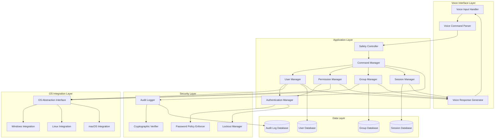
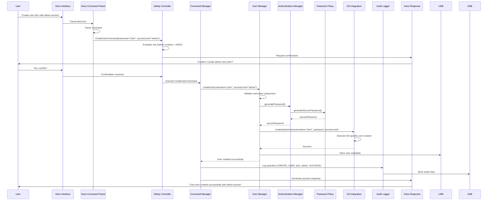
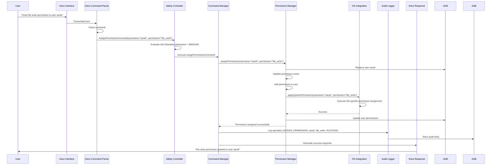
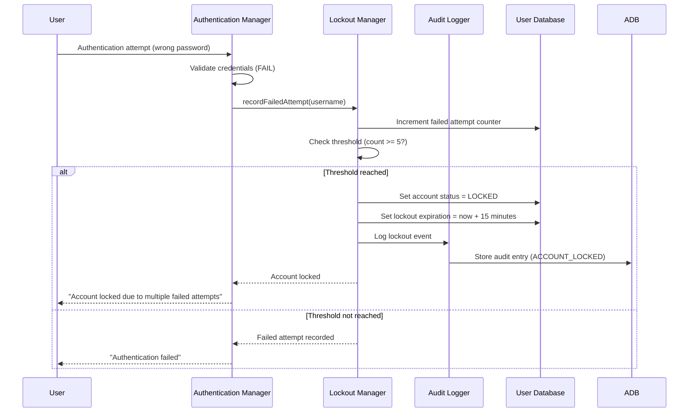

# Design Document: Jarvis System User Access

## Overview

The Jarvis System User Access feature provides comprehensive system-level user account management through voice commands in Bengali and English. This design implements a secure, multi-layered architecture that integrates voice command processing, user management logic, OS-specific authentication systems, and tamper-evident audit logging.

### Design Goals

1. **Security First**: Implement defense-in-depth with multiple security layers including authentication, authorization, audit logging, and safety confirmations
2. **Cross-Platform Compatibility**: Support Windows, Linux, and macOS user management through abstracted OS integration layer
3. **Bilingual Voice Interface**: Process commands in Bengali and English with natural language understanding
4. **Audit Trail Integrity**: Maintain tamper-evident logs with cryptographic verification
5. **Fail-Safe Operations**: Prevent accidental system damage through safety confirmations and validation
6. **Real-Time Performance**: Process voice commands and execute operations within 2 seconds for typical operations

### Key Design Decisions

1. **Layered Architecture**: Separate voice processing, business logic, and OS integration for maintainability and testability
2. **Command Pattern**: Use command objects for all user management operations to enable queuing, retry, and audit logging
3. **Strategy Pattern for OS Integration**: Abstract OS-specific implementations behind common interfaces
4. **Event-Driven Audit Logging**: Asynchronous logging to prevent blocking critical operations
5. **Cryptographic Audit Trail**: Use Merkle tree structure for tamper-evident log storage
6. **State Machine for Safety Confirmations**: Manage multi-step confirmation flows with timeout handling

## Architecture

### System Architecture Diagram



### Component Descriptions

#### Voice Interface Layer

**Voice Input Handler**
- Receives audio input from microphone or audio stream
- Performs speech-to-text conversion using speech recognition engine
- Detects language (Bengali vs English) from audio characteristics and initial keywords
- Passes transcribed text to Voice Command Parser

**Voice Command Parser**
- Parses natural language commands in Bengali and English
- Extracts command intent (create, modify, delete, query, etc.)
- Extracts command parameters (username, access level, permissions, etc.)
- Handles mixed-language commands and common variations
- Returns structured command objects

**Voice Response Generator**
- Converts operation results into natural language responses
- Generates responses in the same language as the input command
- Performs text-to-speech conversion for voice output
- Handles error messages and confirmation prompts

#### Application Layer

**Safety Controller**
- Evaluates operations for safety risk level (low, medium, high, critical)
- Enforces confirmation requirements based on risk level
- Manages confirmation state machines with timeout handling
- Validates confirmation responses match expected criteria
- Prevents operations that violate safety policies (e.g., deleting last admin)

**Command Manager**
- Receives parsed commands from Voice Command Parser
- Routes commands to appropriate managers (User, Permission, Group, Session)
- Implements command pattern for operation encapsulation
- Manages command queuing and retry logic
- Coordinates with Safety Controller for confirmation flows
- Triggers audit logging for all operations

**User Manager**
- Implements user account lifecycle operations (CRUD)
- Validates user data against business rules
- Coordinates with Authentication Manager for credential management
- Coordinates with OS Integration Layer for system account operations
- Manages user metadata and status

**Permission Manager**
- Implements permission assignment and revocation
- Manages access level definitions (Admin, Standard, Guest, Custom)
- Maps high-level access levels to granular permissions
- Enforces permission inheritance from groups
- Validates permission changes against security policies

**Group Manager**
- Implements group lifecycle operations (CRUD)
- Manages group membership (add/remove users)
- Coordinates with Permission Manager for group permissions
- Handles group deletion and membership cleanup

**Session Manager**
- Tracks active user sessions
- Implements session creation, validation, and termination
- Enforces session timeout policies (30 minutes inactivity)
- Provides session query and reporting capabilities
- Coordinates session termination with Authentication Manager

**Authentication Manager**
- Validates user credentials
- Generates and validates session tokens
- Coordinates with Password Policy Enforcer for password operations
- Coordinates with Lockout Manager for failed attempt tracking
- Synchronizes authentication state with OS Integration Layer

#### Security Layer

**Audit Logger**
- Records all user management operations asynchronously
- Implements tamper-evident log storage using Merkle tree structure
- Stores operation metadata (timestamp, operator, target, result, parameters)
- Provides log query and filtering capabilities
- Coordinates with Cryptographic Verifier for integrity checks

**Password Policy Enforcer**
- Validates passwords against complexity requirements
- Generates secure random passwords meeting policy requirements
- Enforces password expiration policies
- Prevents password reuse (stores hashed password history)
- Implements password strength scoring

**Lockout Manager**
- Tracks failed authentication attempts per user
- Activates account lockout after threshold (5 failed attempts)
- Implements automatic lockout expiration (15 minutes)
- Provides manual unlock capability
- Coordinates with Audit Logger for lockout events

**Cryptographic Verifier**
- Computes cryptographic hashes for audit log entries
- Maintains Merkle tree structure for log integrity
- Verifies log integrity on query operations
- Detects tampering attempts
- Uses SHA-256 for hashing

#### OS Integration Layer

**OS Abstraction Interface**
- Defines common interface for user management operations across operating systems
- Provides methods for: createUser, deleteUser, modifyUser, setPassword, assignPermissions
- Abstracts OS-specific user/group representations
- Handles OS-specific error codes and translates to common error types

**Windows Integration**
- Implements OS Abstraction Interface for Windows
- Uses Windows API (NetUserAdd, NetUserDel, NetUserSetInfo, etc.)
- Manages Windows user accounts and groups
- Maps access levels to Windows user groups (Administrators, Users, Guests)
- Handles Windows-specific permissions and ACLs

**Linux Integration**
- Implements OS Abstraction Interface for Linux
- Uses system commands (useradd, userdel, usermod, passwd, etc.) or PAM library
- Manages /etc/passwd, /etc/shadow, /etc/group
- Maps access levels to Linux groups (sudo, users, guests)
- Handles Linux-specific permissions and file ownership

**macOS Integration**
- Implements OS Abstraction Interface for macOS
- Uses dscl (Directory Service Command Line) utility
- Manages macOS user accounts and groups
- Maps access levels to macOS groups (admin, staff, guests)
- Handles macOS-specific permissions and ACLs

### Data Flow Diagrams

#### User Creation Flow



#### Permission Assignment Flow



#### Account Lockout Flow



## Components and Interfaces

### Voice Command Parser

**Interface:**
```python
class VoiceCommandParser:
    def parse(self, transcribed_text: str, detected_language: Language) -> Command:
        """
        Parse natural language command into structured Command object.
        
        Args:
            transcribed_text: The speech-to-text output
            detected_language: BENGALI or ENGLISH
            
        Returns:
            Command object with intent and parameters
            
        Raises:
            ParseException: If command cannot be understood
        """
        pass
    
    def detect_language(self, text: str) -> Language:
        """Detect command language from text characteristics."""
        pass
```

**Command Patterns:**

English patterns:
- "create user {username} with {access_level} access"
- "delete user {username}"
- "grant {permission} to {username}"
- "revoke {permission} from {username}"
- "add {username} to group {groupname}"
- "reset password for {username}"
- "list all users"
- "show permissions for {username}"

Bengali patterns:
- "ইউজার {username} তৈরি করো {access_level} অ্যাক্সেস দিয়ে"
- "ইউজার {username} ডিলিট করো"
- "{username} কে {permission} দাও"
- "{username} থেকে {permission} সরাও"
- "{username} কে {groupname} গ্রুপে যোগ করো"
- "{username} এর পাসওয়ার্ড রিসেট করো"
- "সব ইউজার দেখাও"
- "{username} এর পারমিশন দেখাও"

**Implementation Strategy:**
- Use regex patterns for command matching
- Support fuzzy matching for username/groupname parameters
- Handle common variations and synonyms
- Extract parameters using named capture groups
- Validate extracted parameters before creating Command objects

### Safety Controller

**Interface:**
```python
class SafetyController:
    def evaluate_risk(self, command: Command) -> RiskLevel:
        """Determine risk level of operation."""
        pass
    
    def requires_confirmation(self, command: Command) -> bool:
        """Check if operation requires user confirmation."""
        pass
    
    def request_confirmation(self, command: Command) -> ConfirmationRequest:
        """Generate confirmation request with timeout."""
        pass
    
    def validate_confirmation(self, request: ConfirmationRequest, 
                            response: str) -> bool:
        """Validate user's confirmation response."""
        pass
    
    def check_safety_policy(self, command: Command) -> PolicyViolation:
        """Check for safety policy violations."""
        pass
```

**Risk Levels:**
- **LOW**: Query operations, session listing
- **MEDIUM**: Standard user creation, permission assignment
- **HIGH**: Admin user creation, admin permission changes
- **CRITICAL**: User deletion, last admin modification, bulk operations

**Confirmation Requirements:**
- LOW: No confirmation required
- MEDIUM: Simple "yes/no" confirmation
- HIGH: Confirmation with parameter repetition (e.g., username)
- CRITICAL: Multi-step confirmation with explicit parameter repetition

**Safety Policies:**
- Prevent deletion of last admin account
- Prevent self-demotion from admin (unless other admin exists)
- Require confirmation for bulk operations (>5 users)
- Timeout confirmations after 30 seconds
- Log all confirmation requests and responses

### User Manager

**Interface:**
```python
class UserManager:
    def create_user(self, username: str, access_level: AccessLevel, 
                   initial_password: str = None) -> User:
        """Create new user account."""
        pass
    
    def delete_user(self, username: str) -> bool:
        """Delete user account and cleanup resources."""
        pass
    
    def modify_user(self, username: str, modifications: Dict) -> User:
        """Modify user attributes."""
        pass
    
    def get_user(self, username: str) -> User:
        """Retrieve user by username."""
        pass
    
    def list_users(self, filters: Dict = None) -> List[User]:
        """List users with optional filtering."""
        pass
    
    def user_exists(self, username: str) -> bool:
        """Check if username exists."""
        pass
```

**Validation Rules:**
- Username: 3-32 characters, alphanumeric + underscore/hyphen, must start with letter
- Username uniqueness: Case-insensitive check
- Access level: Must be one of [ADMIN, STANDARD, GUEST, CUSTOM]
- Initial password: Must meet Password Policy requirements if provided

### Permission Manager

**Interface:**
```python
class PermissionManager:
    def assign_permission(self, username: str, permission: Permission) -> bool:
        """Assign permission to user."""
        pass
    
    def revoke_permission(self, username: str, permission: Permission) -> bool:
        """Revoke permission from user."""
        pass
    
    def get_user_permissions(self, username: str) -> Set[Permission]:
        """Get all permissions for user (direct + inherited from groups)."""
        pass
    
    def set_access_level(self, username: str, access_level: AccessLevel) -> bool:
        """Set user's access level."""
        pass
    
    def get_access_level_permissions(self, access_level: AccessLevel) -> Set[Permission]:
        """Get permissions for an access level."""
        pass
```

**Permission Types:**
- **FILE_READ**: Read files and directories
- **FILE_WRITE**: Create, modify, delete files
- **FILE_EXECUTE**: Execute files and scripts
- **SYSTEM_COMMAND**: Execute system commands
- **NETWORK_ACCESS**: Access network resources
- **APP_INSTALL**: Install applications
- **USER_MANAGE**: Manage user accounts (admin only)
- **SYSTEM_CONFIG**: Modify system configuration (admin only)

**Access Level Mappings:**
- **ADMIN**: All permissions
- **STANDARD**: FILE_READ, FILE_WRITE, FILE_EXECUTE, NETWORK_ACCESS
- **GUEST**: FILE_READ (limited), NETWORK_ACCESS (limited)
- **CUSTOM**: Explicitly defined permission set

### Authentication Manager

**Interface:**
```python
class AuthenticationManager:
    def authenticate(self, username: str, password: str) -> Session:
        """Authenticate user and create session."""
        pass
    
    def validate_session(self, session_token: str) -> bool:
        """Validate active session."""
        pass
    
    def generate_password(self) -> str:
        """Generate secure random password."""
        pass
    
    def set_password(self, username: str, new_password: str) -> bool:
        """Set user password."""
        pass
    
    def hash_password(self, password: str) -> str:
        """Hash password using secure algorithm."""
        pass
    
    def verify_password(self, password: str, password_hash: str) -> bool:
        """Verify password against hash."""
        pass
```

**Password Hashing:**
- Algorithm: Argon2id (memory-hard, resistant to GPU attacks)
- Salt: 16 bytes random salt per password
- Iterations: 3 iterations
- Memory: 64 MB
- Parallelism: 4 threads

**Password Generation:**
- Length: 16 characters
- Character set: uppercase, lowercase, digits, special characters (!@#$%^&*()_+-=)
- Ensure at least one character from each category
- Use cryptographically secure random number generator (secrets module)

### Session Manager

**Interface:**
```python
class SessionManager:
    def create_session(self, username: str) -> Session:
        """Create new session for authenticated user."""
        pass
    
    def terminate_session(self, session_id: str) -> bool:
        """Terminate active session."""
        pass
    
    def terminate_user_sessions(self, username: str) -> int:
        """Terminate all sessions for user."""
        pass
    
    def get_active_sessions(self, username: str = None) -> List[Session]:
        """Get active sessions, optionally filtered by username."""
        pass
    
    def check_session_timeout(self, session_id: str) -> bool:
        """Check if session has timed out."""
        pass
    
    def update_session_activity(self, session_id: str) -> bool:
        """Update last activity timestamp."""
        pass
```

**Session Timeout Logic:**
- Inactivity timeout: 30 minutes
- Check timeout on each session validation
- Background task: Cleanup expired sessions every 5 minutes
- Update last_activity on any user action

### Audit Logger

**Interface:**
```python
class AuditLogger:
    def log_operation(self, operation: AuditOperation) -> str:
        """Log operation and return log entry ID."""
        pass
    
    def query_logs(self, filters: AuditFilter) -> List[AuditEntry]:
        """Query audit logs with filtering."""
        pass
    
    def verify_integrity(self, entry_id: str = None) -> bool:
        """Verify log integrity (single entry or entire log)."""
        pass
    
    def get_merkle_root(self) -> str:
        """Get current Merkle tree root hash."""
        pass
```

**Tamper-Evident Storage:**
- Each log entry includes: timestamp, operation_type, operator, target, parameters, result, previous_hash
- Compute entry_hash = SHA256(timestamp + operation_type + operator + target + parameters + result + previous_hash)
- Build Merkle tree from log entries
- Store Merkle root separately for integrity verification
- On query, verify chain integrity by recomputing hashes

## Data Models

### User Model

```python
@dataclass
class User:
    username: str
    user_id: str  # UUID
    access_level: AccessLevel
    password_hash: str
    created_at: datetime
    modified_at: datetime
    last_login: datetime
    status: UserStatus  # ACTIVE, LOCKED, DISABLED
    group_memberships: List[str]  # Group IDs
    direct_permissions: Set[Permission]
    password_expires_at: datetime
    failed_login_attempts: int
    lockout_until: datetime
    metadata: Dict[str, Any]  # Extensible metadata
```

### Group Model

```python
@dataclass
class Group:
    group_id: str  # UUID
    group_name: str
    description: str
    permissions: Set[Permission]
    members: List[str]  # User IDs
    created_at: datetime
    modified_at: datetime
    metadata: Dict[str, Any]
```

### Session Model

```python
@dataclass
class Session:
    session_id: str  # UUID
    user_id: str
    username: str
    session_token: str  # Cryptographically secure random token
    created_at: datetime
    last_activity: datetime
    expires_at: datetime
    ip_address: str
    user_agent: str
    status: SessionStatus  # ACTIVE, EXPIRED, TERMINATED
```

### Audit Entry Model

```python
@dataclass
class AuditEntry:
    entry_id: str  # UUID
    timestamp: datetime
    operation_type: OperationType  # CREATE_USER, DELETE_USER, ASSIGN_PERMISSION, etc.
    operator_id: str  # User ID of operator
    operator_username: str
    target_type: str  # USER, GROUP, SESSION, PERMISSION
    target_id: str
    target_name: str
    parameters: Dict[str, Any]  # Operation-specific parameters
    result: OperationResult  # SUCCESS, FAILURE, CANCELLED
    error_message: str  # If result = FAILURE
    previous_hash: str  # Hash of previous entry
    entry_hash: str  # Hash of this entry
    merkle_path: List[str]  # Path to Merkle root
```

### Command Model

```python
@dataclass
class Command:
    command_id: str  # UUID
    command_type: CommandType  # CREATE_USER, DELETE_USER, etc.
    parameters: Dict[str, Any]
    language: Language  # BENGALI, ENGLISH
    timestamp: datetime
    operator: str  # Username of operator
    risk_level: RiskLevel
    requires_confirmation: bool
    confirmation_state: ConfirmationState  # PENDING, CONFIRMED, DENIED, TIMEOUT
```

### Permission Model

```python
class Permission(Enum):
    FILE_READ = "file_read"
    FILE_WRITE = "file_write"
    FILE_EXECUTE = "file_execute"
    SYSTEM_COMMAND = "system_command"
    NETWORK_ACCESS = "network_access"
    APP_INSTALL = "app_install"
    USER_MANAGE = "user_manage"
    SYSTEM_CONFIG = "system_config"
```

### Access Level Model

```python
class AccessLevel(Enum):
    ADMIN = "admin"
    STANDARD = "standard"
    GUEST = "guest"
    CUSTOM = "custom"
```

## Data Models - Database Schema

### Users Table

```sql
CREATE TABLE users (
    user_id VARCHAR(36) PRIMARY KEY,
    username VARCHAR(32) UNIQUE NOT NULL,
    password_hash VARCHAR(255) NOT NULL,
    access_level VARCHAR(20) NOT NULL,
    status VARCHAR(20) NOT NULL DEFAULT 'ACTIVE',
    created_at TIMESTAMP NOT NULL DEFAULT CURRENT_TIMESTAMP,
    modified_at TIMESTAMP NOT NULL DEFAULT CURRENT_TIMESTAMP,
    last_login TIMESTAMP,
    password_expires_at TIMESTAMP,
    failed_login_attempts INTEGER DEFAULT 0,
    lockout_until TIMESTAMP,
    metadata JSON,
    INDEX idx_username (username),
    INDEX idx_status (status),
    INDEX idx_access_level (access_level)
);
```

### Groups Table

```sql
CREATE TABLE groups (
    group_id VARCHAR(36) PRIMARY KEY,
    group_name VARCHAR(64) UNIQUE NOT NULL,
    description TEXT,
    created_at TIMESTAMP NOT NULL DEFAULT CURRENT_TIMESTAMP,
    modified_at TIMESTAMP NOT NULL DEFAULT CURRENT_TIMESTAMP,
    metadata JSON,
    INDEX idx_group_name (group_name)
);
```

### Group Memberships Table

```sql
CREATE TABLE group_memberships (
    membership_id VARCHAR(36) PRIMARY KEY,
    user_id VARCHAR(36) NOT NULL,
    group_id VARCHAR(36) NOT NULL,
    added_at TIMESTAMP NOT NULL DEFAULT CURRENT_TIMESTAMP,
    FOREIGN KEY (user_id) REFERENCES users(user_id) ON DELETE CASCADE,
    FOREIGN KEY (group_id) REFERENCES groups(group_id) ON DELETE CASCADE,
    UNIQUE KEY unique_membership (user_id, group_id),
    INDEX idx_user_id (user_id),
    INDEX idx_group_id (group_id)
);
```

### User Permissions Table

```sql
CREATE TABLE user_permissions (
    permission_id VARCHAR(36) PRIMARY KEY,
    user_id VARCHAR(36) NOT NULL,
    permission VARCHAR(50) NOT NULL,
    granted_at TIMESTAMP NOT NULL DEFAULT CURRENT_TIMESTAMP,
    FOREIGN KEY (user_id) REFERENCES users(user_id) ON DELETE CASCADE,
    UNIQUE KEY unique_user_permission (user_id, permission),
    INDEX idx_user_id (user_id),
    INDEX idx_permission (permission)
);
```

### Group Permissions Table

```sql
CREATE TABLE group_permissions (
    permission_id VARCHAR(36) PRIMARY KEY,
    group_id VARCHAR(36) NOT NULL,
    permission VARCHAR(50) NOT NULL,
    granted_at TIMESTAMP NOT NULL DEFAULT CURRENT_TIMESTAMP,
    FOREIGN KEY (group_id) REFERENCES groups(group_id) ON DELETE CASCADE,
    UNIQUE KEY unique_group_permission (group_id, permission),
    INDEX idx_group_id (group_id),
    INDEX idx_permission (permission)
);
```

### Sessions Table

```sql
CREATE TABLE sessions (
    session_id VARCHAR(36) PRIMARY KEY,
    user_id VARCHAR(36) NOT NULL,
    session_token VARCHAR(255) UNIQUE NOT NULL,
    created_at TIMESTAMP NOT NULL DEFAULT CURRENT_TIMESTAMP,
    last_activity TIMESTAMP NOT NULL DEFAULT CURRENT_TIMESTAMP,
    expires_at TIMESTAMP NOT NULL,
    ip_address VARCHAR(45),
    user_agent TEXT,
    status VARCHAR(20) NOT NULL DEFAULT 'ACTIVE',
    FOREIGN KEY (user_id) REFERENCES users(user_id) ON DELETE CASCADE,
    INDEX idx_user_id (user_id),
    INDEX idx_session_token (session_token),
    INDEX idx_status (status),
    INDEX idx_expires_at (expires_at)
);
```

### Audit Log Table

```sql
CREATE TABLE audit_log (
    entry_id VARCHAR(36) PRIMARY KEY,
    timestamp TIMESTAMP NOT NULL DEFAULT CURRENT_TIMESTAMP,
    operation_type VARCHAR(50) NOT NULL,
    operator_id VARCHAR(36),
    operator_username VARCHAR(32),
    target_type VARCHAR(50),
    target_id VARCHAR(36),
    target_name VARCHAR(255),
    parameters JSON,
    result VARCHAR(20) NOT NULL,
    error_message TEXT,
    previous_hash VARCHAR(64),
    entry_hash VARCHAR(64) NOT NULL,
    merkle_path JSON,
    INDEX idx_timestamp (timestamp),
    INDEX idx_operation_type (operation_type),
    INDEX idx_operator_id (operator_id),
    INDEX idx_target_id (target_id),
    INDEX idx_result (result)
);
```

### Password History Table

```sql
CREATE TABLE password_history (
    history_id VARCHAR(36) PRIMARY KEY,
    user_id VARCHAR(36) NOT NULL,
    password_hash VARCHAR(255) NOT NULL,
    changed_at TIMESTAMP NOT NULL DEFAULT CURRENT_TIMESTAMP,
    FOREIGN KEY (user_id) REFERENCES users(user_id) ON DELETE CASCADE,
    INDEX idx_user_id (user_id),
    INDEX idx_changed_at (changed_at)
);
```


## Correctness Properties

*A property is a characteristic or behavior that should hold true across all valid executions of a system—essentially, a formal statement about what the system should do. Properties serve as the bridge between human-readable specifications and machine-verifiable correctness guarantees.*

### Property Reflection

After analyzing all acceptance criteria, I identified the following areas of redundancy:

1. **Audit Logging Properties**: Multiple criteria test audit logging for different operations (1.5, 2.4, 3.3, 4.5, 6.5, 8.5, 9.5, 10.1, 12.5). These can be consolidated into a single comprehensive property that all operations are logged with required fields.

2. **Permission Assignment/Revocation**: Criteria 4.1 and 4.2 test assignment and revocation separately, but these are inverse operations that can be tested together as a round-trip property.

3. **Group Membership**: Criteria 5.2 and 5.3 test adding and removing users from groups separately, similar to permissions, these can be combined.

4. **Session Creation and Termination**: Criteria 8.1 and 8.3 test session lifecycle separately, but can be combined into a comprehensive session lifecycle property.

5. **Bilingual Command Support**: Criteria 1.3, 11.1, 11.3 all test bilingual support in different contexts, these can be consolidated into a single property about language equivalence.

6. **Password Generation**: Criteria 1.6 and 6.1 both test password generation meeting policy requirements, these are redundant.

7. **User Query Operations**: Criteria 13.1, 13.2, 13.3 all test query/reporting functionality, these can be consolidated.

After consolidation, the unique properties are:

### Property 1: Voice Command Parameter Extraction

*For any* valid voice command in Bengali or English containing user management intent and parameters, the Voice_Command_Parser SHALL correctly extract the command type and all parameters (username, access level, permissions, group name, etc.) matching the original command intent.

**Validates: Requirements 1.1, 2.1, 11.1, 11.2, 11.4**

### Property 2: User Account Creation Completeness

*For any* user creation request with valid username and access level, the created User account SHALL contain all required fields (user_id, username, password_hash, access_level, created_at, modified_at, status) with valid values.

**Validates: Requirements 1.2**

### Property 3: Bilingual Command Equivalence

*For any* user management command, equivalent commands in Bengali and English SHALL produce identical results, and the system SHALL respond in the same language as the input command.

**Validates: Requirements 1.3, 11.1, 11.3, 11.5**

### Property 4: Username Uniqueness Enforcement

*For any* existing username, attempting to create another user with the same username (including case variations) SHALL be rejected with a conflict error.

**Validates: Requirements 1.4**

### Property 5: Password Policy Compliance

*For any* generated password (initial or reset), the password SHALL meet all Password_Policy requirements: minimum 12 characters, at least one uppercase letter, one lowercase letter, one digit, and one special character.

**Validates: Requirements 1.6, 6.1, 6.2**

### Property 6: User Modification Persistence

*For any* valid user modification request (access level, group membership, or account status), the modifications SHALL persist correctly and be retrievable in subsequent queries.

**Validates: Requirements 2.2**

### Property 7: Non-Existent User Error Handling

*For any* user management operation targeting a non-existent username, the system SHALL report an error and suggest similar existing usernames based on string similarity.

**Validates: Requirements 2.5**

### Property 8: Session Termination on User Deletion

*For any* user with active sessions, deleting the user SHALL terminate all active sessions for that user.

**Validates: Requirements 3.4**

### Property 9: Permission Assignment and Revocation Round-Trip

*For any* user and permission, assigning a permission then revoking it SHALL return the user to their original permission state (excluding the assigned permission).

**Validates: Requirements 4.1, 4.2**

### Property 10: Group Permission Inheritance

*For any* group with assigned permissions, all members of that group SHALL inherit those permissions in addition to their direct permissions.

**Validates: Requirements 5.4**

### Property 11: Group Deletion Cleanup

*For any* group with members, deleting the group SHALL remove all group memberships but preserve each user's direct permissions.

**Validates: Requirements 5.5**

### Property 12: Session Invalidation on Password Change

*For any* user with active sessions, changing the user's password SHALL invalidate all existing sessions for that user.

**Validates: Requirements 6.3**

### Property 13: Custom Access Level Permission Mapping

*For any* custom permission set, assigning a Custom access level with that permission set to a user SHALL result in the user having exactly those permissions (no more, no less).

**Validates: Requirements 7.5**

### Property 14: Session Creation Uniqueness

*For any* successful authentication, a new Session SHALL be created with a unique session_id and session_token that do not conflict with any existing sessions.

**Validates: Requirements 8.1**

### Property 15: Session Listing Completeness

*For any* set of active sessions, listing sessions SHALL return all active sessions with complete information (username, login time, session duration) and no duplicate or missing sessions.

**Validates: Requirements 8.2**

### Property 16: Account Lockout Rejection

*For any* user account with active Account_Lockout, all authentication attempts SHALL be rejected regardless of password correctness.

**Validates: Requirements 9.2**

### Property 17: Account Unlock State Reset

*For any* locked user account, unlocking the account SHALL deactivate the lockout and reset the failed attempt counter to zero.

**Validates: Requirements 9.4**

### Property 18: Comprehensive Audit Logging

*For any* user management operation (create, modify, delete, permission change, group operation, session operation, lockout event), the Audit_Logger SHALL record an entry containing all required fields: timestamp, operation_type, operator_id, operator_username, target_type, target_id, target_name, parameters, result, and entry_hash.

**Validates: Requirements 1.5, 2.4, 3.3, 4.5, 6.5, 8.5, 9.5, 10.1, 12.5**

### Property 19: Audit Log Integrity Verification

*For any* sequence of audit log entries, the cryptographic hash chain SHALL be valid, with each entry's previous_hash matching the previous entry's entry_hash, and the Merkle tree root SHALL be computable from all entries.

**Validates: Requirements 10.2**

### Property 20: Audit Log Query Filtering

*For any* audit log query with filters (date range, user, action type, operator), the returned results SHALL contain only entries matching all specified filter criteria, and SHALL contain all entries that match.

**Validates: Requirements 10.3, 10.5**

### Property 21: Password Audit Security

*For any* password-related operation (generation, reset, change), the audit log entry SHALL record the operation but SHALL NOT contain the actual password value in any field.

**Validates: Requirements 6.5**

### Property 22: Bulk Operation Confirmation Count

*For any* bulk operation affecting N users (where N > 1), the safety confirmation request SHALL include the correct count of affected users.

**Validates: Requirements 12.3**

### Property 23: User Query Completeness

*For any* user query (list all, describe specific, list permissions), the response SHALL contain all requested information with correct values and no missing or incorrect data.

**Validates: Requirements 13.1, 13.2, 13.3**

### Property 24: User List Filtering Accuracy

*For any* user list query with filters (access level, group membership, account status), the returned results SHALL contain only users matching all specified filter criteria, and SHALL contain all users that match.

**Validates: Requirements 13.4**

### Property 25: Error Message Clarity

*For any* failed operation, the error message SHALL contain specific information about the failure reason and SHALL be in the same language as the original command.

**Validates: Requirements 14.1, 14.3**

### Property 26: Parse Error Clarification

*For any* unparseable voice command, the system SHALL request clarification with suggested command formats in the same language as the original command.

**Validates: Requirements 14.3**

### Property 27: Command Synonym Equivalence

*For any* user management operation, using different synonyms or phrasings for the same operation SHALL produce equivalent results.

**Validates: Requirements 11.4**

### Property 28: Mixed Language Parameter Extraction

*For any* voice command containing mixed Bengali and English terms, the Voice_Command_Parser SHALL correctly extract all parameters regardless of which language each parameter is expressed in.

**Validates: Requirements 11.2**

### Property 29: Group Membership Round-Trip

*For any* user and group, adding the user to the group then removing them SHALL return the user to their original group membership state (excluding the specified group).

**Validates: Requirements 5.2, 5.3**

### Property 30: User Modification Audit Trail

*For any* user modification operation, the audit log entry SHALL contain both the previous values and new values for all modified fields.

**Validates: Requirements 2.4**


## Error Handling

### Error Classification

Errors are classified into four categories based on severity and recovery strategy:

#### 1. Validation Errors (Recoverable)
- **Cause**: Invalid input parameters (malformed username, weak password, invalid access level)
- **Handling**: Return error to user with specific validation failure reason
- **Recovery**: User can retry with corrected input
- **Logging**: Log validation failure in audit log
- **Examples**:
  - Username too short/long
  - Password doesn't meet policy
  - Invalid access level specified
  - Duplicate username

#### 2. Authorization Errors (Recoverable)
- **Cause**: Insufficient permissions to perform operation
- **Handling**: Return permission denied error with required permission
- **Recovery**: User can request permission or use different account
- **Logging**: Log authorization failure in audit log
- **Examples**:
  - Non-admin attempting to create admin user
  - User attempting to modify another user without USER_MANAGE permission
  - Attempting to delete last admin account

#### 3. Resource Errors (Potentially Recoverable)
- **Cause**: System resource unavailable (database connection, OS API failure)
- **Handling**: Retry with exponential backoff (3 attempts), then return error
- **Recovery**: Automatic retry, or user can retry later
- **Logging**: Log resource error with retry attempts
- **Examples**:
  - Database connection timeout
  - OS user management API failure
  - Disk full when writing audit log

#### 4. System Errors (Non-Recoverable)
- **Cause**: Critical system failure (corrupted database, OS incompatibility)
- **Handling**: Log error, notify administrator, return generic error to user
- **Recovery**: Requires administrator intervention
- **Logging**: Log critical error with full stack trace
- **Examples**:
  - Database corruption
  - Audit log integrity violation
  - OS user management system unavailable

### Error Handling Strategies

#### Voice Command Parsing Errors

```python
def handle_parse_error(transcribed_text: str, language: Language) -> VoiceResponse:
    """
    Handle unparseable voice commands.
    
    Strategy:
    1. Identify closest matching command pattern
    2. Generate clarification request with suggested format
    3. Provide examples in user's language
    4. Log parse failure for analysis
    """
    closest_pattern = find_closest_command_pattern(transcribed_text)
    suggestions = generate_command_suggestions(closest_pattern, language)
    
    return VoiceResponse(
        message=translate("I couldn't understand that command. Did you mean:", language),
        suggestions=suggestions,
        language=language
    )
```

#### OS Integration Errors

```python
def handle_os_error(operation: str, os_error: OSError) -> OperationResult:
    """
    Handle OS-specific errors with retry logic.
    
    Strategy:
    1. Classify OS error (transient vs permanent)
    2. For transient errors: retry with exponential backoff
    3. For permanent errors: return specific error message
    4. Log all OS errors with error code and message
    """
    if is_transient_error(os_error):
        return retry_with_backoff(operation, max_attempts=3)
    else:
        error_message = translate_os_error(os_error)
        audit_log.log_error(operation, os_error)
        return OperationResult(success=False, error=error_message)
```

#### Database Errors

```python
def handle_database_error(operation: str, db_error: DatabaseError) -> OperationResult:
    """
    Handle database errors with transaction rollback.
    
    Strategy:
    1. Rollback current transaction
    2. Check if error is transient (connection timeout, deadlock)
    3. For transient errors: retry operation
    4. For permanent errors: log and return error
    5. For integrity violations: return specific constraint error
    """
    transaction.rollback()
    
    if is_transient_db_error(db_error):
        return retry_operation(operation, max_attempts=3)
    elif is_integrity_violation(db_error):
        return OperationResult(success=False, error=get_constraint_error_message(db_error))
    else:
        log_critical_error(operation, db_error)
        return OperationResult(success=False, error="Database operation failed")
```

#### Audit Log Integrity Errors

```python
def handle_audit_integrity_error(entry_id: str, expected_hash: str, actual_hash: str):
    """
    Handle audit log integrity violations.
    
    Strategy:
    1. Log critical security event
    2. Notify administrator immediately
    3. Lock audit log for investigation
    4. Preserve evidence (current state, expected vs actual hashes)
    5. Prevent further operations until resolved
    """
    security_alert = SecurityAlert(
        severity=CRITICAL,
        type=AUDIT_TAMPERING,
        details={
            "entry_id": entry_id,
            "expected_hash": expected_hash,
            "actual_hash": actual_hash,
            "timestamp": datetime.now()
        }
    )
    
    notify_administrator(security_alert)
    lock_audit_log()
    preserve_evidence(entry_id)
    raise AuditIntegrityException("Audit log tampering detected")
```

### Error Recovery Patterns

#### Retry with Exponential Backoff

```python
def retry_with_backoff(operation: Callable, max_attempts: int = 3) -> OperationResult:
    """
    Retry operation with exponential backoff.
    
    Backoff schedule:
    - Attempt 1: immediate
    - Attempt 2: 1 second delay
    - Attempt 3: 2 seconds delay
    - Attempt 4: 4 seconds delay
    """
    for attempt in range(max_attempts):
        try:
            result = operation()
            if attempt > 0:
                audit_log.log_retry_success(operation, attempt)
            return result
        except TransientError as e:
            if attempt == max_attempts - 1:
                audit_log.log_retry_exhausted(operation, max_attempts)
                raise
            delay = 2 ** attempt
            time.sleep(delay)
            audit_log.log_retry_attempt(operation, attempt + 1, delay)
```

#### Graceful Degradation

```python
def handle_audit_log_unavailable(operation: AuditOperation) -> bool:
    """
    Handle audit log unavailability with graceful degradation.
    
    Strategy:
    1. Queue audit entry in memory
    2. Continue operation (don't block user operations)
    3. Background task retries writing to audit log
    4. If queue exceeds threshold, write to backup file
    5. Alert administrator if backup file is used
    """
    try:
        audit_log.write(operation)
        return True
    except AuditLogUnavailable:
        audit_queue.enqueue(operation)
        if audit_queue.size() > QUEUE_THRESHOLD:
            write_to_backup_file(audit_queue.drain())
            notify_administrator("Audit log backup file in use")
        return True  # Don't block operation
```

### Error Messages

Error messages follow these principles:
1. **Specific**: Clearly state what went wrong
2. **Actionable**: Suggest how to fix the problem
3. **Localized**: Provided in user's language (Bengali or English)
4. **Secure**: Don't expose sensitive system information

#### Example Error Messages

**English:**
- "Username 'ab' is too short. Usernames must be at least 3 characters."
- "Password does not meet requirements. Must include uppercase, lowercase, digit, and special character."
- "Cannot delete user 'admin' - this is the last administrator account."
- "User 'johndoe' not found. Did you mean 'john_doe' or 'jane_doe'?"
- "Permission denied. You need USER_MANAGE permission to create users."

**Bengali:**
- "ইউজারনেম 'ab' খুব ছোট। ইউজারনেম কমপক্ষে ৩ অক্ষরের হতে হবে।"
- "পাসওয়ার্ড প্রয়োজনীয়তা পূরণ করে না। বড় হাতের অক্ষর, ছোট হাতের অক্ষর, সংখ্যা এবং বিশেষ অক্ষর থাকতে হবে।"
- "ইউজার 'admin' ডিলিট করা যাবে না - এটি শেষ অ্যাডমিনিস্ট্রেটর অ্যাকাউন্ট।"
- "ইউজার 'johndoe' পাওয়া যায়নি। আপনি কি 'john_doe' বা 'jane_doe' বোঝাতে চেয়েছেন?"
- "অনুমতি নেই। ইউজার তৈরি করতে আপনার USER_MANAGE অনুমতি প্রয়োজন।"

## Testing Strategy

### Testing Approach

This feature requires a comprehensive testing strategy combining multiple testing methodologies:

1. **Property-Based Testing**: For pure logic components (parsing, validation, permission calculation)
2. **Unit Testing**: For specific scenarios and edge cases
3. **Integration Testing**: For OS integration and external dependencies
4. **End-to-End Testing**: For complete voice command workflows

### Property-Based Testing

**Library Selection**: 
- Python: Hypothesis
- JavaScript/TypeScript: fast-check
- Java: jqwik

**Configuration**:
- Minimum 100 iterations per property test
- Each test tagged with: `Feature: jarvis-system-user-access, Property {number}: {property_text}`
- Use shrinking to find minimal failing examples

**Property Test Examples**:

```python
from hypothesis import given, strategies as st
import pytest

# Property 1: Voice Command Parameter Extraction
@given(
    username=st.text(min_size=3, max_size=32, alphabet=st.characters(whitelist_categories=('Lu', 'Ll', 'Nd'))),
    access_level=st.sampled_from(['admin', 'standard', 'guest']),
    language=st.sampled_from([Language.ENGLISH, Language.BENGALI])
)
def test_voice_command_parameter_extraction(username, access_level, language):
    """
    Feature: jarvis-system-user-access, Property 1: Voice Command Parameter Extraction
    
    For any valid voice command in Bengali or English containing user management intent 
    and parameters, the Voice_Command_Parser SHALL correctly extract the command type 
    and all parameters.
    """
    # Generate command in specified language
    command_text = generate_create_user_command(username, access_level, language)
    
    # Parse command
    parser = VoiceCommandParser()
    command = parser.parse(command_text, language)
    
    # Verify extraction
    assert command.command_type == CommandType.CREATE_USER
    assert command.parameters['username'] == username
    assert command.parameters['access_level'] == access_level.upper()


# Property 4: Username Uniqueness Enforcement
@given(
    username=st.text(min_size=3, max_size=32, alphabet=st.characters(whitelist_categories=('Lu', 'Ll', 'Nd'))),
    case_variation=st.sampled_from(['upper', 'lower', 'mixed'])
)
def test_username_uniqueness_enforcement(username, case_variation):
    """
    Feature: jarvis-system-user-access, Property 4: Username Uniqueness Enforcement
    
    For any existing username, attempting to create another user with the same username 
    (including case variations) SHALL be rejected with a conflict error.
    """
    user_manager = UserManager()
    
    # Create first user
    user1 = user_manager.create_user(username, AccessLevel.STANDARD)
    assert user1 is not None
    
    # Attempt to create duplicate with case variation
    duplicate_username = apply_case_variation(username, case_variation)
    
    with pytest.raises(UsernameConflictError):
        user_manager.create_user(duplicate_username, AccessLevel.STANDARD)


# Property 5: Password Policy Compliance
@given(st.integers(min_value=1, max_value=1000))
def test_password_policy_compliance(seed):
    """
    Feature: jarvis-system-user-access, Property 5: Password Policy Compliance
    
    For any generated password (initial or reset), the password SHALL meet all 
    Password_Policy requirements: minimum 12 characters, at least one uppercase letter, 
    one lowercase letter, one digit, and one special character.
    """
    auth_manager = AuthenticationManager()
    password = auth_manager.generate_password()
    
    # Verify policy compliance
    assert len(password) >= 12
    assert any(c.isupper() for c in password)
    assert any(c.islower() for c in password)
    assert any(c.isdigit() for c in password)
    assert any(c in '!@#$%^&*()_+-=' for c in password)


# Property 9: Permission Assignment and Revocation Round-Trip
@given(
    username=st.text(min_size=3, max_size=32, alphabet=st.characters(whitelist_categories=('Lu', 'Ll', 'Nd'))),
    permission=st.sampled_from(list(Permission))
)
def test_permission_round_trip(username, permission):
    """
    Feature: jarvis-system-user-access, Property 9: Permission Assignment and Revocation Round-Trip
    
    For any user and permission, assigning a permission then revoking it SHALL return 
    the user to their original permission state.
    """
    user_manager = UserManager()
    permission_manager = PermissionManager()
    
    # Create user
    user = user_manager.create_user(username, AccessLevel.STANDARD)
    
    # Get initial permissions
    initial_permissions = permission_manager.get_user_permissions(username)
    
    # Assign permission
    permission_manager.assign_permission(username, permission)
    
    # Verify permission added
    assert permission in permission_manager.get_user_permissions(username)
    
    # Revoke permission
    permission_manager.revoke_permission(username, permission)
    
    # Verify back to initial state
    final_permissions = permission_manager.get_user_permissions(username)
    assert final_permissions == initial_permissions


# Property 19: Audit Log Integrity Verification
@given(
    operations=st.lists(
        st.builds(AuditOperation,
            operation_type=st.sampled_from(list(OperationType)),
            operator_id=st.uuids(),
            target_id=st.uuids()
        ),
        min_size=1,
        max_size=100
    )
)
def test_audit_log_integrity(operations):
    """
    Feature: jarvis-system-user-access, Property 19: Audit Log Integrity Verification
    
    For any sequence of audit log entries, the cryptographic hash chain SHALL be valid, 
    with each entry's previous_hash matching the previous entry's entry_hash.
    """
    audit_logger = AuditLogger()
    
    # Log all operations
    entry_ids = [audit_logger.log_operation(op) for op in operations]
    
    # Verify integrity
    assert audit_logger.verify_integrity() == True
    
    # Verify hash chain
    entries = [audit_logger.get_entry(eid) for eid in entry_ids]
    for i in range(1, len(entries)):
        assert entries[i].previous_hash == entries[i-1].entry_hash
    
    # Verify Merkle root computable
    merkle_root = audit_logger.get_merkle_root()
    assert merkle_root is not None
    assert len(merkle_root) == 64  # SHA-256 hex string
```

### Unit Testing

Unit tests focus on specific scenarios, edge cases, and error conditions:

**Test Categories**:

1. **Safety Controller Tests**
   - Test confirmation requirements for each risk level
   - Test last admin deletion prevention
   - Test confirmation timeout handling
   - Test bulk operation thresholds

2. **Access Level Tests**
   - Test each access level grants correct permissions
   - Test custom access level with various permission sets
   - Test access level enforcement on operations

3. **Account Lockout Tests**
   - Test lockout triggers at 5 failed attempts
   - Test lockout doesn't trigger at 4 failed attempts
   - Test lockout expiration after 15 minutes
   - Test manual unlock resets counter

4. **Session Timeout Tests**
   - Test session expires after 30 minutes inactivity
   - Test session activity updates prevent timeout
   - Test background cleanup of expired sessions

5. **OS Integration Tests** (per OS)
   - Test user creation on Windows/Linux/macOS
   - Test password synchronization
   - Test permission mapping to OS groups
   - Test user deletion cleanup

**Example Unit Tests**:

```python
def test_last_admin_deletion_prevented():
    """Test that deleting the last admin account is prevented."""
    user_manager = UserManager()
    safety_controller = SafetyController()
    
    # Create single admin user
    admin = user_manager.create_user("admin", AccessLevel.ADMIN)
    
    # Attempt to delete
    command = DeleteUserCommand(username="admin")
    
    # Should fail safety check
    violation = safety_controller.check_safety_policy(command)
    assert violation is not None
    assert violation.type == PolicyViolationType.LAST_ADMIN_DELETION


def test_account_lockout_at_threshold():
    """Test account locks after 5 failed attempts."""
    auth_manager = AuthenticationManager()
    lockout_manager = LockoutManager()
    
    # Create user
    user = create_test_user("testuser")
    
    # 4 failed attempts - should not lock
    for i in range(4):
        with pytest.raises(AuthenticationError):
            auth_manager.authenticate("testuser", "wrongpassword")
    
    assert not lockout_manager.is_locked("testuser")
    
    # 5th failed attempt - should lock
    with pytest.raises(AuthenticationError):
        auth_manager.authenticate("testuser", "wrongpassword")
    
    assert lockout_manager.is_locked("testuser")


def test_session_timeout_after_inactivity():
    """Test session expires after 30 minutes of inactivity."""
    session_manager = SessionManager()
    
    # Create session
    session = session_manager.create_session("testuser")
    
    # Simulate 29 minutes - should still be valid
    with freeze_time(datetime.now() + timedelta(minutes=29)):
        assert session_manager.check_session_timeout(session.session_id) == False
    
    # Simulate 31 minutes - should be expired
    with freeze_time(datetime.now() + timedelta(minutes=31)):
        assert session_manager.check_session_timeout(session.session_id) == True
```

### Integration Testing

Integration tests verify OS integration and external dependencies:

**Test Scenarios**:

1. **Windows Integration**
   - Create user via Windows API
   - Verify user appears in Windows user management
   - Set password and verify authentication works
   - Assign to Administrators group and verify permissions
   - Delete user and verify cleanup

2. **Linux Integration**
   - Create user via useradd/PAM
   - Verify user in /etc/passwd
   - Set password and verify authentication
   - Add to sudo group and verify permissions
   - Delete user and verify cleanup

3. **macOS Integration**
   - Create user via dscl
   - Verify user in Directory Service
   - Set password and verify authentication
   - Add to admin group and verify permissions
   - Delete user and verify cleanup

4. **Database Integration**
   - Test transaction rollback on errors
   - Test concurrent access handling
   - Test connection pool management
   - Test query performance with large datasets

**Example Integration Tests**:

```python
@pytest.mark.integration
@pytest.mark.skipif(platform.system() != 'Windows', reason="Windows only")
def test_windows_user_creation():
    """Test user creation integrates with Windows user management."""
    os_integration = WindowsIntegration()
    
    # Create user
    result = os_integration.create_user(
        username="testuser",
        password="SecurePass123!",
        access_level=AccessLevel.STANDARD
    )
    
    assert result.success == True
    
    # Verify user exists in Windows
    import win32net
    try:
        user_info = win32net.NetUserGetInfo(None, "testuser", 1)
        assert user_info['name'] == "testuser"
    finally:
        # Cleanup
        win32net.NetUserDel(None, "testuser")


@pytest.mark.integration
def test_audit_log_database_persistence():
    """Test audit entries persist correctly to database."""
    audit_logger = AuditLogger()
    
    # Create test operation
    operation = AuditOperation(
        operation_type=OperationType.CREATE_USER,
        operator_id="test-operator",
        target_id="test-user"
    )
    
    # Log operation
    entry_id = audit_logger.log_operation(operation)
    
    # Query from database
    entries = audit_logger.query_logs(AuditFilter(entry_id=entry_id))
    
    assert len(entries) == 1
    assert entries[0].operation_type == OperationType.CREATE_USER
    assert entries[0].operator_id == "test-operator"
```

### End-to-End Testing

End-to-end tests verify complete voice command workflows:

**Test Scenarios**:

1. Complete user creation flow (voice → parse → safety → execute → audit → response)
2. User modification with confirmation flow
3. User deletion with safety checks
4. Permission assignment and verification
5. Group management workflow
6. Password reset workflow
7. Session management workflow
8. Account lockout and unlock workflow

**Example E2E Test**:

```python
@pytest.mark.e2e
def test_complete_user_creation_workflow():
    """Test complete user creation from voice command to response."""
    jarvis = JarvisSystem()
    
    # Simulate voice input
    audio_input = generate_audio("Create user john with admin access")
    
    # Process command
    response = jarvis.process_voice_command(audio_input)
    
    # Should request confirmation (admin creation)
    assert "confirm" in response.text.lower()
    
    # Provide confirmation
    confirmation_audio = generate_audio("Yes, confirm")
    response = jarvis.process_voice_command(confirmation_audio)
    
    # Should confirm success
    assert "created successfully" in response.text.lower()
    
    # Verify user exists
    user_manager = jarvis.get_user_manager()
    user = user_manager.get_user("john")
    assert user is not None
    assert user.access_level == AccessLevel.ADMIN
    
    # Verify audit log
    audit_logger = jarvis.get_audit_logger()
    entries = audit_logger.query_logs(AuditFilter(
        operation_type=OperationType.CREATE_USER,
        target_name="john"
    ))
    assert len(entries) == 1
```

### Performance Testing

**Performance Requirements**:
- Voice command processing: < 2 seconds (95th percentile)
- User creation: < 1 second
- Permission query: < 100ms
- Audit log query: < 500ms for last 1000 entries
- Session validation: < 50ms

**Load Testing Scenarios**:
- 100 concurrent voice commands
- 1000 users in system
- 10,000 audit log entries
- 100 active sessions

### Test Coverage Goals

- **Line Coverage**: > 90%
- **Branch Coverage**: > 85%
- **Property Test Coverage**: All 30 correctness properties
- **Integration Test Coverage**: All OS-specific operations on each supported OS
- **E2E Test Coverage**: All major user workflows


## Security Considerations

### Authentication Security

**Password Storage**:
- Use Argon2id for password hashing (memory-hard, GPU-resistant)
- Generate unique 16-byte salt per password
- Store only hash, never plaintext
- Maintain password history (last 5 passwords) to prevent reuse

**Session Security**:
- Generate cryptographically secure random session tokens (32 bytes)
- Store session tokens hashed in database
- Implement session timeout (30 minutes inactivity)
- Invalidate all sessions on password change
- Include IP address and user agent in session for anomaly detection

**Account Lockout**:
- Lock account after 5 failed authentication attempts
- Automatic unlock after 15 minutes
- Manual unlock requires admin privileges
- Log all lockout events for security monitoring

### Authorization Security

**Permission Enforcement**:
- Check permissions at every operation entry point
- Use deny-by-default approach (explicit permission required)
- Validate permission inheritance from groups correctly
- Prevent privilege escalation through group manipulation

**Safety Policies**:
- Prevent deletion of last admin account
- Require confirmation for admin privilege changes
- Require confirmation for user deletion
- Require confirmation for bulk operations (>5 users)
- Timeout confirmations after 30 seconds

### Audit Security

**Tamper-Evident Logging**:
- Use cryptographic hash chain (SHA-256)
- Build Merkle tree for efficient integrity verification
- Store Merkle root separately for verification
- Detect tampering through hash chain validation
- Alert administrator on integrity violations

**Audit Content**:
- Log all user management operations
- Include timestamp, operator, target, parameters, result
- Never log passwords or sensitive credentials
- Log failed operations and authorization denials
- Log safety policy violations and confirmations

### Input Validation

**Voice Command Validation**:
- Sanitize all extracted parameters
- Validate username format (3-32 chars, alphanumeric + underscore/hyphen)
- Validate access level against allowed values
- Validate permission names against defined permissions
- Prevent command injection through parameter sanitization

**SQL Injection Prevention**:
- Use parameterized queries exclusively
- Never concatenate user input into SQL
- Use ORM with built-in SQL injection protection
- Validate all input before database operations

### OS Integration Security

**Privilege Separation**:
- Run Jarvis with minimum required privileges
- Use OS-specific privilege escalation only when needed (sudo, runas)
- Drop privileges after privileged operations
- Audit all privilege escalation events

**Command Injection Prevention**:
- Never execute shell commands with user input directly
- Use OS API calls instead of shell commands where possible
- If shell commands required, use parameterized execution
- Validate and sanitize all parameters

### Network Security

**API Security** (if exposing API):
- Use HTTPS exclusively
- Implement rate limiting
- Use API authentication tokens
- Validate all API inputs
- Log all API access

### Data Protection

**Sensitive Data Handling**:
- Encrypt sensitive data at rest (database encryption)
- Use secure communication channels (TLS)
- Minimize sensitive data retention
- Implement secure deletion (overwrite, not just delete)

**Privacy**:
- Log only necessary information
- Implement data retention policies (90 days for audit logs)
- Provide audit log query capabilities for compliance
- Support data export for user rights requests

## Implementation Notes

### Technology Stack Recommendations

**Core Application**:
- Language: Python 3.10+ (for type hints, async support)
- Framework: FastAPI (for potential API exposure)
- Database: PostgreSQL 14+ (for JSON support, reliability)
- ORM: SQLAlchemy 2.0+ (for type safety, async support)

**Voice Processing**:
- Speech-to-Text: Google Speech-to-Text API or Whisper (OpenAI)
- Text-to-Speech: Google Text-to-Speech API or Coqui TTS
- NLP: spaCy or NLTK for command parsing
- Language Detection: langdetect or fastText

**Security**:
- Password Hashing: argon2-cffi
- Cryptography: cryptography library (for hashing, encryption)
- Session Management: itsdangerous (for secure tokens)

**OS Integration**:
- Windows: pywin32 (for Windows API)
- Linux: python-pam or subprocess (for useradd/usermod)
- macOS: subprocess (for dscl commands)

**Testing**:
- Property Testing: Hypothesis
- Unit Testing: pytest
- Mocking: pytest-mock
- Coverage: pytest-cov

### Development Phases

**Phase 1: Core Infrastructure (2 weeks)**
- Database schema and models
- Basic CRUD operations for users, groups, permissions
- Authentication and session management
- Audit logging infrastructure

**Phase 2: Voice Interface (2 weeks)**
- Voice command parser (English only initially)
- Voice response generator
- Command routing and execution
- Basic error handling

**Phase 3: Security Features (1 week)**
- Safety controller and confirmation flows
- Account lockout implementation
- Password policy enforcement
- Audit log integrity verification

**Phase 4: OS Integration (2 weeks)**
- Windows integration
- Linux integration
- macOS integration
- Cross-platform testing

**Phase 5: Bengali Support (1 week)**
- Bengali command patterns
- Bengali response templates
- Mixed-language support
- Bilingual testing

**Phase 6: Advanced Features (1 week)**
- Group management
- Custom access levels
- Bulk operations
- Advanced querying

**Phase 7: Testing and Hardening (2 weeks)**
- Property-based testing implementation
- Integration testing
- End-to-end testing
- Security testing and penetration testing
- Performance testing and optimization

### Deployment Considerations

**System Requirements**:
- OS: Windows 10+, Ubuntu 20.04+, macOS 11+
- Python: 3.10+
- Database: PostgreSQL 14+
- Memory: 2GB minimum, 4GB recommended
- Disk: 1GB for application, 10GB for audit logs

**Installation**:
- Package as Python wheel or executable
- Include database migration scripts
- Provide configuration templates
- Include systemd/launchd service files

**Configuration**:
- Database connection settings
- Voice API credentials
- Password policy parameters
- Session timeout settings
- Audit log retention period
- OS-specific settings

**Monitoring**:
- Log all operations to application log
- Monitor audit log integrity
- Track failed authentication attempts
- Monitor system resource usage
- Alert on security events

### Maintenance and Operations

**Backup**:
- Daily database backups
- Audit log backups (separate from main database)
- Configuration backups
- Backup retention: 30 days

**Updates**:
- Regular security updates
- Database schema migrations
- Backward compatibility for voice commands
- Audit log format versioning

**Troubleshooting**:
- Detailed error logging
- Debug mode for development
- Audit log query tools
- System health check commands

## Performance Optimization

### Database Optimization

**Indexing Strategy**:
- Index on username (unique, frequent lookups)
- Index on user_id (foreign key references)
- Index on session_token (session validation)
- Index on audit log timestamp (time-range queries)
- Composite index on (operation_type, timestamp) for audit queries

**Query Optimization**:
- Use connection pooling (10-20 connections)
- Implement query result caching for permission lookups
- Use batch operations for bulk user operations
- Optimize audit log queries with pagination

### Caching Strategy

**Permission Cache**:
- Cache user permissions for 5 minutes
- Invalidate on permission changes
- Use LRU cache with 1000 entry limit

**Session Cache**:
- Cache active sessions in memory
- Sync with database every 30 seconds
- Invalidate on session termination

**User Cache**:
- Cache user objects for 5 minutes
- Invalidate on user modifications
- Use LRU cache with 500 entry limit

### Async Operations

**Background Tasks**:
- Audit log writing (async, non-blocking)
- Session cleanup (every 5 minutes)
- Password expiration checks (daily)
- Audit log integrity verification (hourly)

**Async I/O**:
- Use async database operations
- Use async voice API calls
- Use async OS integration where possible

## Scalability Considerations

### Horizontal Scaling

**Stateless Design**:
- Store all state in database
- Use shared session storage (Redis)
- Avoid in-memory state

**Load Balancing**:
- Support multiple Jarvis instances
- Use database for coordination
- Implement distributed locking for critical operations

### Vertical Scaling

**Resource Limits**:
- Support up to 10,000 users
- Support up to 1,000 concurrent sessions
- Support up to 1,000,000 audit log entries
- Support up to 100 concurrent voice commands

### Data Archival

**Audit Log Archival**:
- Archive logs older than 90 days
- Compress archived logs
- Store in cold storage
- Maintain integrity chain across archives

## Compliance and Standards

### Regulatory Compliance

**GDPR Compliance** (if applicable):
- Right to access: Provide audit log query
- Right to erasure: Implement user data deletion
- Data portability: Export user data in JSON format
- Consent management: Log consent for data processing

**SOC 2 Compliance** (if applicable):
- Access control: Implement role-based access
- Audit logging: Comprehensive audit trail
- Data encryption: Encrypt sensitive data
- Incident response: Alert on security events

### Security Standards

**OWASP Top 10**:
- Injection: Use parameterized queries
- Broken Authentication: Implement secure authentication
- Sensitive Data Exposure: Encrypt sensitive data
- XML External Entities: Not applicable (no XML processing)
- Broken Access Control: Implement permission checks
- Security Misconfiguration: Secure default configuration
- Cross-Site Scripting: Not applicable (no web interface)
- Insecure Deserialization: Validate all input
- Using Components with Known Vulnerabilities: Regular updates
- Insufficient Logging & Monitoring: Comprehensive audit logging

### Password Standards

**NIST 800-63B**:
- Minimum 12 characters (exceeds NIST minimum of 8)
- No composition rules enforced (but recommended)
- Check against common password lists
- No periodic password changes required
- Support password managers

## Future Enhancements

### Potential Features

1. **Multi-Factor Authentication**
   - TOTP support (Google Authenticator, Authy)
   - SMS verification
   - Biometric authentication

2. **Advanced Audit Analytics**
   - Anomaly detection in user behavior
   - Security event correlation
   - Compliance reporting dashboards

3. **Role-Based Access Control (RBAC)**
   - Define custom roles
   - Role hierarchy
   - Role templates

4. **Integration with External Identity Providers**
   - LDAP/Active Directory integration
   - OAuth 2.0 / OpenID Connect
   - SAML 2.0

5. **Advanced Voice Features**
   - Speaker identification
   - Voice biometric authentication
   - Natural conversation flow

6. **Mobile Support**
   - Mobile app for voice commands
   - Push notifications for security events
   - Remote user management

7. **Workflow Automation**
   - User provisioning workflows
   - Approval workflows for sensitive operations
   - Scheduled operations

8. **Advanced Reporting**
   - User activity reports
   - Permission audit reports
   - Compliance reports
   - Security incident reports

## Conclusion

This design provides a comprehensive, secure, and scalable solution for system user access management through voice commands. The architecture separates concerns effectively, enabling maintainability and testability. The security measures ensure protection against common threats while maintaining usability. The property-based testing approach ensures correctness across a wide range of inputs, while integration testing validates OS-specific functionality.

Key strengths of this design:
- **Security-first approach** with multiple layers of protection
- **Cross-platform support** through abstracted OS integration
- **Bilingual voice interface** supporting Bengali and English
- **Tamper-evident audit logging** for compliance and forensics
- **Comprehensive testing strategy** combining property-based, unit, integration, and E2E testing
- **Scalable architecture** supporting growth and future enhancements

The implementation phases provide a clear roadmap for development, with core infrastructure first, followed by voice interface, security features, OS integration, and finally advanced features and testing.

