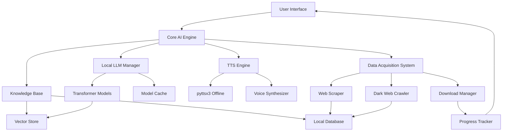
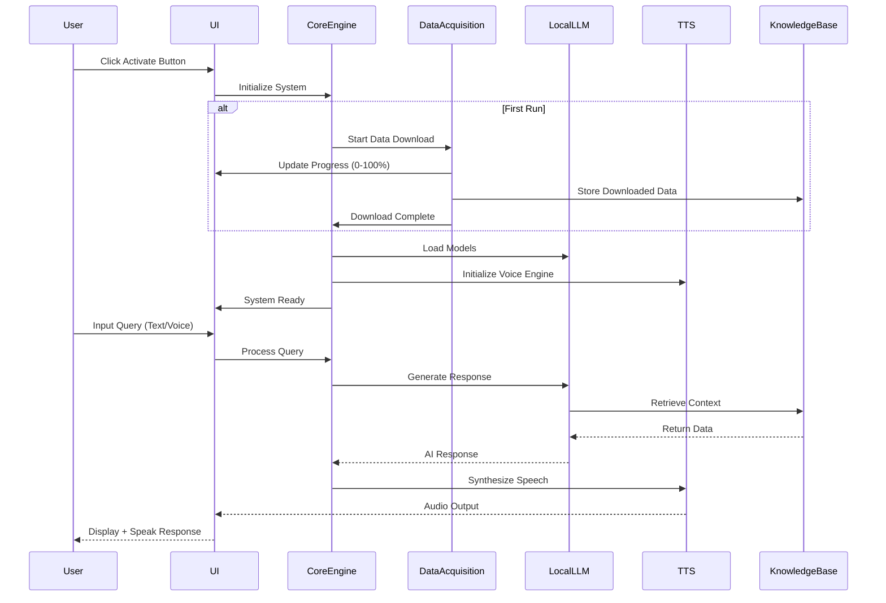

# Design Document: Offline Super AI (JARVIS)

## Overview

This document describes the technical design for an offline JARVIS system that operates without any API keys while providing super AI capabilities. The system combines local language models, offline text-to-speech, web scraping for data acquisition, and a one-click activation mechanism. The architecture enables advanced AI reasoning, code generation, Bengali and English voice synthesis, and internet data downloading (including dark web access) with all data stored locally for offline operation.

The system is designed as a self-contained AI assistant that downloads necessary data once during initialization, then operates completely offline. It provides natural language understanding, voice interaction, system automation, and intelligent task execution without depending on external API services.

## Architecture



## Main Algorithm/Workflow



## Components and Interfaces

### Component 1: Core AI Engine

**Purpose**: Orchestrates all system components and manages the main AI processing pipeline

**Interface**:
```python
class CoreAIEngine:
    def initialize(self, first_run: bool) -> InitializationResult
    def process_query(self, query: str, language: str) -> AIResponse
    def execute_task(self, task: Task) -> TaskResult
    def generate_code(self, specification: str) -> CodeOutput
    def shutdown(self) -> None
```

**Responsibilities**:
- Coordinate between all subsystems
- Manage system lifecycle (initialization, operation, shutdown)
- Route queries to appropriate handlers
- Maintain system state and context

### Component 2: Local LLM Manager

**Purpose**: Manages offline language models for natural language understanding and generation

**Interface**:
```python
class LocalLLMManager:
    def load_models(self, model_paths: List[str]) -> bool
    def generate_response(self, prompt: str, context: Context) -> str
    def embed_text(self, text: str) -> Vector
    def fine_tune(self, training_data: Dataset) -> None
    def get_model_info(self) -> ModelInfo
```

**Responsibilities**:
- Load and manage transformer models (GPT-J, LLaMA, Mistral)
- Generate intelligent responses without API calls
- Create text embeddings for semantic search
- Support model fine-tuning on local data

### Component 3: TTS Engine

**Purpose**: Provides offline text-to-speech in Bengali and English

**Interface**:
```python
class TTSEngine:
    def initialize(self, languages: List[str]) -> bool
    def speak(self, text: str, language: str, voice: str) -> AudioOutput
    def set_voice_properties(self, rate: int, volume: float) -> None
    def get_available_voices(self) -> List[Voice]
    def save_audio(self, text: str, filepath: str) -> bool
```

**Responsibilities**:
- Synthesize speech from text offline
- Support Bengali (বাংলা) and English languages
- Manage voice properties (speed, volume, pitch)
- Generate audio files for responses

### Component 4: Data Acquisition System

**Purpose**: Downloads and stores data from internet sources including dark web

**Interface**:
```python
class DataAcquisitionSystem:
    def start_download(self, sources: List[DataSource]) -> DownloadSession
    def get_progress(self) -> ProgressInfo
    def scrape_web(self, urls: List[str]) -> ScrapedData
    def access_dark_web(self, onion_urls: List[str]) -> DarkWebData
    def store_data(self, data: Any, category: str) -> bool
```

**Responsibilities**:
- Download training data and knowledge bases
- Scrape web content for knowledge enrichment
- Access dark web resources via Tor integration
- Track download progress with percentage updates
- Store all data in local database

### Component 5: Knowledge Base

**Purpose**: Stores and retrieves all downloaded data for offline access

**Interface**:
```python
class KnowledgeBase:
    def store(self, data: Any, metadata: Dict) -> str
    def retrieve(self, query: str, top_k: int) -> List[Document]
    def update(self, doc_id: str, data: Any) -> bool
    def delete(self, doc_id: str) -> bool
    def search_semantic(self, vector: Vector, threshold: float) -> List[Document]
```

**Responsibilities**:
- Persist downloaded data locally
- Enable fast semantic search
- Maintain vector embeddings
- Support CRUD operations on knowledge

### Component 6: UI Controller

**Purpose**: Manages user interface with data loading button and progress display

**Interface**:
```python
class UIController:
    def show_activation_button(self) -> None
    def update_progress(self, percentage: float, message: str) -> None
    def display_response(self, response: AIResponse) -> None
    def get_user_input(self) -> UserInput
    def show_error(self, error: Error) -> None
```

**Responsibilities**:
- Render activation button for first run
- Display download progress (0-100%)
- Show AI responses with text and audio
- Handle user interactions

## Data Models

### Model 1: AIResponse

```python
class AIResponse:
    text: str
    language: str
    confidence: float
    audio_path: Optional[str]
    metadata: Dict[str, Any]
    timestamp: datetime
```

**Validation Rules**:
- text must be non-empty string
- language must be 'en' or 'bn'
- confidence must be between 0.0 and 1.0
- timestamp must be valid datetime

### Model 2: DownloadSession

```python
class DownloadSession:
    session_id: str
    sources: List[DataSource]
    progress: float  # 0.0 to 100.0
    status: DownloadStatus  # PENDING, IN_PROGRESS, COMPLETED, FAILED
    downloaded_bytes: int
    total_bytes: int
    start_time: datetime
    end_time: Optional[datetime]
```

**Validation Rules**:
- progress must be between 0.0 and 100.0
- downloaded_bytes must be <= total_bytes
- status must be valid enum value
- session_id must be unique UUID

### Model 3: Task

```python
class Task:
    task_id: str
    task_type: TaskType  # CODE_GEN, SYSTEM_AUTOMATION, QUERY, LEARNING
    description: str
    parameters: Dict[str, Any]
    priority: int
    status: TaskStatus
    result: Optional[TaskResult]
```

**Validation Rules**:
- task_id must be unique
- task_type must be valid enum
- priority must be between 1 and 10
- description must be non-empty

### Model 4: ModelInfo

```python
class ModelInfo:
    model_name: str
    model_type: str  # GPT, LLAMA, MISTRAL
    parameters: int  # Number of parameters (e.g., 7B, 13B)
    quantization: str  # INT8, INT4, FP16
    memory_usage: int  # MB
    loaded: bool
```

**Validation Rules**:
- parameters must be positive integer
- memory_usage must be positive
- quantization must be valid format

## Algorithmic Pseudocode

### Main Processing Algorithm

```pascal
ALGORITHM processMainWorkflow(userInput)
INPUT: userInput of type UserInput
OUTPUT: result of type AIResponse

BEGIN
  ASSERT validateInput(userInput) = true
  
  // Step 1: Initialize processing state
  context ← retrieveContext(userInput.session_id)
  language ← detectLanguage(userInput.text)
  
  // Step 2: Process query through LLM
  prompt ← buildPrompt(userInput.text, context)
  knowledgeDocs ← knowledgeBase.retrieve(userInput.text, top_k=5)
  
  ASSERT knowledgeDocs IS NOT NULL
  
  enrichedPrompt ← enrichPrompt(prompt, knowledgeDocs)
  aiResponse ← localLLM.generate_response(enrichedPrompt, context)
  
  // Step 3: Synthesize speech
  audioPath ← ttsEngine.speak(aiResponse, language, voice="default")
  
  // Step 4: Build final response
  result ← AIResponse(
    text=aiResponse,
    language=language,
    audio_path=audioPath,
    confidence=calculateConfidence(aiResponse),
    timestamp=now()
  )
  
  ASSERT result.isValid() AND result.confidence > 0.5
  
  RETURN result
END
```

**Preconditions:**
- userInput is validated and well-formed
- System is initialized and models are loaded
- Knowledge base is accessible

**Postconditions:**
- result is complete and valid AIResponse
- Audio file is generated at audioPath
- Response confidence is above threshold

**Loop Invariants:**
- Context remains consistent throughout processing
- All retrieved documents are relevant to query

### Data Download Algorithm

```pascal
ALGORITHM downloadAndStoreData(sources)
INPUT: sources of type List[DataSource]
OUTPUT: session of type DownloadSession

BEGIN
  session ← createDownloadSession(sources)
  totalBytes ← calculateTotalSize(sources)
  downloadedBytes ← 0
  
  // Download from each source with progress tracking
  FOR each source IN sources DO
    ASSERT session.status = IN_PROGRESS
    
    IF source.type = CLEARNET THEN
      data ← webScraper.scrape(source.url)
    ELSE IF source.type = DARKWEB THEN
      data ← darkWebCrawler.access(source.onion_url)
    END IF
    
    // Store data in knowledge base
    knowledgeBase.store(data, metadata=source.metadata)
    
    // Update progress
    downloadedBytes ← downloadedBytes + data.size
    progress ← (downloadedBytes / totalBytes) * 100
    session.updateProgress(progress)
    
    ASSERT progress >= 0 AND progress <= 100
  END FOR
  
  session.status ← COMPLETED
  session.end_time ← now()
  
  ASSERT session.progress = 100.0
  
  RETURN session
END
```

**Preconditions:**
- sources list is non-empty and valid
- Network connection is available
- Storage space is sufficient

**Postconditions:**
- All data is downloaded and stored
- Progress reaches 100%
- Session status is COMPLETED

**Loop Invariants:**
- Progress is monotonically increasing
- Downloaded bytes never exceeds total bytes
- All stored data is accessible in knowledge base

### System Initialization Algorithm

```pascal
ALGORITHM initializeSystem(firstRun)
INPUT: firstRun of type boolean
OUTPUT: status of type InitializationResult

BEGIN
  status ← InitializationResult()
  
  // Step 1: Check if first run
  IF firstRun = true THEN
    // Download required data
    sources ← getDefaultDataSources()
    downloadSession ← downloadAndStoreData(sources)
    
    ASSERT downloadSession.status = COMPLETED
    
    status.dataDownloaded ← true
  END IF
  
  // Step 2: Load AI models
  modelPaths ← getLocalModelPaths()
  
  FOR each modelPath IN modelPaths DO
    success ← localLLM.load_models([modelPath])
    
    IF success = false THEN
      status.errors.append("Failed to load model: " + modelPath)
    END IF
  END FOR
  
  ASSERT localLLM.get_model_info().loaded = true
  
  // Step 3: Initialize TTS engine
  ttsSuccess ← ttsEngine.initialize(languages=["en", "bn"])
  
  ASSERT ttsSuccess = true
  
  // Step 4: Verify knowledge base
  kbReady ← knowledgeBase.verify()
  
  IF kbReady = false THEN
    status.errors.append("Knowledge base not accessible")
  END IF
  
  // Step 5: Set system ready
  IF status.errors.isEmpty() THEN
    status.ready ← true
    status.message ← "System initialized successfully"
  ELSE
    status.ready ← false
    status.message ← "Initialization failed with errors"
  END IF
  
  RETURN status
END
```

**Preconditions:**
- System has sufficient resources (CPU, RAM, storage)
- Required model files exist in local storage (if not first run)
- Configuration files are valid

**Postconditions:**
- All models are loaded if status.ready = true
- TTS engine is initialized
- Knowledge base is accessible
- System is ready for queries

**Loop Invariants:**
- Each successfully loaded model is accessible
- Error list accurately reflects all failures

## Key Functions with Formal Specifications

### Function 1: generate_response()

```python
def generate_response(prompt: str, context: Context) -> str
```

**Preconditions:**
- `prompt` is non-empty string
- `context` contains valid session information
- Local LLM models are loaded and ready
- Knowledge base is accessible

**Postconditions:**
- Returns non-empty string response
- Response is contextually relevant to prompt
- Response length is within configured limits
- No external API calls are made

**Loop Invariants:** N/A

### Function 2: speak()

```python
def speak(text: str, language: str, voice: str) -> AudioOutput
```

**Preconditions:**
- `text` is non-empty string
- `language` is either 'en' or 'bn'
- `voice` is valid voice identifier
- TTS engine is initialized

**Postconditions:**
- Returns valid AudioOutput object
- Audio file is created at specified path
- Audio duration matches text length appropriately
- No external API calls are made

**Loop Invariants:** N/A

### Function 3: scrape_web()

```python
def scrape_web(urls: List[str]) -> ScrapedData
```

**Preconditions:**
- `urls` is non-empty list of valid URLs
- Network connection is available
- User agent and headers are configured

**Postconditions:**
- Returns ScrapedData containing extracted content
- All accessible URLs are processed
- Failed URLs are logged in errors list
- Scraped content is sanitized and structured

**Loop Invariants:**
- For scraping loops: All previously scraped URLs have stored data
- Progress counter accurately reflects processed URLs

### Function 4: access_dark_web()

```python
def access_dark_web(onion_urls: List[str]) -> DarkWebData
```

**Preconditions:**
- `onion_urls` is non-empty list of valid .onion URLs
- Tor service is running and configured
- SOCKS proxy is accessible

**Postconditions:**
- Returns DarkWebData containing extracted content
- All accessible onion URLs are processed
- Connection is routed through Tor network
- User anonymity is preserved

**Loop Invariants:**
- For crawling loops: All connections use Tor proxy
- No direct connections to onion addresses

### Function 5: retrieve()

```python
def retrieve(query: str, top_k: int) -> List[Document]
```

**Preconditions:**
- `query` is non-empty string
- `top_k` is positive integer
- Knowledge base is initialized
- Vector embeddings are available

**Postconditions:**
- Returns list of up to top_k documents
- Documents are ranked by relevance
- All returned documents have relevance score > threshold
- Query is processed using local embeddings only

**Loop Invariants:**
- For search loops: Documents are sorted by descending relevance

## Example Usage

```python
# Example 1: System Initialization (First Run)
from offline_jarvis import CoreAIEngine, UIController

ui = UIController()
engine = CoreAIEngine()

# Show activation button
ui.show_activation_button()

# User clicks activate
first_run = True
result = engine.initialize(first_run=first_run)

# Progress updates during data download
while result.downloading:
    progress = result.get_progress()
    ui.update_progress(progress.percentage, progress.message)
    # Output: "Downloading data... 45%"

# System ready
if result.ready:
    ui.display_response("System activated successfully!")

# Example 2: Processing Query with Voice Output
query = "আমাকে একটি Python web scraper তৈরি করে দাও"
response = engine.process_query(query, language="bn")

# Display text response
ui.display_response(response)
# Output: "অবশ্যই! আমি আপনার জন্য একটি Python web scraper তৈরি করছি..."

# Speak response in Bengali
# Audio plays automatically from response.audio_path

# Example 3: Code Generation
specification = "Create a Python function to scrape website data"
code_output = engine.generate_code(specification)

print(code_output.code)
# Output: Complete Python code with imports, functions, error handling

# Example 4: Complete Workflow
from offline_jarvis import OfflineJARVIS

# One-click activation
jarvis = OfflineJARVIS()
jarvis.activate()  # Handles everything: download, load models, initialize

# Use the system
jarvis.speak("Hello! I am JARVIS, your offline AI assistant.", language="en")
response = jarvis.ask("What can you do?")
jarvis.speak(response, language="en")

# Generate and execute code
code = jarvis.generate_code("Create a file organizer script")
jarvis.execute_code(code)
```

## Correctness Properties

### Property 1: No External API Dependencies
**Statement**: ∀ operations o ∈ SystemOperations, ¬requiresExternalAPI(o)

**Meaning**: For all operations in the system, none require external API calls. All AI processing, speech synthesis, and data retrieval happen locally.

### Property 2: Data Persistence
**Statement**: ∀ data d downloaded during initialization, ∃ localPath p such that accessible(d, p) after system restart

**Meaning**: All data downloaded during initialization is persistently stored and accessible locally even after system restarts.

### Property 3: Progress Monotonicity
**Statement**: ∀ download sessions s, ∀ time points t1 < t2, progress(s, t1) ≤ progress(s, t2)

**Meaning**: Download progress is monotonically increasing and never decreases during a session.

### Property 4: Language Support
**Statement**: ∀ text t, ∀ language l ∈ {English, Bengali}, canSpeak(t, l) = true

**Meaning**: The system can synthesize speech for any text in both English and Bengali languages.

### Property 5: One-Time Activation
**Statement**: ∀ system s, firstRun(s) ⟹ (downloadData(s) ∧ ¬requiresDownload(s, future))

**Meaning**: If it's the first run, data is downloaded once, and future runs don't require re-downloading.

### Property 6: Offline Operation
**Statement**: ∀ queries q after initialization, processQuery(q) succeeds without network access

**Meaning**: After initial setup, all queries can be processed without internet connectivity.

### Property 7: Response Completeness
**Statement**: ∀ queries q, ∃ response r such that hasText(r) ∧ hasAudio(r) ∧ relevant(r, q)

**Meaning**: Every query produces a complete response with both text and audio that is relevant to the query.

## Error Handling

### Error Scenario 1: Model Loading Failure

**Condition**: Local LLM model files are corrupted or missing
**Response**: 
- Log detailed error with model path
- Attempt to load alternative/backup model
- Display user-friendly error message
- Provide option to re-download models

**Recovery**: 
- Fall back to smaller quantized model if available
- Offer degraded mode with limited capabilities
- Guide user to download required models

### Error Scenario 2: Download Interruption

**Condition**: Network connection lost during data download
**Response**:
- Pause download and save current progress
- Display "Download paused" message with resume option
- Store partial data with metadata
- Log interruption point

**Recovery**:
- Resume download from last checkpoint when network returns
- Verify integrity of partial downloads
- Re-download corrupted chunks only

### Error Scenario 3: Insufficient Storage

**Condition**: Not enough disk space for data download or model loading
**Response**:
- Calculate required space before download
- Display clear error: "Need X GB, have Y GB available"
- Abort download to prevent system instability
- Log storage requirements

**Recovery**:
- Suggest cleaning temporary files
- Offer to download smaller model variants
- Provide option to select custom storage location

### Error Scenario 4: TTS Engine Failure

**Condition**: Text-to-speech engine fails to initialize or synthesize
**Response**:
- Log TTS error with details
- Continue operation in text-only mode
- Display warning: "Voice output unavailable"
- Attempt to reinitialize TTS engine

**Recovery**:
- Fall back to alternative TTS library
- Provide text-only responses
- Offer manual TTS restart option

### Error Scenario 5: Dark Web Access Failure

**Condition**: Tor service not running or onion URL inaccessible
**Response**:
- Check if Tor service is installed and running
- Display specific error: "Tor connection failed"
- Skip dark web sources and continue with clearnet
- Log failed onion URLs for retry

**Recovery**:
- Attempt to start Tor service automatically
- Provide instructions for manual Tor setup
- Continue with available data sources

### Error Scenario 6: Knowledge Base Corruption

**Condition**: Local database files are corrupted or inaccessible
**Response**:
- Detect corruption during initialization
- Display error: "Knowledge base corrupted"
- Prevent system startup to avoid data loss
- Log corruption details

**Recovery**:
- Attempt database repair using built-in tools
- Restore from backup if available
- Offer to rebuild knowledge base from scratch
- Preserve user data separately

## Testing Strategy

### Unit Testing Approach

**Objective**: Verify individual components work correctly in isolation

**Key Test Cases**:

1. **Local LLM Manager Tests**
   - Test model loading with valid/invalid paths
   - Test response generation with various prompts
   - Test embedding generation for text
   - Test memory management and model unloading

2. **TTS Engine Tests**
   - Test speech synthesis in English and Bengali
   - Test voice property configuration
   - Test audio file generation
   - Test handling of special characters and numbers

3. **Data Acquisition Tests**
   - Test web scraping with mock HTTP responses
   - Test dark web access with Tor mock
   - Test progress tracking accuracy
   - Test data storage and retrieval

4. **Knowledge Base Tests**
   - Test CRUD operations on documents
   - Test semantic search with embeddings
   - Test vector similarity calculations
   - Test database persistence

**Coverage Goals**: 
- Minimum 85% code coverage
- 100% coverage for critical paths (initialization, query processing)
- All error handling paths tested

### Property-Based Testing Approach

**Objective**: Verify system properties hold for wide range of inputs

**Property Test Library**: Hypothesis (Python)

**Key Properties to Test**:

1. **Progress Monotonicity Property**
```python
@given(download_events=st.lists(st.floats(min_value=0, max_value=100)))
def test_progress_monotonicity(download_events):
    session = DownloadSession()
    for progress in sorted(download_events):
        session.update_progress(progress)
        assert session.progress >= 0 and session.progress <= 100
    # Verify progress never decreases
    assert all(download_events[i] <= download_events[i+1] 
               for i in range(len(download_events)-1))
```

2. **Response Completeness Property**
```python
@given(query=st.text(min_size=1))
def test_response_completeness(query):
    engine = CoreAIEngine()
    response = engine.process_query(query, language="en")
    assert response.text is not None and len(response.text) > 0
    assert response.audio_path is not None
    assert os.path.exists(response.audio_path)
```

3. **No External API Calls Property**
```python
@given(query=st.text(min_size=1))
def test_no_external_api_calls(query):
    with NetworkBlocker():  # Mock that blocks all network
        engine = CoreAIEngine()
        response = engine.process_query(query, language="en")
        assert response is not None  # Should succeed without network
```

4. **Language Support Property**
```python
@given(text=st.text(min_size=1), 
       language=st.sampled_from(['en', 'bn']))
def test_language_support(text, language):
    tts = TTSEngine()
    audio = tts.speak(text, language, voice="default")
    assert audio is not None
    assert audio.language == language
```

### Integration Testing Approach

**Objective**: Verify components work together correctly

**Key Integration Tests**:

1. **End-to-End Query Processing**
   - Test complete flow: input → LLM → TTS → output
   - Verify context is maintained across components
   - Test error propagation between components

2. **First Run Initialization**
   - Test complete initialization workflow
   - Verify data download → storage → model loading
   - Test progress updates reach UI correctly

3. **Knowledge Base Integration**
   - Test LLM retrieves relevant documents
   - Verify embeddings are used for semantic search
   - Test data flows from acquisition to retrieval

4. **Multi-Language Processing**
   - Test query in Bengali → response in Bengali
   - Test code generation with Bengali comments
   - Verify TTS handles language switching

**Test Environment**:
- Isolated test database
- Mock network for controlled testing
- Sample model files (smaller versions)
- Test data fixtures for knowledge base

## Performance Considerations

### Model Loading Optimization
- Use quantized models (INT8/INT4) to reduce memory footprint
- Implement lazy loading: load models on-demand
- Cache frequently used model outputs
- Target: Model loading < 30 seconds on consumer hardware

### Response Generation Speed
- Optimize prompt engineering for faster inference
- Use beam search with limited width
- Implement response streaming for better UX
- Target: Response generation < 5 seconds for typical queries

### Memory Management
- Implement model unloading for unused models
- Use memory-mapped files for large knowledge base
- Clear TTS audio cache periodically
- Target: Peak memory usage < 8GB RAM

### Storage Optimization
- Compress downloaded data using efficient algorithms
- Deduplicate similar documents in knowledge base
- Use incremental updates instead of full re-downloads
- Target: Total storage < 50GB for complete system

### Concurrent Processing
- Process multiple queries in parallel when possible
- Use async I/O for data acquisition
- Implement thread pool for TTS generation
- Target: Support 3-5 concurrent queries

## Security Considerations

### Data Privacy
- All data processing happens locally
- No telemetry or usage data sent externally
- User queries never leave the system
- Downloaded data encrypted at rest

### Dark Web Access Safety
- Tor integration for anonymity
- No direct IP exposure to onion services
- Validate and sanitize all downloaded content
- Warn users about potential malicious content

### Code Execution Safety
- Sandbox generated code before execution
- Implement permission system for system operations
- Validate all user inputs to prevent injection
- Limit file system access to designated directories

### Model Security
- Verify model file integrity using checksums
- Prevent model poisoning attacks
- Isolate model inference from system operations
- Regular security updates for dependencies

### Network Security
- Use HTTPS for all clearnet downloads
- Implement certificate validation
- Rate limiting to prevent abuse
- Timeout mechanisms for hanging connections

## Dependencies

### Core AI Dependencies
- **transformers** (v4.35+): Hugging Face library for LLM models
- **torch** (v2.1+): PyTorch for model inference
- **sentence-transformers** (v2.2+): For text embeddings
- **accelerate** (v0.24+): For optimized model loading

### Local LLM Models
- **GPT-J-6B** or **LLaMA-2-7B**: Primary language model
- **Mistral-7B-Instruct**: Alternative instruction-following model
- **all-MiniLM-L6-v2**: Lightweight embedding model

### Text-to-Speech
- **pyttsx3** (v2.90+): Offline TTS engine
- **gTTS** (v2.4+): Google TTS with offline mode
- **espeak**: Backend for pyttsx3 (system dependency)

### Web Scraping & Data Acquisition
- **requests** (v2.31+): HTTP library
- **beautifulsoup4** (v4.12+): HTML parsing
- **scrapy** (v2.11+): Advanced web scraping framework
- **selenium** (v4.15+): Browser automation for dynamic content

### Dark Web Access
- **stem** (v1.8+): Tor control library
- **PySocks** (v1.7+): SOCKS proxy support
- **requests[socks]**: Requests with SOCKS support

### Database & Storage
- **chromadb** (v0.4+): Vector database for embeddings
- **sqlite3**: Built-in Python database
- **sqlalchemy** (v2.0+): Database ORM

### UI & Progress Tracking
- **tkinter**: Built-in Python GUI (or **PyQt5** for advanced UI)
- **tqdm** (v4.66+): Progress bar library
- **rich** (v13.7+): Terminal formatting and progress

### Utilities
- **numpy** (v1.24+): Numerical operations
- **pandas** (v2.1+): Data manipulation
- **python-dotenv** (v1.0+): Configuration management
- **loguru** (v0.7+): Advanced logging

### System Requirements
- **Python 3.10+**
- **CUDA 11.8+** (optional, for GPU acceleration)
- **Tor Browser** or **Tor service** (for dark web access)
- **8GB+ RAM** (16GB recommended)
- **50GB+ free storage**
- **Multi-core CPU** (4+ cores recommended)

### Optional Dependencies
- **bitsandbytes**: For model quantization
- **flash-attention**: For faster attention mechanisms
- **onnxruntime**: For optimized inference
- **triton**: For GPU kernel optimization
