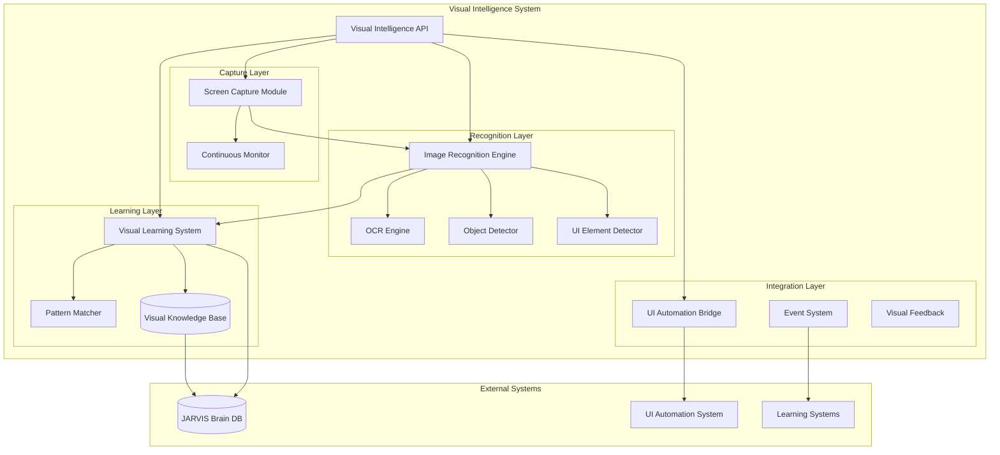
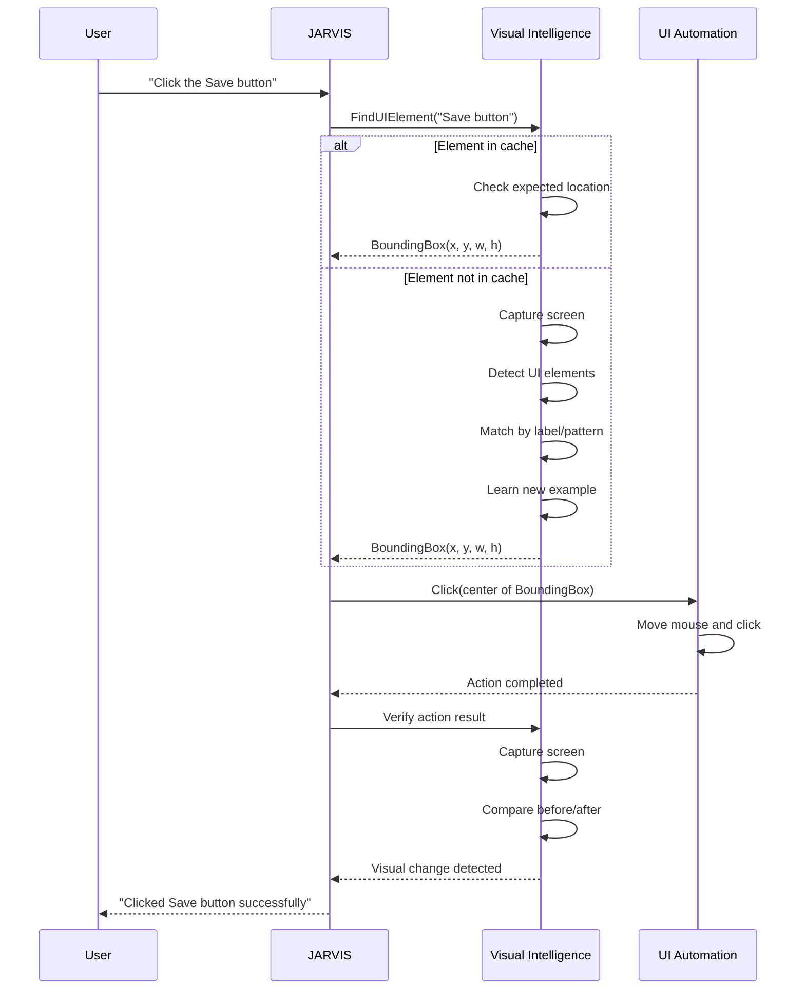

# Design Document: JARVIS Visual Intelligence System

## Overview

The JARVIS Visual Intelligence System is a comprehensive computer vision subsystem that enables JARVIS to perceive, understand, and learn from visual content. The system provides screen capture, optical character recognition (OCR), UI element detection, object recognition, visual learning capabilities, and seamless integration with existing JARVIS components.

### Key Capabilities

- **Screen Capture**: Fast, multi-monitor screenshot capture with region-specific and continuous monitoring support
- **OCR**: Multi-language text extraction (English and Bengali) with high accuracy
- **UI Element Detection**: Automated detection and classification of interface components (buttons, text fields, icons, etc.)
- **Object Recognition**: General-purpose object detection and classification
- **Visual Learning**: Learn from examples to improve recognition accuracy over time
- **Pattern Recognition**: Identify learned visual patterns across different contexts
- **UI Automation Integration**: Provide visual guidance for automated UI interactions
- **Visual Knowledge Persistence**: Store and retrieve learned visual patterns across sessions

### Design Principles

1. **Modularity**: Clear separation between capture, recognition, learning, and integration components
2. **Performance**: Sub-second response times for most operations with efficient resource usage
3. **Extensibility**: Plugin architecture for adding new recognition capabilities
4. **Accuracy**: High-confidence recognition with uncertainty quantification
5. **Privacy**: Local-only processing with no external data transmission
6. **Integration**: Seamless interoperability with existing JARVIS systems

## Architecture

### System Architecture Diagram



### Component Responsibilities

#### 1. Screen Capture Module (SCM)
- Capture full screen, specific windows, or regions
- Multi-monitor support
- Continuous monitoring with change detection
- Image format conversion and optimization
- **Technology**: MSS library for fast cross-platform capture

#### 2. Image Recognition Engine (IRE)
- Coordinate recognition subsystems (OCR, UI detection, object detection)
- Image preprocessing and normalization
- Template matching and image search
- Visual comparison and similarity calculation
- **Technology**: OpenCV for image processing

#### 3. OCR Engine
- Text extraction from images
- Multi-language support (English, Bengali)
- Text localization with bounding boxes
- Orientation detection and correction
- **Technology**: EasyOCR (primary), Tesseract (fallback)

#### 4. UI Element Detector
- Detect and classify UI components
- Extract element properties (state, color, position)
- Context-aware element identification
- **Technology**: YOLOv8/v11 fine-tuned on UI datasets

#### 5. Object Detector
- General-purpose object recognition
- Icon and logo detection
- Shape and pattern identification
- **Technology**: Pre-trained YOLO models

#### 6. Visual Learning System (VLS)
- Store visual examples with labels
- Build recognition models from examples
- Incremental learning and model updates
- Cross-application visual memory
- **Technology**: Custom learning layer with embeddings

#### 7. Pattern Matcher
- Match learned patterns in new images
- Fuzzy matching with configurable thresholds
- Multi-scale and rotation-invariant matching
- **Technology**: Feature extraction + similarity search

#### 8. Visual Knowledge Base (VKB)
- Persistent storage of visual examples
- Metadata management (labels, timestamps, accuracy)
- Efficient retrieval and indexing
- **Technology**: SQLite with BLOB storage, integrated with JARVIS Brain

#### 9. UI Automation Bridge
- Provide coordinates for automation actions
- Verify automation results visually
- Adaptive element location
- Diagnostic screenshot capture

#### 10. Event System
- Visual event detection and notification
- Event handler registration
- Event queuing and processing

#### 11. Visual Feedback
- Real-time visualization of detected elements
- Confidence score overlays
- Debug mode with annotated images

## Components and Interfaces

### Core Data Models

```python
@dataclass
class ImageData:
    """Represents a captured or processed image"""
    data: np.ndarray  # Image pixel data
    width: int
    height: int
    format: str  # 'RGB', 'RGBA', 'BGR'
    timestamp: datetime
    source: str  # 'screen', 'window', 'region', 'file'
    file_path: Optional[str] = None
    metadata: Dict[str, Any] = field(default_factory=dict)

@dataclass
class BoundingBox:
    """Represents a rectangular region in an image"""
    x: int  # Top-left x coordinate
    y: int  # Top-left y coordinate
    width: int
    height: int
    
    def center(self) -> Tuple[int, int]:
        return (self.x + self.width // 2, self.y + self.height // 2)
    
    def area(self) -> int:
        return self.width * self.height

@dataclass
class RecognitionResult:
    """Base class for recognition results"""
    confidence: float  # 0.0 to 1.0
    bounding_box: BoundingBox
    metadata: Dict[str, Any] = field(default_factory=dict)

@dataclass
class TextBlock(RecognitionResult):
    """OCR result for a text region"""
    text: str
    language: str  # 'en', 'bn', 'mixed'
    orientation: float  # Rotation angle in degrees

@dataclass
class UIElement(RecognitionResult):
    """Detected UI element"""
    element_type: str  # 'button', 'text_field', 'icon', etc.
    state: str  # 'enabled', 'disabled', 'selected', 'focused'
    properties: Dict[str, Any]  # color, size, etc.
    label: Optional[str] = None  # Text label if present

@dataclass
class DetectedObject(RecognitionResult):
    """Detected object in image"""
    label: str
    category: str

@dataclass
class VisualExample:
    """A learned visual example"""
    id: str  # Unique identifier
    image_data: ImageData
    label: str
    category: str  # 'ui_element', 'object', 'pattern'
    bounding_box: Optional[BoundingBox] = None
    features: Optional[np.ndarray] = None  # Feature vector
    metadata: Dict[str, Any] = field(default_factory=dict)
    created_at: datetime = field(default_factory=datetime.now)
    usage_count: int = 0
    accuracy: float = 0.0

@dataclass
class VisualEvent:
    """Visual event notification"""
    event_type: str  # 'element_appeared', 'element_disappeared', 'pattern_matched', 'screen_changed'
    timestamp: datetime
    image_data: ImageData
    details: Dict[str, Any]
```

### API Interfaces

#### Screen Capture Module Interface

```python
class ScreenCaptureModule:
    """Handles screen capture operations"""
    
    def capture_screen(self, monitor: int = 0) -> ImageData:
        """
        Capture entire screen from specified monitor
        
        Preconditions:
            - monitor >= 0 and monitor < number of monitors
        Postconditions:
            - Returns ImageData with timestamp within 500ms of call
            - Image dimensions match monitor resolution
        """
        pass
    
    def capture_window(self, window_title: str) -> ImageData:
        """
        Capture specific window by title
        
        Preconditions:
            - Window with window_title exists and is visible
        Postconditions:
            - Returns ImageData containing only window content
            - Capture completes within 500ms
        """
        pass
    
    def capture_region(self, bbox: BoundingBox, monitor: int = 0) -> ImageData:
        """
        Capture specific screen region
        
        Preconditions:
            - bbox coordinates are within monitor bounds
        Postconditions:
            - Returns ImageData with dimensions matching bbox
            - Capture completes within 300ms
        """
        pass
    
    def start_monitoring(self, 
                        interval_ms: int = 1000,
                        region: Optional[BoundingBox] = None,
                        change_threshold: float = 0.05,
                        callback: Callable[[ImageData], None] = None) -> str:
        """
        Start continuous screen monitoring
        
        Preconditions:
            - interval_ms >= 100
            - 0.0 <= change_threshold <= 1.0
        Postconditions:
            - Returns monitoring session ID
            - Callback invoked when change exceeds threshold
            - CPU usage remains below 10%
        """
        pass
    
    def stop_monitoring(self, session_id: str) -> None:
        """
        Stop monitoring session
        
        Preconditions:
            - session_id is valid active session
        Postconditions:
            - Resources released within 1 second
            - No further callbacks invoked
        """
        pass
```

#### OCR Engine Interface

```python
class OCREngine:
    """Handles text recognition from images"""
    
    def __init__(self, languages: List[str] = ['en', 'bn']):
        """
        Initialize OCR engine with language support
        
        Preconditions:
            - All languages in list are supported
        Postconditions:
            - Engine ready for text extraction
        """
        pass
    
    def extract_text(self, image: ImageData) -> List[TextBlock]:
        """
        Extract all text from image
        
        Preconditions:
            - image.data is valid image array
        Postconditions:
            - Returns list of TextBlock with confidence >= 0.0
            - For clear fonts, accuracy >= 95%
            - Processing completes within 2 seconds for full screen
        """
        pass
    
    def detect_language(self, image: ImageData) -> str:
        """
        Detect primary language in image
        
        Postconditions:
            - Returns 'en', 'bn', or 'mixed'
        """
        pass
```

#### UI Element Detector Interface

```python
class UIElementDetector:
    """Detects and classifies UI elements"""
    
    def detect_elements(self, image: ImageData) -> List[UIElement]:
        """
        Detect all UI elements in image
        
        Preconditions:
            - image.data is valid image array
        Postconditions:
            - Returns list of UIElement with bounding boxes
            - Detection accuracy >= 85% for standard applications
            - Each element has confidence score
        """
        pass
    
    def classify_element(self, image: ImageData, bbox: BoundingBox) -> UIElement:
        """
        Classify specific UI element
        
        Preconditions:
            - bbox is within image bounds
        Postconditions:
            - Returns UIElement with type classification
            - Includes state and property detection
        """
        pass
```

#### Visual Learning System Interface

```python
class VisualLearningSystem:
    """Manages visual learning and knowledge"""
    
    def add_example(self, 
                   image: ImageData,
                   label: str,
                   category: str,
                   bbox: Optional[BoundingBox] = None,
                   metadata: Dict[str, Any] = None) -> str:
        """
        Add visual example to knowledge base
        
        Preconditions:
            - label is non-empty string
            - category in ['ui_element', 'object', 'pattern']
        Postconditions:
            - Returns unique example ID
            - Example stored in Visual Knowledge Base
            - Feature vector extracted and stored
        """
        pass
    
    def find_similar(self, 
                    image: ImageData,
                    threshold: float = 0.7,
                    category: Optional[str] = None) -> List[Tuple[VisualExample, float]]:
        """
        Find similar examples in knowledge base
        
        Preconditions:
            - 0.0 <= threshold <= 1.0
        Postconditions:
            - Returns list of (example, similarity_score) tuples
            - Results sorted by similarity descending
            - Query completes within 500ms
        """
        pass
    
    def recognize_pattern(self, image: ImageData) -> List[Tuple[str, float, BoundingBox]]:
        """
        Recognize learned patterns in image
        
        Postconditions:
            - Returns list of (label, confidence, location) tuples
            - After 5 training examples, accuracy >= 90%
        """
        pass
    
    def update_accuracy(self, example_id: str, correct: bool) -> None:
        """
        Update example accuracy based on feedback
        
        Preconditions:
            - example_id exists in knowledge base
        Postconditions:
            - Example accuracy metric updated
            - Usage count incremented
        """
        pass
```

#### Image Recognition Engine Interface

```python
class ImageRecognitionEngine:
    """Coordinates all recognition subsystems"""
    
    def __init__(self):
        self.ocr_engine = OCREngine()
        self.ui_detector = UIElementDetector()
        self.object_detector = ObjectDetector()
        self.visual_learning = VisualLearningSystem()
    
    def analyze_image(self, image: ImageData) -> Dict[str, Any]:
        """
        Comprehensive image analysis
        
        Postconditions:
            - Returns dict with 'text', 'ui_elements', 'objects' keys
            - Processing completes within 2 seconds
        """
        pass
    
    def find_element(self, 
                    template: ImageData,
                    target: ImageData,
                    threshold: float = 0.7) -> List[BoundingBox]:
        """
        Find template matches in target image
        
        Preconditions:
            - 0.5 <= threshold <= 1.0
        Postconditions:
            - Returns list of matching locations
            - Search completes within 2 seconds for full screen
        """
        pass
    
    def compare_images(self, img1: ImageData, img2: ImageData) -> Tuple[float, List[BoundingBox]]:
        """
        Compare two images for similarity
        
        Postconditions:
            - Returns (similarity_percentage, difference_regions)
            - similarity_percentage in [0.0, 1.0]
            - Comparison completes within 1 second
        """
        pass
```

## Main Algorithms and Workflows

### Algorithm 1: Screen Capture with Change Detection

```
ALGORITHM ContinuousMonitoring(interval_ms, region, change_threshold)
INPUT:
    interval_ms: Capture interval in milliseconds (>= 100)
    region: Optional BoundingBox for monitoring area
    change_threshold: Percentage change to trigger event (0.0-1.0)
OUTPUT:
    Triggers callback when significant change detected

PRECONDITIONS:
    - interval_ms >= 100
    - 0.0 <= change_threshold <= 1.0
    - region is None or within screen bounds

BEGIN
    previous_frame ← NULL
    session_active ← TRUE
    
    WHILE session_active DO
        current_frame ← CaptureRegion(region)
        
        IF previous_frame IS NOT NULL THEN
            difference ← CalculateImageDifference(previous_frame, current_frame)
            change_percentage ← difference / total_pixels
            
            IF change_percentage > change_threshold THEN
                TriggerChangeEvent(current_frame, change_percentage)
            END IF
        END IF
        
        previous_frame ← current_frame
        Sleep(interval_ms)
    END WHILE
END

POSTCONDITIONS:
    - CPU usage < 10% during monitoring
    - Change events triggered only when threshold exceeded
    - Resources released when session stopped
```

### Algorithm 2: Multi-Language OCR with Auto-Detection

```
ALGORITHM ExtractTextMultiLanguage(image)
INPUT:
    image: ImageData containing text
OUTPUT:
    List of TextBlock with extracted text and language

PRECONDITIONS:
    - image.data is valid image array
    - OCR engines initialized for supported languages

BEGIN
    text_blocks ← []
    
    // Preprocess image
    preprocessed ← PreprocessImage(image)
    // - Convert to grayscale
    // - Enhance contrast
    // - Denoise
    // - Detect and correct orientation
    
    // Detect text regions
    text_regions ← DetectTextRegions(preprocessed)
    
    FOR EACH region IN text_regions DO
        // Try language detection
        detected_lang ← DetectLanguage(region)
        
        IF detected_lang == 'uncertain' THEN
            // Try both languages
            results_en ← OCREngine_EN.Extract(region)
            results_bn ← OCREngine_BN.Extract(region)
            
            // Choose result with higher confidence
            IF results_en.confidence > results_bn.confidence THEN
                text_block ← results_en
                text_block.language ← 'en'
            ELSE
                text_block ← results_bn
                text_block.language ← 'bn'
            END IF
        ELSE
            // Use detected language
            text_block ← OCREngine[detected_lang].Extract(region)
            text_block.language ← detected_lang
        END IF
        
        IF text_block.confidence >= 0.5 THEN
            text_blocks.APPEND(text_block)
        END IF
    END FOR
    
    RETURN text_blocks
END

POSTCONDITIONS:
    - All returned TextBlock have confidence >= 0.5
    - For clear fonts, accuracy >= 95%
    - Processing time <= 2 seconds for full screen
```

### Algorithm 3: UI Element Detection and Classification

```
ALGORITHM DetectUIElements(image)
INPUT:
    image: ImageData of screen or window
OUTPUT:
    List of UIElement with type, location, and properties

PRECONDITIONS:
    - image.data is valid image array
    - YOLO model loaded and ready

BEGIN
    ui_elements ← []
    
    // Preprocess for YOLO
    preprocessed ← ResizeAndNormalize(image, target_size=640)
    
    // Run YOLO detection
    detections ← YOLOModel.Detect(preprocessed)
    // Returns: class_id, confidence, bbox for each detection
    
    FOR EACH detection IN detections DO
        IF detection.confidence >= 0.6 THEN
            element ← UIElement()
            element.element_type ← ClassIDToType(detection.class_id)
            element.confidence ← detection.confidence
            element.bounding_box ← ScaleBBox(detection.bbox, image.size)
            
            // Extract element region
            element_region ← CropImage(image, element.bounding_box)
            
            // Detect visual state
            element.state ← DetectElementState(element_region, element.element_type)
            // - Check color saturation for enabled/disabled
            // - Check border/background for selected/focused
            
            // Extract properties
            element.properties ← ExtractProperties(element_region)
            // - Dominant colors
            // - Size and shape
            // - Transparency
            
            // Try to extract text label
            text_blocks ← OCREngine.Extract(element_region)
            IF text_blocks IS NOT EMPTY THEN
                element.label ← text_blocks[0].text
            END IF
            
            ui_elements.APPEND(element)
        END IF
    END FOR
    
    // Post-process: resolve overlaps and refine positions
    ui_elements ← ResolveOverlappingElements(ui_elements)
    
    RETURN ui_elements
END

POSTCONDITIONS:
    - Detection accuracy >= 85% for standard applications
    - All elements have confidence scores
    - Element states and properties extracted
```

### Algorithm 4: Visual Learning from Examples

```
ALGORITHM AddVisualExample(image, label, category, bbox)
INPUT:
    image: ImageData of visual example
    label: String label for the example
    category: Category ('ui_element', 'object', 'pattern')
    bbox: Optional bounding box for specific region
OUTPUT:
    Unique example ID

PRECONDITIONS:
    - label is non-empty
    - category is valid
    - bbox is None or within image bounds

BEGIN
    example_id ← GenerateUUID()
    
    // Extract region if bbox provided
    IF bbox IS NOT NULL THEN
        example_image ← CropImage(image, bbox)
    ELSE
        example_image ← image
    END IF
    
    // Extract feature vector
    features ← ExtractFeatures(example_image)
    // Using pre-trained CNN (e.g., ResNet) for feature extraction
    // Returns: 512-dimensional feature vector
    
    // Create example record
    example ← VisualExample(
        id=example_id,
        image_data=example_image,
        label=label,
        category=category,
        bounding_box=bbox,
        features=features,
        metadata={'original_size': image.size},
        created_at=NOW(),
        usage_count=0,
        accuracy=0.0
    )
    
    // Store in knowledge base
    VisualKnowledgeBase.Store(example)
    
    // Update search index
    FeatureIndex.Add(example_id, features)
    
    // If multiple examples with same label exist, retrain matcher
    similar_examples ← VisualKnowledgeBase.GetByLabel(label)
    IF LENGTH(similar_examples) >= 3 THEN
        PatternMatcher.UpdateModel(label, similar_examples)
    END IF
    
    RETURN example_id
END

POSTCONDITIONS:
    - Example stored in Visual Knowledge Base
    - Feature vector indexed for fast retrieval
    - Pattern matcher updated if sufficient examples exist
```

### Algorithm 5: Pattern Recognition with Learned Examples

```
ALGORITHM RecognizeLearnedPatterns(image)
INPUT:
    image: ImageData to search for patterns
OUTPUT:
    List of (label, confidence, location) tuples

PRECONDITIONS:
    - image.data is valid image array
    - Visual Knowledge Base contains learned examples

BEGIN
    matches ← []
    
    // Extract features from input image at multiple scales
    multi_scale_features ← []
    FOR scale IN [0.5, 0.75, 1.0, 1.25, 1.5] DO
        scaled_image ← ResizeImage(image, scale)
        features ← ExtractFeaturesWithLocations(scaled_image)
        // Returns: list of (feature_vector, location) pairs
        multi_scale_features.EXTEND(features)
    END FOR
    
    // Query feature index for similar patterns
    FOR EACH (feature_vec, location) IN multi_scale_features DO
        similar_examples ← FeatureIndex.KNNSearch(feature_vec, k=5, threshold=0.7)
        
        FOR EACH (example, similarity) IN similar_examples DO
            // Verify match with template matching
            template ← example.image_data
            target_region ← CropImageAround(image, location, template.size)
            
            match_score ← TemplateMatch(template, target_region)
            
            IF match_score >= 0.7 THEN
                confidence ← (similarity + match_score) / 2
                bbox ← BoundingBox(location, template.size)
                
                // Check if this is a duplicate detection
                IF NOT IsDuplicateMatch(matches, bbox, example.label) THEN
                    matches.APPEND((example.label, confidence, bbox))
                    
                    // Update usage statistics
                    VisualKnowledgeBase.IncrementUsage(example.id)
                END IF
            END IF
        END FOR
    END FOR
    
    // Sort by confidence and remove low-confidence matches
    matches ← SORT(matches, BY=confidence, DESCENDING)
    matches ← FILTER(matches, WHERE confidence >= 0.6)
    
    RETURN matches
END

POSTCONDITIONS:
    - After 5 training examples, accuracy >= 90%
    - Returns matches sorted by confidence
    - No duplicate detections for same location
```

### Algorithm 6: Adaptive UI Element Location

```
ALGORITHM FindUIElementAdaptive(element_name, expected_location)
INPUT:
    element_name: Label or description of UI element
    expected_location: Last known BoundingBox (may be None)
OUTPUT:
    BoundingBox of found element or None

PRECONDITIONS:
    - element_name is non-empty
    - Visual examples exist for element_name

BEGIN
    current_screen ← CaptureScreen()
    
    // Strategy 1: Check expected location first
    IF expected_location IS NOT NULL THEN
        region ← ExpandBBox(expected_location, margin=20)
        element ← SearchInRegion(current_screen, region, element_name)
        
        IF element IS NOT NULL AND element.confidence >= 0.8 THEN
            // Update stored location
            VisualKnowledgeBase.UpdateLocation(element_name, element.bounding_box)
            RETURN element.bounding_box
        END IF
    END IF
    
    // Strategy 2: Search using learned visual examples
    examples ← VisualKnowledgeBase.GetByLabel(element_name)
    IF examples IS NOT EMPTY THEN
        matches ← RecognizeLearnedPatterns(current_screen)
        
        FOR EACH (label, confidence, bbox) IN matches DO
            IF label == element_name AND confidence >= 0.7 THEN
                // Update stored location
                VisualKnowledgeBase.UpdateLocation(element_name, bbox)
                RETURN bbox
            END IF
        END FOR
    END IF
    
    // Strategy 3: Full screen UI element detection
    ui_elements ← DetectUIElements(current_screen)
    
    FOR EACH element IN ui_elements DO
        // Match by label text
        IF element.label IS NOT NULL AND SimilarText(element.label, element_name) THEN
            // Learn this as new example
            AddVisualExample(current_screen, element_name, 'ui_element', element.bounding_box)
            RETURN element.bounding_box
        END IF
    END FOR
    
    // Strategy 4: OCR-based search
    text_blocks ← OCREngine.Extract(current_screen)
    FOR EACH text_block IN text_blocks DO
        IF SimilarText(text_block.text, element_name) THEN
            // Expand to likely button/element region
            bbox ← ExpandTextToElement(text_block.bounding_box)
            
            // Learn this as new example
            AddVisualExample(current_screen, element_name, 'ui_element', bbox)
            RETURN bbox
        END IF
    END FOR
    
    // Element not found
    RETURN NULL
END

POSTCONDITIONS:
    - Returns accurate location if element found
    - Updates stored location on successful find
    - Learns new examples when element found by fallback methods
    - Returns NULL only if element truly not present
```

### Workflow: Visual-Guided UI Automation




## Data Models

### Database Schema (Visual Knowledge Base)

```sql
-- Visual Examples Table
CREATE TABLE visual_examples (
    id TEXT PRIMARY KEY,
    label TEXT NOT NULL,
    category TEXT NOT NULL CHECK(category IN ('ui_element', 'object', 'pattern')),
    image_data BLOB NOT NULL,
    image_width INTEGER NOT NULL,
    image_height INTEGER NOT NULL,
    bbox_x INTEGER,
    bbox_y INTEGER,
    bbox_width INTEGER,
    bbox_height INTEGER,
    features BLOB,  -- Serialized feature vector
    created_at TIMESTAMP DEFAULT CURRENT_TIMESTAMP,
    updated_at TIMESTAMP DEFAULT CURRENT_TIMESTAMP,
    usage_count INTEGER DEFAULT 0,
    accuracy REAL DEFAULT 0.0,
    metadata TEXT  -- JSON metadata
);

CREATE INDEX idx_visual_examples_label ON visual_examples(label);
CREATE INDEX idx_visual_examples_category ON visual_examples(category);
CREATE INDEX idx_visual_examples_created_at ON visual_examples(created_at);

-- Feature Index for fast similarity search
CREATE TABLE feature_index (
    example_id TEXT NOT NULL,
    feature_vector BLOB NOT NULL,
    FOREIGN KEY (example_id) REFERENCES visual_examples(id) ON DELETE CASCADE
);

CREATE INDEX idx_feature_index_example ON feature_index(example_id);

-- Element Location Cache
CREATE TABLE element_locations (
    element_name TEXT PRIMARY KEY,
    application TEXT,
    bbox_x INTEGER NOT NULL,
    bbox_y INTEGER NOT NULL,
    bbox_width INTEGER NOT NULL,
    bbox_height INTEGER NOT NULL,
    last_seen TIMESTAMP DEFAULT CURRENT_TIMESTAMP,
    confidence REAL NOT NULL
);

CREATE INDEX idx_element_locations_app ON element_locations(application);

-- Visual Events Log
CREATE TABLE visual_events (
    id INTEGER PRIMARY KEY AUTOINCREMENT,
    event_type TEXT NOT NULL,
    timestamp TIMESTAMP DEFAULT CURRENT_TIMESTAMP,
    image_path TEXT,
    details TEXT  -- JSON details
);

CREATE INDEX idx_visual_events_type ON visual_events(event_type);
CREATE INDEX idx_visual_events_timestamp ON visual_events(timestamp);
```

## Correctness Properties

*A property is a characteristic or behavior that should hold true across all valid executions of a system—essentially, a formal statement about what the system should do. Properties serve as the bridge between human-readable specifications and machine-verifiable correctness guarantees.*

### Property Reflection

After analyzing all 30 requirements with 150+ acceptance criteria, I identified the following testable properties. Many requirements involve:
- **Performance/timing constraints** (not suitable for PBT - use integration tests)
- **Accuracy requirements** (require labeled ground truth - use integration tests)
- **External system integration** (require integration tests)
- **Heuristic behavior** (not deterministic - use integration tests)

The properties below focus on **structural correctness**, **data integrity**, **round-trip properties**, and **invariants** that should hold across all valid inputs.

### Property 1: Region Capture Dimensions Match Request

*For any* valid screen region specification (BoundingBox within screen bounds), capturing that region SHALL produce an ImageData with dimensions exactly matching the requested width and height.

**Validates: Requirements 1.3**

### Property 2: PNG Round-Trip Preserves Image Data

*For any* captured ImageData, saving to PNG format then loading SHALL produce an ImageData with identical pixel values (lossless compression property).

**Validates: Requirements 1.4**

### Property 3: Captured Image Contains Required Metadata

*For any* screen capture operation (full screen, window, or region), the returned ImageData SHALL contain non-null values for dimensions, timestamp, format, and source fields.

**Validates: Requirements 1.6**

### Property 4: Change Detection Respects Threshold

*For any* two images with calculated difference percentage, a change event SHALL be triggered if and only if the difference exceeds the configured threshold.

**Validates: Requirements 2.2**

### Property 5: UI Element Detection Returns Valid Types

*For any* detected UIElement, the element_type field SHALL be one of the valid types: 'button', 'text_field', 'icon', 'menu', 'checkbox', 'radio_button', 'dropdown', or other defined types.

**Validates: Requirements 3.2**

### Property 6: UI Element Detection Returns Complete Structure

*For any* detected UIElement, the result SHALL contain non-null values for bounding_box, element_type, and confidence fields.

**Validates: Requirements 3.3**

### Property 7: OCR Results Include Bounding Boxes

*For any* TextBlock returned by OCR extraction, the result SHALL contain a valid BoundingBox with coordinates within the source image bounds.

**Validates: Requirements 4.2**

### Property 8: Low Confidence Results Are Flagged

*For any* recognition result (OCR, object detection, UI detection) with confidence below 0.5, the system SHALL flag the result as uncertain or exclude it from results.

**Validates: Requirements 4.6, 16.3**

### Property 9: Object Detection Returns Label and Confidence

*For any* DetectedObject returned by object recognition, the result SHALL contain non-null label and confidence fields with confidence in range [0.0, 1.0].

**Validates: Requirements 5.2**

### Property 10: Template Matching Respects Confidence Threshold

*For any* template matching operation with threshold T, all returned matches SHALL have confidence >= T, and no matches with confidence < T SHALL be returned.

**Validates: Requirements 6.2, 6.3**

### Property 11: Visual Example Storage Round-Trip Preserves Data

*For any* VisualExample with label, category, and image data, storing to the Visual_Knowledge_Base then retrieving by ID SHALL produce a VisualExample with equivalent label, category, and image data.

**Validates: Requirements 7.1, 7.6**

### Property 12: Stored Visual Examples Have Unique IDs

*For any* set of VisualExamples stored in the Visual_Knowledge_Base, all example IDs SHALL be unique (no two examples share the same ID).

**Validates: Requirements 7.5**

### Property 13: Stored Examples Have Required Metadata

*For any* VisualExample stored in the Visual_Knowledge_Base, the example SHALL contain non-null values for label, category, created_at, usage_count, and accuracy fields.

**Validates: Requirements 7.2, 14.3**

### Property 14: Label Query Returns All Matching Examples

*For any* label L and Visual_Knowledge_Base containing N examples with label L, querying by label L SHALL return exactly N examples, all with label matching L.

**Validates: Requirements 8.1**

### Property 15: Similarity Search Results Include Scores

*For any* similarity search query, all returned results SHALL include similarity scores in range [0.0, 1.0].

**Validates: Requirements 8.2**

### Property 16: Query Results Are Sorted By Relevance

*For any* similarity search or pattern recognition query returning multiple results, the results SHALL be sorted in descending order by confidence/similarity score.

**Validates: Requirements 8.3, 9.3**

### Property 17: Pattern Recognition With Transformations

*For any* learned pattern P, applying minor transformations (scale ±10%, rotation ±5°, brightness ±10%) SHALL still result in pattern recognition with confidence >= 0.6.

**Validates: Requirements 9.5**

### Property 18: Screen Analysis Returns Structured Data

*For any* screen analysis operation, the result SHALL be a dictionary containing 'ui_elements', 'text_blocks', and 'objects' keys with list values.

**Validates: Requirements 10.5**

### Property 19: Detected Elements Provide Automation Coordinates

*For any* detected UIElement, the bounding_box SHALL have coordinates within the source image bounds, and the center point SHALL be calculable for automation targeting.

**Validates: Requirements 12.1**

### Property 20: Knowledge Base Export-Import Round-Trip

*For any* Visual_Knowledge_Base state, exporting to file then importing SHALL restore the knowledge base to an equivalent state with all examples preserved.

**Validates: Requirements 14.5**

### Property 21: Error Conditions Return Error Messages

*For any* operation that fails (invalid input, processing error, corrupted data), the system SHALL return or raise an error with a descriptive message string.

**Validates: Requirements 16.1**

### Property 22: Error Logging Includes Required Fields

*For any* logged error, the log entry SHALL contain timestamp, error_type, and context fields.

**Validates: Requirements 16.4**

### Property 23: Image Similarity Is Reflexive

*For any* image I, calculating similarity between I and I SHALL return 1.0 (100% similarity).

**Validates: Requirements 18.4**

### Property 24: Image Similarity Is In Valid Range

*For any* two images I1 and I2, the calculated similarity SHALL be in range [0.0, 1.0].

**Validates: Requirements 18.1**

### Property 25: Difference Detection Returns Bounding Boxes

*For any* image comparison that detects differences, each difference region SHALL be represented by a valid BoundingBox.

**Validates: Requirements 18.2**

### Property 26: Recognition Results Are JSON-Serializable

*For any* recognition result (UIElement, TextBlock, DetectedObject, VisualExample), the result SHALL be serializable to JSON format without errors.

**Validates: Requirements 22.2**

## Error Handling

### Error Categories

1. **Input Validation Errors**
   - Invalid image data (null, corrupted, wrong format)
   - Invalid coordinates (negative, out of bounds)
   - Invalid parameters (threshold out of range, invalid language code)
   - **Strategy**: Validate inputs at API boundary, return descriptive error messages

2. **Processing Errors**
   - OCR engine failure
   - Model inference failure
   - Feature extraction failure
   - **Strategy**: Catch exceptions, log with context, return error result with low confidence

3. **Resource Errors**
   - Out of memory
   - Disk space exhausted
   - Database connection failure
   - **Strategy**: Graceful degradation, cleanup resources, notify user

4. **Integration Errors**
   - Screen capture failure (no display, permission denied)
   - Window not found
   - Database write failure
   - **Strategy**: Retry with backoff, fallback to alternative methods, log for diagnostics

### Error Handling Patterns

```python
class VisualIntelligenceError(Exception):
    """Base exception for visual intelligence errors"""
    def __init__(self, message: str, error_code: str, context: Dict[str, Any] = None):
        self.message = message
        self.error_code = error_code
        self.context = context or {}
        super().__init__(self.message)

class ImageCaptureError(VisualIntelligenceError):
    """Screen capture failed"""
    pass

class RecognitionError(VisualIntelligenceError):
    """Recognition processing failed"""
    pass

class ValidationError(VisualIntelligenceError):
    """Input validation failed"""
    pass

# Error handling example
def capture_region(bbox: BoundingBox) -> ImageData:
    try:
        # Validate input
        if bbox.width <= 0 or bbox.height <= 0:
            raise ValidationError(
                "Invalid bounding box dimensions",
                "INVALID_BBOX",
                {"bbox": bbox}
            )
        
        # Attempt capture
        image = mss_capture(bbox)
        
        if image is None:
            raise ImageCaptureError(
                "Screen capture returned null",
                "CAPTURE_FAILED",
                {"bbox": bbox}
            )
        
        return image
        
    except ValidationError:
        raise  # Re-raise validation errors
    except Exception as e:
        # Log unexpected errors
        logger.error(f"Unexpected error in capture_region: {e}", 
                    extra={"bbox": bbox, "error": str(e)})
        raise ImageCaptureError(
            f"Screen capture failed: {str(e)}",
            "CAPTURE_ERROR",
            {"bbox": bbox, "original_error": str(e)}
        )
```

### Confidence-Based Error Handling

For recognition operations, low confidence indicates potential errors:

```python
def extract_text_with_confidence(image: ImageData) -> List[TextBlock]:
    results = ocr_engine.extract(image)
    
    validated_results = []
    for text_block in results:
        if text_block.confidence < 0.5:
            # Flag as uncertain
            logger.warning(f"Low confidence OCR result: {text_block.confidence}",
                         extra={"text": text_block.text, "bbox": text_block.bounding_box})
            text_block.metadata['uncertain'] = True
        
        if text_block.confidence >= 0.3:  # Include even low confidence with flag
            validated_results.append(text_block)
        else:
            # Too low confidence, exclude
            logger.debug(f"Excluding very low confidence result: {text_block.confidence}")
    
    return validated_results
```

## Testing Strategy

### Dual Testing Approach

The Visual Intelligence System requires both **property-based testing** for structural correctness and data integrity, and **integration testing** for accuracy, performance, and external system integration.

#### Property-Based Testing (Unit Level)

**Scope**: Structural properties, data integrity, round-trip properties, invariants

**Library**: `hypothesis` for Python

**Configuration**: Minimum 100 iterations per property test

**Test Categories**:

1. **Data Structure Properties**
   - All recognition results contain required fields
   - Confidence scores in valid range [0.0, 1.0]
   - Bounding boxes within image bounds
   - JSON serializability

2. **Round-Trip Properties**
   - PNG save/load preserves pixel data
   - Visual example store/retrieve preserves data
   - Knowledge base export/import preserves data

3. **Invariant Properties**
   - Image similarity is reflexive (I == I → similarity = 1.0)
   - Unique IDs for all stored examples
   - Threshold filtering (only results >= threshold returned)

4. **Transformation Properties**
   - Minor transformations preserve pattern recognition
   - Region capture dimensions match request

**Example Property Test**:

```python
from hypothesis import given, strategies as st
import hypothesis.extra.numpy as npst

@given(
    width=st.integers(min_value=100, max_value=1920),
    height=st.integers(min_value=100, max_value=1080),
    x=st.integers(min_value=0, max_value=1920),
    y=st.integers(min_value=0, max_value=1080)
)
def test_region_capture_dimensions_match_request(width, height, x, y):
    """
    Feature: visual-intelligence, Property 1: Region Capture Dimensions Match Request
    
    For any valid screen region specification, capturing that region
    SHALL produce an ImageData with dimensions exactly matching the request.
    """
    # Ensure region is within screen bounds
    screen_width, screen_height = get_screen_size()
    if x + width > screen_width or y + height > screen_height:
        return  # Skip invalid regions
    
    bbox = BoundingBox(x=x, y=y, width=width, height=height)
    
    # Capture region
    image = screen_capture_module.capture_region(bbox)
    
    # Verify dimensions match
    assert image.width == width, f"Width mismatch: expected {width}, got {image.width}"
    assert image.height == height, f"Height mismatch: expected {height}, got {image.height}"
    assert image.data.shape == (height, width, 3) or image.data.shape == (height, width, 4)

@given(
    image_array=npst.arrays(
        dtype=np.uint8,
        shape=st.tuples(
            st.integers(min_value=10, max_value=500),  # height
            st.integers(min_value=10, max_value=500),  # width
            st.just(3)  # RGB channels
        )
    )
)
def test_png_roundtrip_preserves_data(image_array):
    """
    Feature: visual-intelligence, Property 2: PNG Round-Trip Preserves Image Data
    
    For any captured ImageData, saving to PNG then loading
    SHALL produce identical pixel values (lossless compression).
    """
    # Create ImageData
    height, width, _ = image_array.shape
    image = ImageData(
        data=image_array,
        width=width,
        height=height,
        format='RGB',
        timestamp=datetime.now(),
        source='test'
    )
    
    # Save to PNG
    temp_path = save_as_png(image)
    
    # Load from PNG
    loaded_image = load_from_png(temp_path)
    
    # Verify pixel data identical
    assert np.array_equal(image.data, loaded_image.data), "PNG round-trip altered pixel data"
    
    # Cleanup
    os.remove(temp_path)

@given(
    label=st.text(min_size=1, max_size=50),
    category=st.sampled_from(['ui_element', 'object', 'pattern']),
    image_array=npst.arrays(
        dtype=np.uint8,
        shape=(100, 100, 3)
    )
)
def test_visual_example_storage_roundtrip(label, category, image_array):
    """
    Feature: visual-intelligence, Property 11: Visual Example Storage Round-Trip
    
    For any VisualExample, storing then retrieving SHALL produce
    equivalent data.
    """
    # Create example
    image = ImageData(
        data=image_array,
        width=100,
        height=100,
        format='RGB',
        timestamp=datetime.now(),
        source='test'
    )
    
    # Store example
    example_id = visual_learning_system.add_example(
        image=image,
        label=label,
        category=category
    )
    
    # Retrieve example
    retrieved = visual_learning_system.get_example(example_id)
    
    # Verify equivalence
    assert retrieved.label == label
    assert retrieved.category == category
    assert np.array_equal(retrieved.image_data.data, image_array)
    
    # Cleanup
    visual_learning_system.delete_example(example_id)
```

#### Integration Testing

**Scope**: Accuracy, performance, external integrations, end-to-end workflows

**Test Categories**:

1. **Accuracy Tests**
   - OCR accuracy on labeled datasets (English, Bengali)
   - UI element detection accuracy on benchmark datasets
   - Object detection accuracy
   - Pattern recognition accuracy after training

2. **Performance Tests**
   - Screen capture timing (< 500ms)
   - OCR processing time (< 2 seconds full screen)
   - Template matching time (< 2 seconds)
   - Query response time (< 500ms)
   - CPU usage during monitoring (< 10%)
   - Memory usage (< 500MB)

3. **Integration Tests**
   - JARVIS Brain database integration
   - UI Automation System integration
   - Multi-monitor support
   - Continuous monitoring with change detection
   - Visual event system

4. **End-to-End Workflows**
   - Visual-guided UI automation
   - Incremental learning and improvement
   - Adaptive element location
   - Cross-application visual memory

**Example Integration Test**:

```python
def test_ocr_accuracy_english():
    """
    Integration test for OCR accuracy on English text.
    Validates: Requirements 4.1
    """
    # Load labeled test dataset
    test_images = load_test_dataset('ocr_english_clear_fonts')
    
    correct_count = 0
    total_count = len(test_images)
    
    for image, ground_truth in test_images:
        # Extract text
        text_blocks = ocr_engine.extract_text(image)
        extracted_text = ' '.join([block.text for block in text_blocks])
        
        # Calculate accuracy
        accuracy = calculate_text_similarity(extracted_text, ground_truth)
        if accuracy >= 0.95:
            correct_count += 1
    
    overall_accuracy = correct_count / total_count
    assert overall_accuracy >= 0.95, f"OCR accuracy {overall_accuracy} below 95% threshold"

def test_screen_capture_performance():
    """
    Integration test for screen capture timing.
    Validates: Requirements 1.1
    """
    timings = []
    
    for _ in range(10):
        start = time.time()
        image = screen_capture_module.capture_screen()
        end = time.time()
        
        timings.append(end - start)
    
    avg_time = sum(timings) / len(timings)
    max_time = max(timings)
    
    assert avg_time < 0.5, f"Average capture time {avg_time}s exceeds 500ms"
    assert max_time < 0.7, f"Max capture time {max_time}s too high"

def test_visual_guided_ui_automation():
    """
    End-to-end test for visual-guided UI automation.
    Validates: Requirements 12.1, 12.2, 12.3
    """
    # Launch test application
    app = launch_test_app()
    time.sleep(1)  # Wait for app to load
    
    # Find "Save" button visually
    screen = screen_capture_module.capture_screen()
    ui_elements = image_recognition_engine.analyze_image(screen)['ui_elements']
    
    save_button = None
    for element in ui_elements:
        if element.label and 'save' in element.label.lower():
            save_button = element
            break
    
    assert save_button is not None, "Could not find Save button"
    
    # Get coordinates for automation
    center_x, center_y = save_button.bounding_box.center()
    
    # Perform click
    ui_automation_system.click(center_x, center_y)
    time.sleep(0.5)
    
    # Verify action result visually
    screen_after = screen_capture_module.capture_screen()
    similarity, differences = image_recognition_engine.compare_images(screen, screen_after)
    
    assert similarity < 0.95, "Screen did not change after click"
    assert len(differences) > 0, "No visual differences detected"
    
    # Cleanup
    app.close()
```

### Test Coverage Goals

- **Property-based tests**: 100% coverage of structural properties (26 properties)
- **Integration tests**: 
  - 95%+ accuracy on OCR benchmarks
  - 85%+ accuracy on UI detection benchmarks
  - 80%+ accuracy on object detection benchmarks
  - All performance requirements validated
  - All external integrations tested

### Continuous Testing

- Run property-based tests on every commit (fast, deterministic)
- Run integration tests nightly (slower, require test environment)
- Track accuracy metrics over time
- Regression testing when models updated

## Performance Considerations

### Optimization Strategies

1. **Screen Capture Optimization**
   - Use MSS library for fast cross-platform capture (10-50ms typical)
   - Cache monitor information to avoid repeated queries
   - Use region capture instead of full screen when possible
   - Reuse MSS instance across captures

2. **Image Processing Optimization**
   - Resize images to model input size before inference
   - Use GPU acceleration for YOLO and feature extraction
   - Batch processing for multiple images
   - Lazy loading of models (load on first use)

3. **OCR Optimization**
   - Preprocess images (grayscale, contrast enhancement) before OCR
   - Use region-based OCR instead of full image when possible
   - Cache OCR results for unchanged regions
   - Parallel processing for multiple text regions

4. **Visual Learning Optimization**
   - Use feature vectors (512-dim) instead of full images for similarity search
   - Index feature vectors with approximate nearest neighbor (ANN) search
   - Cache frequently accessed examples in memory
   - Lazy load image data (store features separately)

5. **Database Optimization**
   - Index frequently queried fields (label, category, timestamp)
   - Use BLOB storage for images and features
   - Batch database writes
   - Connection pooling

### Resource Management

```python
class ResourceManager:
    """Manages system resources for visual intelligence"""
    
    def __init__(self, max_memory_mb: int = 500):
        self.max_memory_mb = max_memory_mb
        self.image_cache = LRUCache(maxsize=100)
        self.model_cache = {}
        
    def get_model(self, model_name: str):
        """Lazy load models"""
        if model_name not in self.model_cache:
            self.model_cache[model_name] = load_model(model_name)
        return self.model_cache[model_name]
    
    def check_memory_usage(self):
        """Monitor memory usage"""
        process = psutil.Process()
        memory_mb = process.memory_info().rss / 1024 / 1024
        
        if memory_mb > self.max_memory_mb:
            # Clear caches
            self.image_cache.clear()
            gc.collect()
            
            logger.warning(f"Memory usage {memory_mb}MB exceeded limit {self.max_memory_mb}MB, cleared caches")
```

### Performance Benchmarks

| Operation | Target | Typical | Notes |
|-----------|--------|---------|-------|
| Full screen capture | < 500ms | 20-50ms | MSS library |
| Region capture | < 300ms | 10-30ms | Smaller area |
| OCR full screen | < 2s | 1-1.5s | EasyOCR |
| UI element detection | < 1s | 500-800ms | YOLOv8 |
| Object detection | < 1s | 400-600ms | YOLOv8 |
| Template matching | < 2s | 500ms-1.5s | Depends on template size |
| Visual example storage | < 100ms | 50-80ms | Feature extraction + DB write |
| Similarity search | < 500ms | 100-300ms | ANN search |
| Pattern recognition | < 2s | 1-1.5s | Multi-scale search |

## Dependencies

### Core Dependencies

```python
# requirements.txt

# Screen Capture
mss==9.0.1  # Fast cross-platform screenshot

# Image Processing
opencv-python==4.8.1.78  # Computer vision
Pillow==10.1.0  # Image manipulation
numpy==1.24.3  # Array operations

# OCR
easyocr==1.7.0  # Multi-language OCR (primary)
pytesseract==0.3.10  # Tesseract wrapper (fallback)

# Object Detection / UI Detection
ultralytics==8.0.200  # YOLOv8/v11
torch==2.1.0  # PyTorch for YOLO
torchvision==0.16.0

# Feature Extraction
timm==0.9.12  # Pre-trained models for feature extraction

# Database
sqlite3  # Built-in Python (Visual Knowledge Base)

# Utilities
psutil==5.9.6  # Resource monitoring
python-dateutil==2.8.2  # Date handling

# Testing
pytest==7.4.3
hypothesis==6.92.1  # Property-based testing
pytest-cov==4.1.0  # Coverage reporting
```

### External Dependencies

1. **Tesseract OCR** (system-level)
   - Installation: `apt-get install tesseract-ocr` (Linux) or `brew install tesseract` (Mac)
   - Language data: `apt-get install tesseract-ocr-eng tesseract-ocr-ben`

2. **CUDA** (optional, for GPU acceleration)
   - CUDA Toolkit 11.8+
   - cuDNN 8.6+

### Model Dependencies

1. **YOLOv8 UI Detection Model**
   - Pre-trained on UI element datasets
   - Source: Hugging Face (e.g., `macpaw-research/yolov11l-ui-elements-detection`)
   - Size: ~50MB

2. **EasyOCR Models**
   - English model: ~100MB
   - Bengali model: ~50MB
   - Auto-downloaded on first use

3. **Feature Extraction Model**
   - ResNet50 or EfficientNet
   - Pre-trained on ImageNet
   - Size: ~100MB

### Integration Dependencies

1. **JARVIS Brain Database**
   - SQLite database connection
   - Schema compatibility with existing JARVIS tables

2. **UI Automation System**
   - Coordinate-based click/type interface
   - Window management API

3. **Learning Systems**
   - Internet_Learner integration
   - Ultimate_Learner integration
   - Shared knowledge base schema

## Deployment Considerations

### Installation Steps

1. Install system dependencies (Tesseract, CUDA if using GPU)
2. Install Python dependencies: `pip install -r requirements.txt`
3. Download pre-trained models (auto-downloaded on first use)
4. Initialize Visual Knowledge Base: `python init_vkb.py`
5. Configure settings in `config.yaml`

### Configuration

```yaml
# config.yaml

visual_intelligence:
  # Screen Capture
  capture:
    default_monitor: 0
    default_format: 'PNG'
  
  # OCR
  ocr:
    languages: ['en', 'bn']
    confidence_threshold: 0.5
    gpu: true
  
  # UI Detection
  ui_detection:
    model: 'yolov8-ui'
    confidence_threshold: 0.6
    gpu: true
  
  # Object Detection
  object_detection:
    model: 'yolov8n'
    confidence_threshold: 0.6
    gpu: true
  
  # Visual Learning
  learning:
    feature_model: 'resnet50'
    similarity_threshold: 0.7
    max_examples_per_label: 100
  
  # Performance
  performance:
    max_memory_mb: 500
    cache_size: 100
    batch_size: 4
  
  # Database
  database:
    path: 'data/visual_knowledge_base.db'
    backup_enabled: true
    backup_interval_hours: 24
  
  # Privacy
  privacy:
    retention_days: 30
    auto_delete_enabled: true
    mask_sensitive_content: true
```

### Monitoring and Logging

```python
# Configure logging
import logging

logging.basicConfig(
    level=logging.INFO,
    format='%(asctime)s - %(name)s - %(levelname)s - %(message)s',
    handlers=[
        logging.FileHandler('logs/visual_intelligence.log'),
        logging.StreamHandler()
    ]
)

# Metrics to track
metrics = {
    'captures_per_minute': 0,
    'ocr_requests_per_minute': 0,
    'detection_requests_per_minute': 0,
    'average_confidence': 0.0,
    'cache_hit_rate': 0.0,
    'memory_usage_mb': 0.0,
    'error_rate': 0.0
}
```

## Future Enhancements

1. **Advanced Learning**
   - Active learning (request labels for uncertain cases)
   - Transfer learning from user corrections
   - Few-shot learning for new element types

2. **Additional Languages**
   - Expand OCR to support more languages
   - Multi-script document handling

3. **Video Processing**
   - Real-time video stream analysis
   - Action recognition in videos
   - Temporal pattern detection

4. **3D Understanding**
   - Depth estimation from 2D images
   - 3D UI element localization

5. **Accessibility**
   - Screen reader integration
   - Accessibility tree generation from visual analysis
   - Automated accessibility testing

6. **Cloud Integration** (optional)
   - Cloud-based model inference for heavy workloads
   - Distributed visual knowledge base
   - Collaborative learning across instances

---

**Document Version**: 1.0  
**Last Updated**: 2024  
**Status**: Ready for Review
