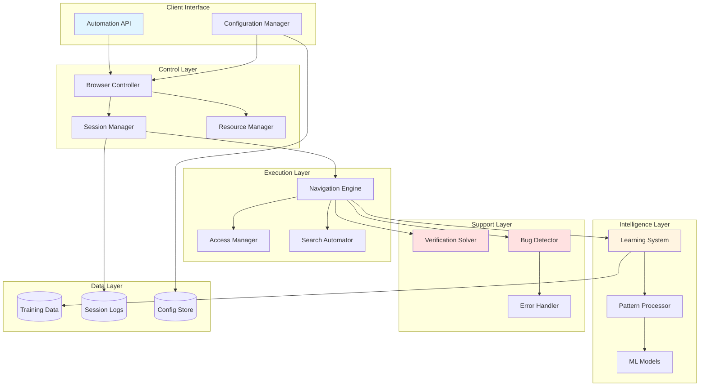
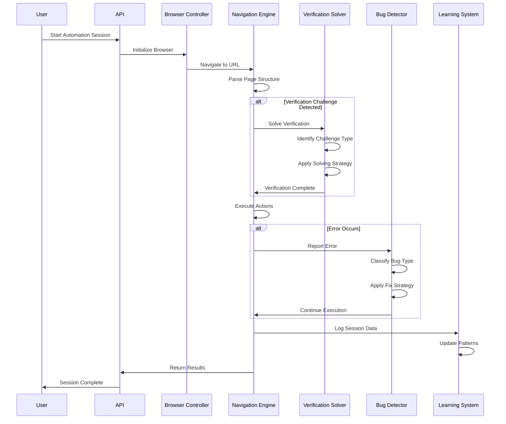

# Design Document: Web Automation Browser Control

## Overview

The Web Automation Browser Control system is an intelligent, self-improving web automation platform that combines browser automation, machine learning, and adaptive problem-solving to enable reliable, hands-free web interaction. The system automatically handles common automation challenges including CAPTCHA verification, dynamic content loading, authentication flows, and automation detection mechanisms.

### Key Capabilities

- **Intelligent Browser Control**: Multi-browser support with session management and state preservation
- **Adaptive Verification Solving**: Automatic CAPTCHA and robot verification handling using multiple solving strategies
- **Self-Healing Automation**: Real-time bug detection and automatic resolution with pattern learning
- **Machine Learning Enhancement**: Continuous improvement through interaction analysis and pattern recognition
- **Universal Web Access**: Full support for modern web technologies including SPAs, AJAX, and authentication flows
- **Resource-Aware Execution**: Intelligent resource management for concurrent automation sessions

### Design Philosophy

The system follows a **layered architecture** with clear separation of concerns:

1. **Control Layer**: Browser lifecycle and session management
2. **Execution Layer**: Navigation, interaction, and action execution
3. **Intelligence Layer**: Learning, pattern recognition, and adaptive behavior
4. **Support Layer**: Verification solving, bug detection, and error handling

Each layer operates independently while communicating through well-defined interfaces, enabling extensibility and maintainability.

## Architecture

### High-Level Architecture



### Component Interaction Flow



## Components and Interfaces

### 1. Browser Controller

**Responsibility**: Manages browser lifecycle, instances, and low-level browser operations.

**Key Functions**:
- `initialize_browser(browser_type: BrowserType, options: BrowserOptions) -> BrowserInstance`
- `close_browser(instance_id: str) -> None`
- `get_browser_state(instance_id: str) -> BrowserState`
- `execute_script(instance_id: str, script: str) -> Any`
- `take_screenshot(instance_id: str) -> bytes`

**Technology Stack**:
- **Primary**: Selenium WebDriver (mature, widely supported)
- **Alternative**: Playwright (modern, faster, better async support)
- **Browser Drivers**: ChromeDriver, GeckoDriver, EdgeDriver

**Configuration**:
```python
class BrowserOptions:
    headless: bool = False
    window_size: Tuple[int, int] = (1920, 1080)
    user_agent: Optional[str] = None
    proxy: Optional[str] = None
    timeout: int = 30
    disable_images: bool = False
    disable_javascript: bool = False
```

**State Management**:
- Maintains registry of active browser instances
- Tracks session cookies and local storage
- Monitors resource usage per instance
- Implements connection pooling for efficiency

### 2. Navigation Engine

**Responsibility**: Executes high-level navigation actions and page interactions.

**Key Functions**:
- `navigate_to(url: str, wait_condition: WaitCondition) -> PageState`
- `click_element(selector: ElementSelector) -> bool`
- `input_text(selector: ElementSelector, text: str) -> bool`
- `extract_data(selectors: List[ElementSelector]) -> Dict[str, Any]`
- `wait_for_element(selector: ElementSelector, timeout: int) -> Element`
- `execute_action_sequence(actions: List[Action]) -> ActionResult`

**Element Selection Strategies**:
```python
class ElementSelector:
    strategy: SelectionStrategy  # CSS, XPATH, ID, CLASS, TEXT
    value: str
    fallback_selectors: List[ElementSelector] = []
    wait_visible: bool = True
    wait_clickable: bool = False
```

**Wait Conditions**:
- DOM ready
- Network idle
- Specific element present
- Custom JavaScript condition
- Timeout with fallback

**Action Types**:
- Click, Double-click, Right-click
- Type text, Clear input
- Select dropdown option
- Drag and drop
- Scroll to element
- Hover
- Submit form

### 3. Verification Solver

**Responsibility**: Detects and solves CAPTCHA and robot verification challenges.

**Key Functions**:
- `detect_verification(page_source: str) -> Optional[VerificationChallenge]`
- `solve_challenge(challenge: VerificationChallenge) -> Solution`
- `submit_solution(solution: Solution) -> bool`
- `register_solver(challenge_type: str, solver: Solver) -> None`

**Supported Challenge Types**:
```python
class ChallengeType(Enum):
    RECAPTCHA_V2 = "recaptcha_v2"
    RECAPTCHA_V3 = "recaptcha_v3"
    HCAPTCHA = "hcaptcha"
    IMAGE_CAPTCHA = "image_captcha"
    TEXT_CAPTCHA = "text_captcha"
    CLOUDFLARE = "cloudflare"
    CUSTOM = "custom"
```

**Solving Strategies**:

1. **API-Based Solving** (Primary):
   - Integration with 2Captcha, Anti-Captcha, or similar services
   - Async submission and polling for results
   - Cost tracking and budget management

2. **ML-Based Solving** (Secondary):
   - Local OCR for simple text CAPTCHAs
   - Image classification for object selection
   - Pattern recognition for puzzle CAPTCHAs

3. **Behavioral Solving** (Tertiary):
   - Mouse movement simulation
   - Timing randomization
   - Browser fingerprint management

**Detection Mechanisms**:
- DOM inspection for known CAPTCHA iframes
- Image analysis for CAPTCHA patterns
- Network request monitoring for verification endpoints
- JavaScript challenge detection

### 4. Bug Detector

**Responsibility**: Monitors automation execution, detects failures, and applies fixes.

**Key Functions**:
- `monitor_execution(session_id: str) -> None`
- `detect_bug(error: Exception, context: ExecutionContext) -> BugReport`
- `classify_bug(bug_report: BugReport) -> BugType`
- `apply_fix(bug_type: BugType, context: ExecutionContext) -> FixResult`
- `register_fix_strategy(bug_type: BugType, strategy: FixStrategy) -> None`

**Bug Classification**:
```python
class BugType(Enum):
    ELEMENT_NOT_FOUND = "element_not_found"
    TIMEOUT = "timeout"
    STALE_ELEMENT = "stale_element"
    NETWORK_ERROR = "network_error"
    JAVASCRIPT_ERROR = "javascript_error"
    AUTHENTICATION_FAILURE = "authentication_failure"
    RATE_LIMIT = "rate_limit"
    UNKNOWN = "unknown"
```

**Fix Strategies**:

1. **Element Not Found**:
   - Retry with increased wait time
   - Try fallback selectors
   - Scroll element into view
   - Wait for page stabilization

2. **Timeout**:
   - Increase timeout threshold
   - Check network connectivity
   - Reload page and retry
   - Switch to alternative approach

3. **Stale Element**:
   - Re-query element
   - Wait for DOM update
   - Refresh element reference

4. **Network Error**:
   - Retry with exponential backoff
   - Check proxy configuration
   - Switch to alternative endpoint

5. **Rate Limit**:
   - Implement delay
   - Rotate IP/proxy
   - Reduce request frequency

**Context Capture**:
```python
class ExecutionContext:
    timestamp: datetime
    page_url: str
    page_source: str
    screenshot: bytes
    console_logs: List[str]
    network_logs: List[NetworkRequest]
    action_attempted: Action
    error_message: str
    stack_trace: str
```

### 5. Learning System

**Responsibility**: Analyzes automation sessions and improves performance through machine learning.

**Key Functions**:
- `record_session(session_data: SessionData) -> None`
- `analyze_patterns() -> List[NavigationPattern]`
- `get_recommendation(context: NavigationContext) -> Action`
- `update_models() -> None`
- `get_success_rate(pattern_id: str) -> float`

**Data Collection**:
```python
class SessionData:
    session_id: str
    start_time: datetime
    end_time: datetime
    target_url: str
    actions_executed: List[Action]
    success: bool
    errors_encountered: List[BugReport]
    verification_challenges: List[VerificationChallenge]
    performance_metrics: PerformanceMetrics
```

**Pattern Recognition**:
- Sequence mining for common action patterns
- Success rate tracking per pattern
- Context-based pattern matching
- Similarity scoring for new websites

**ML Models**:

1. **Navigation Pattern Classifier**:
   - Input: Page structure, target goal
   - Output: Recommended action sequence
   - Algorithm: Random Forest or Gradient Boosting

2. **Element Selector Predictor**:
   - Input: Element description, page context
   - Output: Optimal selector strategy
   - Algorithm: Neural Network

3. **Success Probability Estimator**:
   - Input: Planned action sequence, page state
   - Output: Probability of success
   - Algorithm: Logistic Regression

**Training Schedule**:
- Incremental learning after each session
- Batch retraining daily at low-usage hours
- Model versioning and rollback capability

### 6. Search Automator

**Responsibility**: Performs automated web searches across different platforms.

**Key Functions**:
- `detect_search_interface(page_source: str) -> Optional[SearchInterface]`
- `execute_search(query: str, search_interface: SearchInterface) -> SearchResults`
- `parse_results(page_source: str) -> List[SearchResult]`
- `navigate_pagination(direction: PaginationDirection) -> bool`
- `apply_filters(filters: Dict[str, Any]) -> bool`

**Search Interface Detection**:
```python
class SearchInterface:
    input_selector: ElementSelector
    submit_selector: Optional[ElementSelector]
    submit_method: SubmitMethod  # ENTER_KEY, BUTTON_CLICK, AUTO_SUBMIT
    result_container_selector: ElementSelector
    result_item_selector: ElementSelector
    pagination_selector: Optional[ElementSelector]
```

**Supported Platforms**:
- Google Search (with advanced operators)
- Bing Search
- DuckDuckGo
- Generic website search
- E-commerce search (Amazon, eBay patterns)

**Result Parsing**:
```python
class SearchResult:
    title: str
    url: str
    snippet: str
    metadata: Dict[str, Any]  # price, rating, date, etc.
    position: int
```

**Advanced Features**:
- Auto-complete handling
- Search suggestion extraction
- Filter and facet application
- Result deduplication
- Infinite scroll handling

### 7. Access Manager

**Responsibility**: Handles authentication, authorization, and content access.

**Key Functions**:
- `authenticate(credentials: Credentials, auth_flow: AuthFlow) -> AuthResult`
- `handle_popup(popup_type: PopupType) -> bool`
- `wait_for_content_load(load_strategy: LoadStrategy) -> bool`
- `bypass_restrictions(restriction_type: RestrictionType) -> bool`
- `manage_cookies(action: CookieAction) -> None`

**Authentication Flows**:
```python
class AuthFlow(Enum):
    FORM_LOGIN = "form_login"
    OAUTH2 = "oauth2"
    SAML = "saml"
    API_KEY = "api_key"
    SESSION_TOKEN = "session_token"
```

**Credential Management**:
- Secure storage using system keyring
- Encryption at rest
- Per-domain credential mapping
- Credential rotation support

**Popup Handling**:
- Cookie consent dialogs
- Newsletter subscriptions
- Age verification
- Location permissions
- Notification requests
- Modal overlays

**Dynamic Content Strategies**:
- Wait for network idle
- Wait for specific AJAX calls
- Observe DOM mutations
- Scroll-triggered loading
- Intersection observer monitoring

## Data Models

### Core Data Structures

```python
from dataclasses import dataclass
from datetime import datetime
from enum import Enum
from typing import List, Dict, Any, Optional

@dataclass
class BrowserInstance:
    instance_id: str
    browser_type: str
    process_id: int
    created_at: datetime
    last_active: datetime
    memory_usage: int
    session_data: Dict[str, Any]

@dataclass
class Action:
    action_type: str
    target: ElementSelector
    parameters: Dict[str, Any]
    timestamp: datetime
    success: bool
    duration_ms: int

@dataclass
class NavigationPattern:
    pattern_id: str
    name: str
    action_sequence: List[Action]
    success_rate: float
    usage_count: int
    applicable_contexts: List[str]
    created_at: datetime
    last_used: datetime

@dataclass
class VerificationChallenge:
    challenge_id: str
    challenge_type: str
    detected_at: datetime
    page_url: str
    challenge_data: Dict[str, Any]
    solution: Optional[str]
    solved: bool
    solve_duration_ms: Optional[int]

@dataclass
class BugReport:
    bug_id: str
    bug_type: str
    severity: str
    context: ExecutionContext
    fix_applied: Optional[str]
    resolved: bool
    resolution_time_ms: Optional[int]

@dataclass
class AutomationSession:
    session_id: str
    start_time: datetime
    end_time: Optional[datetime]
    target_url: str
    goal: str
    status: str  # RUNNING, COMPLETED, FAILED, PAUSED
    actions: List[Action]
    bugs: List[BugReport]
    verifications: List[VerificationChallenge]
    result_data: Optional[Dict[str, Any]]
```

### Storage Strategy

**Session Logs** (Short-term):
- Storage: SQLite database
- Retention: 30 days
- Purpose: Debugging, monitoring, recent history
- Schema: Normalized relational structure

**Training Data** (Long-term):
- Storage: Parquet files (columnar format)
- Retention: Configurable (default 1 year)
- Purpose: ML model training
- Compression: Snappy
- Partitioning: By date and website domain

**Configuration** (Persistent):
- Storage: YAML files
- Location: User config directory
- Version control: Git-friendly format
- Validation: JSON Schema

**Credentials** (Secure):
- Storage: System keyring (Windows Credential Manager, macOS Keychain, Linux Secret Service)
- Encryption: AES-256
- Access: Per-process isolation

**ML Models** (Versioned):
- Storage: Pickle files (Python) or ONNX (cross-platform)
- Versioning: Semantic versioning with metadata
- Registry: Model registry with performance metrics

## Technology Stack

### Core Technologies

**Programming Language**: Python 3.10+
- Rationale: Rich ecosystem for web automation and ML, excellent library support

**Browser Automation**:
- **Primary**: Selenium 4.x
  - Mature, stable, wide browser support
  - Large community and extensive documentation
- **Alternative**: Playwright
  - Modern, faster, better async support
  - Consider for future migration

**Web Drivers**:
- ChromeDriver (Chrome/Chromium)
- GeckoDriver (Firefox)
- EdgeDriver (Microsoft Edge)

**Machine Learning**:
- **scikit-learn**: Classical ML algorithms (Random Forest, Logistic Regression)
- **TensorFlow/Keras**: Neural networks for complex pattern recognition
- **pandas**: Data manipulation and analysis
- **numpy**: Numerical computations

**Data Storage**:
- **SQLite**: Session logs and operational data
- **Parquet**: Training data storage
- **YAML**: Configuration files
- **keyring**: Secure credential storage

**CAPTCHA Solving**:
- **2Captcha API**: Primary solving service
- **pytesseract**: Local OCR for simple CAPTCHAs
- **OpenCV**: Image processing for CAPTCHA analysis

**Utilities**:
- **requests**: HTTP client for API calls
- **beautifulsoup4**: HTML parsing
- **lxml**: Fast XML/HTML processing
- **Pillow**: Image manipulation
- **schedule**: Task scheduling

### Development Tools

- **pytest**: Testing framework
- **hypothesis**: Property-based testing
- **black**: Code formatting
- **mypy**: Static type checking
- **pylint**: Code linting
- **sphinx**: Documentation generation

## API Specifications

### REST API Endpoints

```python
# Session Management
POST   /api/v1/sessions
GET    /api/v1/sessions/{session_id}
DELETE /api/v1/sessions/{session_id}
POST   /api/v1/sessions/{session_id}/pause
POST   /api/v1/sessions/{session_id}/resume
GET    /api/v1/sessions

# Actions
POST   /api/v1/sessions/{session_id}/navigate
POST   /api/v1/sessions/{session_id}/click
POST   /api/v1/sessions/{session_id}/input
POST   /api/v1/sessions/{session_id}/extract
POST   /api/v1/sessions/{session_id}/search

# Configuration
GET    /api/v1/config
PUT    /api/v1/config
GET    /api/v1/config/browsers
PUT    /api/v1/config/browsers/{browser_type}

# Monitoring
GET    /api/v1/status
GET    /api/v1/metrics
GET    /api/v1/logs
GET    /api/v1/errors

# Learning System
GET    /api/v1/patterns
GET    /api/v1/patterns/{pattern_id}
POST   /api/v1/patterns/{pattern_id}/apply
GET    /api/v1/models
POST   /api/v1/models/train
```

### Request/Response Examples

**Start Automation Session**:
```json
POST /api/v1/sessions
{
  "target_url": "https://example.com",
  "goal": "search_and_extract",
  "browser_type": "chrome",
  "headless": true,
  "actions": [
    {
      "type": "navigate",
      "url": "https://example.com/search"
    },
    {
      "type": "input",
      "selector": {"strategy": "css", "value": "#search-input"},
      "text": "automation testing"
    },
    {
      "type": "click",
      "selector": {"strategy": "css", "value": "button[type='submit']"}
    },
    {
      "type": "extract",
      "selectors": {
        "results": {"strategy": "css", "value": ".result-item"}
      }
    }
  ]
}

Response:
{
  "session_id": "sess_abc123",
  "status": "running",
  "created_at": "2024-01-15T10:30:00Z"
}
```

**Get Session Status**:
```json
GET /api/v1/sessions/sess_abc123

Response:
{
  "session_id": "sess_abc123",
  "status": "completed",
  "start_time": "2024-01-15T10:30:00Z",
  "end_time": "2024-01-15T10:30:45Z",
  "actions_completed": 4,
  "actions_total": 4,
  "errors": 0,
  "verifications_solved": 1,
  "result_data": {
    "results": [
      {"title": "Result 1", "url": "https://example.com/1"},
      {"title": "Result 2", "url": "https://example.com/2"}
    ]
  }
}
```

### Python SDK

```python
from web_automation import AutomationClient, Action, ElementSelector

# Initialize client
client = AutomationClient(api_key="your_api_key")

# Create session
session = client.create_session(
    target_url="https://example.com",
    browser_type="chrome",
    headless=True
)

# Execute actions
session.navigate("https://example.com/search")
session.input(
    ElementSelector.css("#search-input"),
    "automation testing"
)
session.click(ElementSelector.css("button[type='submit']"))

# Extract data
results = session.extract({
    "results": ElementSelector.css(".result-item")
})

# Get results
print(results)

# Close session
session.close()
```

## Integration Patterns

### Plugin Architecture

The system supports extensibility through a plugin interface:

```python
from abc import ABC, abstractmethod

class BrowserPlugin(ABC):
    @abstractmethod
    def on_browser_start(self, instance: BrowserInstance) -> None:
        pass
    
    @abstractmethod
    def on_page_load(self, url: str, page_source: str) -> None:
        pass
    
    @abstractmethod
    def on_action_execute(self, action: Action) -> None:
        pass

class VerificationSolver(ABC):
    @abstractmethod
    def can_solve(self, challenge: VerificationChallenge) -> bool:
        pass
    
    @abstractmethod
    def solve(self, challenge: VerificationChallenge) -> Solution:
        pass

class FixStrategy(ABC):
    @abstractmethod
    def can_fix(self, bug: BugReport) -> bool:
        pass
    
    @abstractmethod
    def apply_fix(self, bug: BugReport, context: ExecutionContext) -> FixResult:
        pass

# Registration
plugin_manager.register_browser_plugin(CustomPlugin())
verification_solver.register_solver("custom_captcha", CustomSolver())
bug_detector.register_fix_strategy(BugType.CUSTOM, CustomFixStrategy())
```

### Event System

Components communicate through an event bus:

```python
class EventType(Enum):
    BROWSER_STARTED = "browser_started"
    PAGE_LOADED = "page_loaded"
    ACTION_EXECUTED = "action_executed"
    VERIFICATION_DETECTED = "verification_detected"
    BUG_DETECTED = "bug_detected"
    SESSION_COMPLETED = "session_completed"

event_bus.subscribe(EventType.VERIFICATION_DETECTED, verification_handler)
event_bus.subscribe(EventType.BUG_DETECTED, bug_handler)
event_bus.publish(Event(EventType.PAGE_LOADED, data={"url": url}))
```

### External Service Integration

**CAPTCHA Solving Services**:
```python
class CaptchaSolvingService:
    def __init__(self, api_key: str, service_url: str):
        self.api_key = api_key
        self.service_url = service_url
    
    async def submit_captcha(self, image: bytes, captcha_type: str) -> str:
        # Submit to service, return task_id
        pass
    
    async def get_solution(self, task_id: str) -> Optional[str]:
        # Poll for solution
        pass
```

**Proxy Services**:
```python
class ProxyManager:
    def get_proxy(self, region: Optional[str] = None) -> str:
        # Return proxy URL
        pass
    
    def rotate_proxy(self, current_proxy: str) -> str:
        # Get new proxy
        pass
    
    def report_failure(self, proxy: str) -> None:
        # Mark proxy as failed
        pass
```

## Correctness Properties

*A property is a characteristic or behavior that should hold true across all valid executions of a system—essentially, a formal statement about what the system should do. Properties serve as the bridge between human-readable specifications and machine-verifiable correctness guarantees.*

Before defining correctness properties, I need to analyze which acceptance criteria are suitable for property-based testing.


### Property Reflection

After analyzing all acceptance criteria, I identified the following properties suitable for property-based testing:

**Identified Properties:**
1. Session state persistence (1.5)
2. Challenge type identification (2.1)
3. Error context capture (3.2)
4. Bug classification (3.3)
5. Session data storage (4.1)
6. Success rate tracking (4.4)
7. Credential storage and retrieval (5.2)
8. Search interface detection (6.1)
9. Search result parsing (6.3)
10. Session creation with parameters (8.2)
11. Verbose logging output (8.5)
12. Error logging with required fields (9.1)
13. Error report generation (9.4)
14. Failure retryability classification (9.5)
15. Error rate tracking (9.6)
16. Training data cleanup (10.4)
17. Session scheduling (10.5)
18. Metrics collection (10.6)

**Redundancy Analysis:**

- **Properties 9.1 and 9.4** (error logging and error reports): These both test that error information is captured with required fields. Property 9.4 is more comprehensive as it includes screenshots and traces in addition to basic logging. **Consolidate into single property about comprehensive error capture.**

- **Properties 4.1 and 10.6** (session data storage and metrics collection): Both test that session information is captured. Metrics are a subset of session data. **Keep separate** as they serve different purposes (training vs monitoring).

- **Properties 9.5 and 9.6** (failure classification and error rate tracking): These are distinct - one classifies individual failures, the other tracks aggregate rates. **Keep separate.**

- **Properties 3.2 and 9.1/9.4**: All test error information capture. Property 3.2 is specific to bug detection context, while 9.1/9.4 are general error logging. **Keep separate** as they test different components.

**Final Property Set (after consolidation):**
1. Session state persistence (1.5)
2. Challenge type identification (2.1)
3. Error context capture for bugs (3.2)
4. Bug classification (3.3)
5. Session data storage (4.1)
6. Success rate tracking (4.4)
7. Credential storage and retrieval (5.2)
8. Search interface detection (6.1)
9. Search result parsing (6.3)
10. Session creation with parameters (8.2)
11. Verbose logging output (8.5)
12. Comprehensive error capture (9.1, 9.4 combined)
13. Failure retryability classification (9.5)
14. Error rate tracking (9.6)
15. Training data cleanup (10.4)
16. Session scheduling (10.5)
17. Metrics collection (10.6)

### Property 1: Session State Persistence

*For any* automation session and any sequence of valid actions executed within that session, the browser state (cookies, local storage, session storage) SHALL remain consistent and accessible throughout the session lifecycle.

**Validates: Requirements 1.5**

### Property 2: Challenge Type Identification

*For any* HTML page source containing a verification challenge, the Verification_Solver SHALL correctly identify the challenge type (reCAPTCHA v2, reCAPTCHA v3, hCaptcha, image CAPTCHA, text CAPTCHA, Cloudflare, or custom) based on the DOM structure and embedded scripts.

**Validates: Requirements 2.1**

### Property 3: Error Context Completeness

*For any* automation error that occurs during execution, the Bug_Detector SHALL capture a complete error context containing at minimum: timestamp, page URL, page source, screenshot, console logs, network logs, action attempted, error message, and stack trace.

**Validates: Requirements 3.2**

### Property 4: Bug Classification Accuracy

*For any* automation error with a known error pattern (element not found, timeout, stale element, network error, JavaScript error, authentication failure, rate limit), the Bug_Detector SHALL classify the bug into the correct BugType category based on the error signature.

**Validates: Requirements 3.3**

### Property 5: Session Data Persistence

*For any* completed automation session, the Learning_System SHALL store the complete session data as Training_Data including session ID, timestamps, target URL, actions executed, success status, errors encountered, verification challenges, and performance metrics.

**Validates: Requirements 4.1**

### Property 6: Success Rate Calculation

*For any* automation strategy with recorded execution history, the Learning_System SHALL calculate the success rate as (successful_executions / total_executions) and maintain this metric with accuracy to two decimal places.

**Validates: Requirements 4.4**

### Property 7: Credential Storage Round-Trip

*For any* valid credential set (username, password, domain), when stored by the Access_Manager, the credentials SHALL be encrypted, stored securely in the system keyring, and retrievable in their original form when requested for the same domain.

**Validates: Requirements 5.2**

### Property 8: Search Interface Detection

*For any* HTML page containing a search interface (input field with associated submit mechanism), the Search_Automator SHALL detect the interface and correctly identify the input selector, submit selector, and submit method.

**Validates: Requirements 6.1**

### Property 9: Search Result Extraction

*For any* search results page with a consistent result structure, the Search_Automator SHALL parse and extract all result items with their title, URL, snippet, and position, maintaining the original result ordering.

**Validates: Requirements 6.3**

### Property 10: Session Creation Validity

*For any* valid set of session parameters (target URL, browser type, actions list, configuration options), the system SHALL successfully create an automation session and return a unique session ID.

**Validates: Requirements 8.2**

### Property 11: Verbose Logging Completeness

*For any* action executed with verbose logging enabled, the system SHALL output log entries containing at minimum: timestamp, component name, action type, action parameters, execution duration, and result status.

**Validates: Requirements 8.5**

### Property 12: Comprehensive Error Capture

*For any* error encountered by any system component, the system SHALL generate a complete error record containing: timestamp, component name, error type, error message, stack trace, page screenshot (if applicable), page source (if applicable), and execution trace.

**Validates: Requirements 9.1, 9.4**

### Property 13: Failure Retryability Classification

*For any* automation failure, the system SHALL classify the failure as either "retryable" (timeout, network error, rate limit, stale element) or "permanent" (authentication failure, invalid selector, missing element, JavaScript error) based on the failure type.

**Validates: Requirements 9.5**

### Property 14: Error Rate Tracking

*For any* time window and error threshold configuration, the system SHALL accurately track the error rate (errors per time unit) and trigger an alert when the rate exceeds the configured threshold.

**Validates: Requirements 9.6**

### Property 15: Training Data Size Management

*For any* Training_Data storage with a configured maximum size limit, when the storage size exceeds the limit, the Learning_System SHALL automatically remove the oldest data entries until the size is below the limit.

**Validates: Requirements 10.4**

### Property 16: Optimal Session Scheduling

*For any* queue of pending automation sessions with associated resource requirements, the scheduler SHALL order the sessions to maximize resource utilization while respecting resource constraints (CPU, memory, browser instances).

**Validates: Requirements 10.5**

### Property 17: Metrics Collection Completeness

*For any* automation session, the system SHALL collect and report resource usage metrics including CPU percentage, memory usage (MB), network bandwidth (KB/s), and execution duration (ms) for that session.

**Validates: Requirements 10.6**


## Error Handling

### Error Categories

The system handles errors across multiple categories with specific strategies for each:

#### 1. Browser Errors

**Types**:
- Browser launch failure
- Browser crash
- Browser unresponsive
- Driver version mismatch

**Handling Strategy**:
- Retry with exponential backoff (3 attempts)
- Try alternative browser if configured
- Log detailed error with system information
- Notify user if all attempts fail

**Recovery**:
- Automatic browser restart
- Session state restoration from checkpoint
- Continue from last successful action

#### 2. Navigation Errors

**Types**:
- Page load timeout
- Network connection failure
- DNS resolution failure
- SSL certificate error
- HTTP error codes (404, 500, etc.)

**Handling Strategy**:
- Retry with increased timeout
- Check network connectivity
- Try alternative URL if available
- Log error with network diagnostics

**Recovery**:
- Reload page
- Navigate to fallback URL
- Skip to next action if non-critical

#### 3. Element Interaction Errors

**Types**:
- Element not found
- Element not visible
- Element not clickable
- Stale element reference

**Handling Strategy**:
- Wait for element with increased timeout
- Try fallback selectors
- Scroll element into view
- Re-query element after DOM update

**Recovery**:
- Retry action with fresh element reference
- Use JavaScript click as fallback
- Skip action if optional

#### 4. Verification Errors

**Types**:
- CAPTCHA detection failure
- CAPTCHA solving failure
- Solution submission failure
- Verification timeout

**Handling Strategy**:
- Try alternative detection method
- Use different solving service
- Retry with human intervention option
- Log failure for learning system

**Recovery**:
- Pause for manual solving
- Skip verification if optional
- Abort session if critical

#### 5. Data Extraction Errors

**Types**:
- Selector mismatch
- Data format unexpected
- Parsing failure
- Empty results

**Handling Strategy**:
- Try alternative selectors
- Apply data cleaning/normalization
- Log unexpected format for learning
- Return partial results if available

**Recovery**:
- Continue with available data
- Mark extraction as incomplete
- Retry with updated selectors

#### 6. Resource Errors

**Types**:
- Out of memory
- CPU overload
- Disk space exhausted
- Too many open files

**Handling Strategy**:
- Close idle browser instances
- Pause new session creation
- Clean up temporary files
- Alert system administrator

**Recovery**:
- Wait for resources to free up
- Queue sessions for later execution
- Reduce concurrent sessions

#### 7. Learning System Errors

**Types**:
- Model loading failure
- Training data corruption
- Prediction failure
- Storage failure

**Handling Strategy**:
- Fall back to rule-based approach
- Use previous model version
- Validate and repair data
- Log error for investigation

**Recovery**:
- Continue without ML enhancement
- Schedule model rebuild
- Use default strategies

### Error Logging Format

All errors are logged in structured JSON format:

```json
{
  "timestamp": "2024-01-15T10:30:45.123Z",
  "error_id": "err_abc123",
  "component": "Navigation_Engine",
  "error_type": "ElementNotFound",
  "severity": "WARNING",
  "message": "Could not find element with selector #search-button",
  "context": {
    "session_id": "sess_xyz789",
    "page_url": "https://example.com/search",
    "action": "click",
    "selector": {"strategy": "css", "value": "#search-button"},
    "retry_count": 2
  },
  "stack_trace": "...",
  "resolution": "Applied fallback selector",
  "resolved": true,
  "resolution_time_ms": 1500
}
```

### Error Notification

**Notification Channels**:
- Console output (always)
- Log file (always)
- Email (configurable, for critical errors)
- Webhook (configurable, for integration)
- UI notification (if GUI present)

**Notification Thresholds**:
- **INFO**: Logged only
- **WARNING**: Logged + console
- **ERROR**: Logged + console + email (if configured)
- **CRITICAL**: All channels

### Error Recovery Strategies

**Automatic Recovery**:
- Retry with backoff
- Fallback to alternative approach
- Skip non-critical actions
- Continue with partial results

**Manual Intervention**:
- Pause session for user input
- Request manual CAPTCHA solving
- Confirm destructive actions
- Provide recovery options

**Graceful Degradation**:
- Disable ML features if models fail
- Use simpler selectors if complex ones fail
- Reduce quality for performance
- Skip optional features

## Testing Strategy

### Testing Approach

The testing strategy combines multiple testing methodologies to ensure comprehensive coverage:

1. **Property-Based Testing**: For internal logic with universal properties
2. **Unit Testing**: For specific examples and edge cases
3. **Integration Testing**: For component interactions and external services
4. **End-to-End Testing**: For complete automation workflows
5. **Performance Testing**: For resource usage and timing requirements

### Property-Based Testing

**Framework**: Hypothesis (Python)

**Configuration**:
- Minimum 100 iterations per property test
- Deadline: 60 seconds per test
- Database: Store failing examples for regression
- Verbosity: Show detailed failure information

**Test Structure**:
```python
from hypothesis import given, strategies as st
import pytest

@given(
    session_data=st.builds(SessionData, ...)
)
def test_property_5_session_data_persistence(session_data):
    """
    Feature: web-automation-browser-control
    Property 5: Session Data Persistence
    
    For any completed automation session, the Learning_System SHALL store
    the complete session data as Training_Data.
    """
    learning_system = LearningSystem()
    
    # Store session data
    learning_system.record_session(session_data)
    
    # Retrieve and verify
    stored_data = learning_system.get_session(session_data.session_id)
    
    assert stored_data is not None
    assert stored_data.session_id == session_data.session_id
    assert stored_data.target_url == session_data.target_url
    assert len(stored_data.actions_executed) == len(session_data.actions_executed)
    assert stored_data.success == session_data.success
```

**Property Test Coverage**:
- Property 1: Session state persistence (100+ iterations)
- Property 2: Challenge type identification (100+ iterations)
- Property 3: Error context completeness (100+ iterations)
- Property 4: Bug classification accuracy (100+ iterations)
- Property 5: Session data persistence (100+ iterations)
- Property 6: Success rate calculation (100+ iterations)
- Property 7: Credential storage round-trip (100+ iterations)
- Property 8: Search interface detection (100+ iterations)
- Property 9: Search result extraction (100+ iterations)
- Property 10: Session creation validity (100+ iterations)
- Property 11: Verbose logging completeness (100+ iterations)
- Property 12: Comprehensive error capture (100+ iterations)
- Property 13: Failure retryability classification (100+ iterations)
- Property 14: Error rate tracking (100+ iterations)
- Property 15: Training data size management (100+ iterations)
- Property 16: Optimal session scheduling (100+ iterations)
- Property 17: Metrics collection completeness (100+ iterations)

### Unit Testing

**Framework**: pytest

**Coverage Target**: 80% code coverage minimum

**Test Categories**:

1. **Component Initialization**:
   - Browser controller initialization with different browsers
   - Configuration loading and validation
   - Plugin registration

2. **Data Validation**:
   - URL validation
   - Selector validation
   - Configuration schema validation
   - Credential format validation

3. **Error Handling**:
   - Exception handling for each error type
   - Error logging format
   - Notification triggering

4. **Utility Functions**:
   - Element selector parsing
   - Wait condition evaluation
   - Data serialization/deserialization

**Example Unit Test**:
```python
def test_browser_controller_initialization():
    """Test browser controller initializes with valid configuration"""
    config = BrowserOptions(
        headless=True,
        window_size=(1920, 1080),
        timeout=30
    )
    
    controller = BrowserController(config)
    instance = controller.initialize_browser(BrowserType.CHROME, config)
    
    assert instance is not None
    assert instance.browser_type == "chrome"
    assert controller.get_browser_state(instance.instance_id) is not None
    
    controller.close_browser(instance.instance_id)
```

### Integration Testing

**Framework**: pytest with fixtures for external services

**Test Environment**:
- Mock web server for controlled testing
- Mock CAPTCHA service
- Mock authentication endpoints
- Test databases for data storage

**Test Categories**:

1. **Browser Automation**:
   - Open browser and navigate to URL
   - Execute actions on real web pages
   - Handle dynamic content loading
   - Manage browser sessions

2. **Verification Solving**:
   - Detect CAPTCHA on test pages
   - Submit to solving service (mock)
   - Verify solution submission

3. **Bug Detection and Resolution**:
   - Trigger known error conditions
   - Verify bug detection
   - Verify fix application
   - Verify execution continuation

4. **Learning System**:
   - Store and retrieve session data
   - Train models on sample data
   - Apply learned patterns
   - Update models

5. **Search Automation**:
   - Execute searches on test pages
   - Parse results
   - Navigate pagination
   - Apply filters

**Example Integration Test**:
```python
@pytest.fixture
def mock_web_server():
    """Start mock web server for testing"""
    server = MockWebServer()
    server.start()
    yield server
    server.stop()

def test_navigation_with_verification(mock_web_server):
    """Test navigation handles CAPTCHA verification"""
    # Setup mock page with CAPTCHA
    mock_web_server.add_page("/protected", has_captcha=True)
    
    # Create automation session
    client = AutomationClient()
    session = client.create_session(
        target_url=f"{mock_web_server.url}/protected",
        browser_type="chrome",
        headless=True
    )
    
    # Navigate (should detect and solve CAPTCHA)
    result = session.navigate(f"{mock_web_server.url}/protected")
    
    assert result.success
    assert result.verification_solved
    assert session.get_current_url() == f"{mock_web_server.url}/protected"
```

### End-to-End Testing

**Test Scenarios**:

1. **Complete Search Workflow**:
   - Start session
   - Navigate to search engine
   - Execute search
   - Extract results
   - Close session

2. **Authentication Flow**:
   - Navigate to login page
   - Handle cookie consent
   - Enter credentials
   - Verify successful login
   - Access protected content

3. **Error Recovery**:
   - Trigger element not found error
   - Verify automatic retry
   - Verify fallback selector usage
   - Verify successful completion

4. **Learning and Improvement**:
   - Execute task multiple times
   - Verify pattern learning
   - Verify performance improvement
   - Verify pattern application

**Example E2E Test**:
```python
def test_complete_search_workflow():
    """Test complete search automation workflow"""
    client = AutomationClient()
    
    # Create session
    session = client.create_session(
        target_url="https://www.google.com",
        browser_type="chrome",
        headless=True
    )
    
    # Execute search
    session.navigate("https://www.google.com")
    session.input(ElementSelector.css("input[name='q']"), "web automation")
    session.click(ElementSelector.css("input[name='btnK']"))
    
    # Extract results
    results = session.extract({
        "results": ElementSelector.css("div.g")
    })
    
    # Verify
    assert len(results["results"]) > 0
    
    # Close
    session.close()
    
    # Verify session was logged
    learning_system = LearningSystem()
    session_data = learning_system.get_session(session.session_id)
    assert session_data is not None
    assert session_data.success
```

### Performance Testing

**Metrics to Test**:
- Browser initialization time (< 2 seconds)
- Page load time
- Action execution time
- Search execution time (< 3 seconds)
- Resource cleanup time (< 5 seconds)
- Memory usage per session
- CPU usage per session
- Concurrent session capacity

**Tools**:
- pytest-benchmark for timing
- memory_profiler for memory usage
- psutil for system resource monitoring

**Example Performance Test**:
```python
def test_browser_initialization_performance(benchmark):
    """Test browser initialization meets performance requirement"""
    controller = BrowserController()
    
    def initialize():
        instance = controller.initialize_browser(
            BrowserType.CHROME,
            BrowserOptions(headless=True)
        )
        controller.close_browser(instance.instance_id)
    
    result = benchmark(initialize)
    
    # Requirement: < 2 seconds
    assert result.stats.mean < 2.0
```

### Test Data Generation

**Strategies for Property-Based Testing**:

```python
from hypothesis import strategies as st

# Session data strategy
session_data_strategy = st.builds(
    SessionData,
    session_id=st.uuids().map(str),
    start_time=st.datetimes(),
    end_time=st.datetimes(),
    target_url=st.from_regex(r'https?://[a-z0-9.-]+\.[a-z]{2,}', fullmatch=True),
    actions_executed=st.lists(action_strategy, min_size=1, max_size=20),
    success=st.booleans(),
    errors_encountered=st.lists(bug_report_strategy, max_size=5),
    verification_challenges=st.lists(verification_challenge_strategy, max_size=2),
    performance_metrics=performance_metrics_strategy
)

# Element selector strategy
selector_strategy = st.builds(
    ElementSelector,
    strategy=st.sampled_from(["css", "xpath", "id", "class", "text"]),
    value=st.text(min_size=1, max_size=100),
    wait_visible=st.booleans(),
    wait_clickable=st.booleans()
)

# HTML with search interface strategy
html_with_search_strategy = st.builds(
    lambda input_id, button_id: f'''
        <html>
            <body>
                <input type="text" id="{input_id}" name="search" />
                <button id="{button_id}" type="submit">Search</button>
            </body>
        </html>
    ''',
    input_id=st.text(alphabet=st.characters(whitelist_categories=('Ll', 'Lu', 'Nd')), min_size=3, max_size=20),
    button_id=st.text(alphabet=st.characters(whitelist_categories=('Ll', 'Lu', 'Nd')), min_size=3, max_size=20)
)
```

### Continuous Integration

**CI Pipeline**:
1. Lint code (pylint, black)
2. Type check (mypy)
3. Run unit tests
4. Run property-based tests
5. Run integration tests (with mocks)
6. Generate coverage report
7. Run security scan
8. Build documentation

**Test Execution**:
- Unit tests: Every commit
- Property tests: Every commit
- Integration tests: Every commit (with mocks)
- E2E tests: Nightly build
- Performance tests: Weekly

**Quality Gates**:
- Code coverage > 80%
- All property tests pass
- No critical security issues
- Type checking passes
- Linting passes

### Test Maintenance

**Strategies**:
- Keep tests independent and isolated
- Use fixtures for common setup
- Mock external services
- Use test data builders
- Maintain test documentation
- Review and update tests with code changes
- Remove obsolete tests
- Refactor duplicated test code

## Summary

The Web Automation Browser Control system provides a comprehensive, intelligent solution for automated web interaction. The design emphasizes:

1. **Modularity**: Clear separation of concerns with well-defined component interfaces
2. **Extensibility**: Plugin architecture and event system for easy enhancement
3. **Reliability**: Self-healing automation with bug detection and automatic fixes
4. **Intelligence**: Machine learning for continuous improvement
5. **Robustness**: Comprehensive error handling and recovery strategies
6. **Testability**: Property-based testing for correctness guarantees

The system is designed to handle the complexities of modern web automation including CAPTCHA solving, dynamic content, authentication flows, and resource management, while continuously learning and improving from each interaction.
