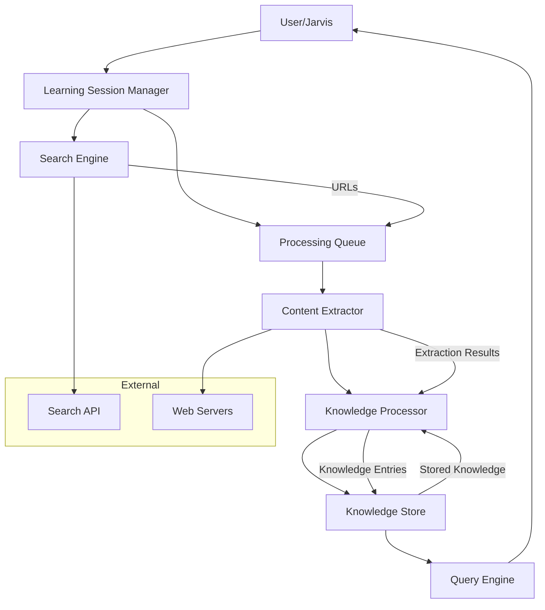

# Design Document: Web Learning System

## Overview

The Web Learning System is a comprehensive knowledge acquisition platform that enables Jarvis to systematically learn from web sources. The system orchestrates four primary components: web search, content extraction, knowledge processing, and persistent storage. 

The architecture follows a pipeline pattern where each stage transforms data progressively from raw search queries to structured, queryable knowledge entries. The system emphasizes sequential processing to ensure thorough understanding of each source before moving to the next, while maintaining resilience through comprehensive error handling and retry mechanisms.

Key design principles:
- **Sequential Processing**: One website at a time for deep understanding
- **Incremental Learning**: Build upon existing knowledge rather than isolated facts
- **Quality Assessment**: Evaluate source credibility and content reliability
- **Persistent Memory**: Durable storage with semantic search capabilities
- **Graceful Degradation**: Continue learning even when individual sources fail

## Architecture

### System Components



### Component Responsibilities

**Learning Session Manager**
- Orchestrates the complete learning workflow
- Manages session lifecycle (start, pause, resume, complete)
- Tracks progress and statistics
- Coordinates error handling and recovery

**Search Engine**
- Interfaces with external search APIs
- Ranks and filters search results
- Handles multi-language queries
- Returns prioritized URL lists

**Processing Queue**
- Maintains ordered list of URLs to process
- Ensures sequential processing
- Tracks processing status per URL
- Supports pause/resume operations

**Content Extractor**
- Retrieves HTML content from URLs
- Renders JavaScript when needed
- Parses and structures content
- Removes boilerplate and noise
- Extracts metadata and links

**Knowledge Processor**
- Analyzes content semantics
- Identifies topics, entities, and relationships
- Generates multi-level summaries
- Assesses content quality and credibility
- Links to existing knowledge
- Detects contradictions

**Knowledge Store**
- Persists knowledge entries durably
- Maintains relationships between entries
- Supports semantic search
- Handles versioning and updates
- Manages deduplication

**Query Engine**
- Processes retrieval queries
- Ranks results by relevance
- Applies filters (date, topic, source)
- Returns appropriate summary levels

**Batch Learning UI**
- Displays list of learning sources with buttons
- Manages button states (ready, learning, learned)
- Triggers learning sessions on button click
- Shows learning progress and status
- Persists source list and learning history


## Components and Interfaces

### Search Engine Interface

```python
class SearchEngine:
    def search(self, query: str, language: str = "en", max_results: int = 10) -> SearchResult:
        """Search the web for relevant URLs."""
        pass

@dataclass
class SearchResult:
    query: str
    urls: List[URLResult]
    total_found: int
    search_time: float
    timestamp: datetime
    
@dataclass
class URLResult:
    url: str
    title: str
    snippet: str
    relevance_score: float
```

### Content Extractor Interface

```python
class ContentExtractor:
    def extract(self, url: str, render_js: bool = False) -> ExtractionResult:
        """Extract content from a URL."""
        pass

@dataclass
class ExtractionResult:
    url: str
    title: str
    content: str
    headings: List[Heading]
    links: List[Link]
    metadata: ContentMetadata
    extraction_time: float
    timestamp: datetime
    
@dataclass
class Heading:
    level: int  # 1-6 for h1-h6
    text: str
    
@dataclass
class Link:
    url: str
    anchor_text: str
    
@dataclass
class ContentMetadata:
    author: Optional[str]
    publication_date: Optional[datetime]
    language: str
    word_count: int
```

### Knowledge Processor Interface

```python
class KnowledgeProcessor:
    def process(self, extraction: ExtractionResult, depth: LearningDepth) -> KnowledgeEntry:
        """Process extracted content into structured knowledge."""
        pass
    
    def link_to_existing(self, entry: KnowledgeEntry) -> List[str]:
        """Find and create links to related existing knowledge entries."""
        pass

@dataclass
class KnowledgeEntry:
    id: str
    source_url: str
    extraction_timestamp: datetime
    processing_timestamp: datetime
    
    # Content summaries
    brief_summary: str  # ~50 words
    medium_summary: str  # ~200 words
    detailed_summary: str  # ~500 words
    
    # Structured knowledge
    topics: List[str]
    content_type: ContentType
    entities: List[Entity]
    facts: List[Fact]
    relationships: List[Relationship]
    
    # Quality metrics
    credibility_score: float  # 0-100
    bias_indicators: List[str]
    is_promotional: bool
    
    # Metadata
    tags: List[str]
    related_entries: List[str]  # IDs of related entries
    version: int
    source_count: int  # Number of sources contributing

class LearningDepth(Enum):
    SHALLOW = "shallow"
    MEDIUM = "medium"
    DEEP = "deep"

class ContentType(Enum):
    ARTICLE = "article"
    TUTORIAL = "tutorial"
    DOCUMENTATION = "documentation"
    NEWS = "news"
    BLOG = "blog"
    OTHER = "other"

@dataclass
class Entity:
    text: str
    type: EntityType  # PERSON, ORGANIZATION, LOCATION, DATE, etc.
    
@dataclass
class Fact:
    statement: str
    confidence: float
    
@dataclass
class Relationship:
    subject: str
    predicate: str
    object: str
```

### Knowledge Store Interface

```python
class KnowledgeStore:
    def save(self, entry: KnowledgeEntry) -> str:
        """Save a knowledge entry, returns entry ID."""
        pass
    
    def update(self, entry_id: str, entry: KnowledgeEntry) -> None:
        """Update an existing knowledge entry."""
        pass
    
    def get(self, entry_id: str) -> Optional[KnowledgeEntry]:
        """Retrieve a knowledge entry by ID."""
        pass
    
    def search(self, query: str, filters: SearchFilters = None) -> List[KnowledgeEntry]:
        """Search for knowledge entries."""
        pass
    
    def find_duplicates(self, entry: KnowledgeEntry) -> List[str]:
        """Find duplicate or highly similar entries."""
        pass
    
    def delete(self, entry_id: str) -> None:
        """Delete a knowledge entry."""
        pass

@dataclass
class SearchFilters:
    source_urls: Optional[List[str]] = None
    date_range: Optional[Tuple[datetime, datetime]] = None
    topics: Optional[List[str]] = None
    content_types: Optional[List[ContentType]] = None
    min_credibility: Optional[float] = None
```

### Learning Session Manager Interface

```python
class LearningSessionManager:
    def start_session(self, config: SessionConfig) -> str:
        """Start a new learning session, returns session ID."""
        pass
    
    def pause_session(self, session_id: str) -> None:
        """Pause an active session."""
        pass
    
    def resume_session(self, session_id: str) -> None:
        """Resume a paused session."""
        pass
    
    def complete_session(self, session_id: str) -> SessionSummary:
        """Complete a session and return summary."""
        pass
    
    def get_session_status(self, session_id: str) -> SessionStatus:
        """Get current status of a session."""
        pass

@dataclass
class SessionConfig:
    query: Optional[str] = None  # Initial search query
    urls: Optional[List[str]] = None  # Direct URLs to process
    learning_depth: LearningDepth = LearningDepth.MEDIUM
    max_urls: Optional[int] = None
    domain_whitelist: Optional[List[str]] = None
    domain_blacklist: Optional[List[str]] = None
    content_filters: Optional[List[str]] = None

@dataclass
class SessionStatus:
    session_id: str
    state: SessionState
    start_time: datetime
    current_url: Optional[str]
    urls_processed: int
    urls_pending: int
    entries_created: int
    errors: List[ErrorRecord]

class SessionState(Enum):
    ACTIVE = "active"
    PAUSED = "paused"
    COMPLETED = "completed"
    FAILED = "failed"

@dataclass
class SessionSummary:
    session_id: str
    start_time: datetime
    end_time: datetime
    urls_processed: int
    entries_created: int
    entries_updated: int
    errors: List[ErrorRecord]
    
@dataclass
class ErrorRecord:
    timestamp: datetime
    url: Optional[str]
    error_type: str
    message: str
```

## Data Models

### Database Schema

The Knowledge Store uses a relational database with the following schema:

**knowledge_entries table**
```sql
CREATE TABLE knowledge_entries (
    id VARCHAR(36) PRIMARY KEY,
    source_url TEXT NOT NULL,
    extraction_timestamp TIMESTAMP NOT NULL,
    processing_timestamp TIMESTAMP NOT NULL,
    brief_summary TEXT NOT NULL,
    medium_summary TEXT NOT NULL,
    detailed_summary TEXT NOT NULL,
    content_type VARCHAR(50) NOT NULL,
    credibility_score FLOAT NOT NULL,
    is_promotional BOOLEAN NOT NULL,
    version INTEGER NOT NULL DEFAULT 1,
    source_count INTEGER NOT NULL DEFAULT 1,
    created_at TIMESTAMP DEFAULT CURRENT_TIMESTAMP,
    updated_at TIMESTAMP DEFAULT CURRENT_TIMESTAMP
);

CREATE INDEX idx_source_url ON knowledge_entries(source_url);
CREATE INDEX idx_credibility ON knowledge_entries(credibility_score);
CREATE INDEX idx_content_type ON knowledge_entries(content_type);
```

**topics table**
```sql
CREATE TABLE topics (
    id INTEGER PRIMARY KEY AUTOINCREMENT,
    entry_id VARCHAR(36) NOT NULL,
    topic VARCHAR(255) NOT NULL,
    FOREIGN KEY (entry_id) REFERENCES knowledge_entries(id) ON DELETE CASCADE
);

CREATE INDEX idx_topic ON topics(topic);
CREATE INDEX idx_entry_topic ON topics(entry_id, topic);
```

**entities table**
```sql
CREATE TABLE entities (
    id INTEGER PRIMARY KEY AUTOINCREMENT,
    entry_id VARCHAR(36) NOT NULL,
    text VARCHAR(500) NOT NULL,
    type VARCHAR(50) NOT NULL,
    FOREIGN KEY (entry_id) REFERENCES knowledge_entries(id) ON DELETE CASCADE
);

CREATE INDEX idx_entity_text ON entities(text);
CREATE INDEX idx_entity_type ON entities(type);
```

**facts table**
```sql
CREATE TABLE facts (
    id INTEGER PRIMARY KEY AUTOINCREMENT,
    entry_id VARCHAR(36) NOT NULL,
    statement TEXT NOT NULL,
    confidence FLOAT NOT NULL,
    FOREIGN KEY (entry_id) REFERENCES knowledge_entries(id) ON DELETE CASCADE
);
```

**relationships table**
```sql
CREATE TABLE relationships (
    id INTEGER PRIMARY KEY AUTOINCREMENT,
    entry_id VARCHAR(36) NOT NULL,
    subject VARCHAR(500) NOT NULL,
    predicate VARCHAR(255) NOT NULL,
    object VARCHAR(500) NOT NULL,
    FOREIGN KEY (entry_id) REFERENCES knowledge_entries(id) ON DELETE CASCADE
);

CREATE INDEX idx_relationship_subject ON relationships(subject);
CREATE INDEX idx_relationship_object ON relationships(object);
```

**entry_links table**
```sql
CREATE TABLE entry_links (
    from_entry_id VARCHAR(36) NOT NULL,
    to_entry_id VARCHAR(36) NOT NULL,
    link_type VARCHAR(50) NOT NULL,
    created_at TIMESTAMP DEFAULT CURRENT_TIMESTAMP,
    PRIMARY KEY (from_entry_id, to_entry_id),
    FOREIGN KEY (from_entry_id) REFERENCES knowledge_entries(id) ON DELETE CASCADE,
    FOREIGN KEY (to_entry_id) REFERENCES knowledge_entries(id) ON DELETE CASCADE
);
```

**learning_sessions table**
```sql
CREATE TABLE learning_sessions (
    id VARCHAR(36) PRIMARY KEY,
    start_time TIMESTAMP NOT NULL,
    end_time TIMESTAMP,
    state VARCHAR(20) NOT NULL,
    learning_depth VARCHAR(20) NOT NULL,
    urls_processed INTEGER DEFAULT 0,
    entries_created INTEGER DEFAULT 0,
    entries_updated INTEGER DEFAULT 0,
    error_count INTEGER DEFAULT 0
);
```

**session_entries table**
```sql
CREATE TABLE session_entries (
    session_id VARCHAR(36) NOT NULL,
    entry_id VARCHAR(36) NOT NULL,
    PRIMARY KEY (session_id, entry_id),
    FOREIGN KEY (session_id) REFERENCES learning_sessions(id) ON DELETE CASCADE,
    FOREIGN KEY (entry_id) REFERENCES knowledge_entries(id) ON DELETE CASCADE
);
```

**session_errors table**
```sql
CREATE TABLE session_errors (
    id INTEGER PRIMARY KEY AUTOINCREMENT,
    session_id VARCHAR(36) NOT NULL,
    timestamp TIMESTAMP NOT NULL,
    url TEXT,
    error_type VARCHAR(100) NOT NULL,
    message TEXT NOT NULL,
    FOREIGN KEY (session_id) REFERENCES learning_sessions(id) ON DELETE CASCADE
);
```

### Full-Text Search

For semantic search capabilities, the system uses a full-text search index:

```sql
CREATE VIRTUAL TABLE knowledge_fts USING fts5(
    entry_id,
    brief_summary,
    medium_summary,
    detailed_summary,
    content='knowledge_entries',
    content_rowid='id'
);

-- Triggers to keep FTS index synchronized
CREATE TRIGGER knowledge_fts_insert AFTER INSERT ON knowledge_entries BEGIN
    INSERT INTO knowledge_fts(entry_id, brief_summary, medium_summary, detailed_summary)
    VALUES (new.id, new.brief_summary, new.medium_summary, new.detailed_summary);
END;

CREATE TRIGGER knowledge_fts_update AFTER UPDATE ON knowledge_entries BEGIN
    UPDATE knowledge_fts 
    SET brief_summary = new.brief_summary,
        medium_summary = new.medium_summary,
        detailed_summary = new.detailed_summary
    WHERE entry_id = new.id;
END;

CREATE TRIGGER knowledge_fts_delete AFTER DELETE ON knowledge_entries BEGIN
    DELETE FROM knowledge_fts WHERE entry_id = old.id;
END;
```


## Correctness Properties

*A property is a characteristic or behavior that should hold true across all valid executions of a system—essentially, a formal statement about what the system should do. Properties serve as the bridge between human-readable specifications and machine-verifiable correctness guarantees.*

### Property 1: Query Construction with Multiple Keywords

*For any* set of keywords, when constructing a search query, the resulting query string SHALL contain all keywords combined with logical AND operations.

**Validates: Requirements 1.3**

### Property 2: HTML Structure Preservation

*For any* HTML document containing paragraphs, headings (h1-h6), links, and metadata tags, the Content_Extractor SHALL correctly extract and preserve the hierarchical structure of headings, paragraph boundaries, all links with anchor text, and available metadata fields.

**Validates: Requirements 2.2, 2.3, 2.4, 2.5**

### Property 3: Boilerplate Removal

*For any* HTML document containing identifiable boilerplate patterns (navigation menus, advertisements, footers), the Content_Extractor SHALL remove these elements while preserving the main content.

**Validates: Requirements 2.8**

### Property 4: Sequential Processing Order

*For any* ordered list of URLs in the processing queue, the Web_Learning_System SHALL process URLs in the exact order they appear in the queue, completing each URL before starting the next.

**Validates: Requirements 3.1**

### Property 5: Queue State Consistency

*For any* sequence of queue operations (add, remove, process), the processing queue state SHALL accurately reflect pending URLs and maintain correct ordering.

**Validates: Requirements 3.4**

### Property 6: Summary Length Constraints

*For any* processed content, the Knowledge_Processor SHALL generate summaries where the brief summary is approximately 50 words (±10), medium summary is approximately 200 words (±20), and detailed summary is approximately 500 words (±50).

**Validates: Requirements 4.4**

### Property 7: Knowledge Entry Storage Completeness

*For any* knowledge entry containing source URL, timestamps, summaries, topics, entities, facts, relationships, and tags, the Knowledge_Store SHALL store all components and make them retrievable without data loss.

**Validates: Requirements 5.1, 5.2, 5.3, 5.4, 5.6**

### Property 8: Bidirectional Link Creation

*For any* two related knowledge entries, when a link is created from entry A to entry B, a corresponding link SHALL exist from entry B to entry A.

**Validates: Requirements 5.5**

### Property 9: Deduplication on Save

*For any* knowledge entry that is substantially similar to an existing entry (same source URL or high content similarity), the Knowledge_Store SHALL update the existing entry rather than creating a duplicate.

**Validates: Requirements 5.8**

### Property 10: Search Result Filtering

*For any* search query with filters (source URL, date range, topic, content type), the Knowledge_Store SHALL return only entries that match all specified filter criteria.

**Validates: Requirements 6.3**

### Property 11: Retrieval Metadata Completeness

*For any* knowledge entry retrieved from the Knowledge_Store, the result SHALL include the source URL, extraction timestamp, processing timestamp, and credibility score.

**Validates: Requirements 5.2, 6.5**

### Property 12: Session State Tracking

*For any* learning session, the system SHALL accurately track and maintain the session ID, start timestamp, current state, URLs processed count, entries created count, and error count, with all statistics matching actual operations performed.

**Validates: Requirements 7.1, 7.2, 7.3, 7.4**

### Property 13: Session Resume Continuity

*For any* learning session that is paused at an arbitrary point, when resumed, the system SHALL continue processing from the next unprocessed URL without reprocessing completed URLs or skipping pending URLs.

**Validates: Requirements 7.6**

### Property 14: Credibility Score Range

*For any* processed content, the Knowledge_Processor SHALL assign a credibility score in the range [0, 100], and any entry with a score below 40 SHALL be marked as low-confidence.

**Validates: Requirements 8.1, 8.6**

### Property 15: Domain Reputation Impact on Credibility

*For any* two pieces of content that are otherwise similar, content from a high-reputation domain SHALL receive a higher credibility score than content from a low-reputation domain.

**Validates: Requirements 8.2**

### Property 16: Content Freshness Impact on Credibility

*For any* two pieces of content that are otherwise similar, more recently published content SHALL receive a higher credibility score than older content.

**Validates: Requirements 8.3**

### Property 17: Promotional Content Detection

*For any* content containing promotional indicators (excessive marketing language, affiliate links, sponsored content markers), the Knowledge_Processor SHALL flag the entry as promotional.

**Validates: Requirements 8.5**

### Property 18: Knowledge Connection Identification

*For any* new knowledge entry being processed, the Knowledge_Processor SHALL identify and create links to existing entries that share topics, entities, or conceptual relationships.

**Validates: Requirements 9.1**

### Property 19: Knowledge Entry Updates

*For any* knowledge entry that receives additional information from new sources, the Knowledge_Store SHALL update the entry, increment the version number, and increment the source count.

**Validates: Requirements 9.2, 9.5, 9.6**

### Property 20: Contradiction Detection and Flagging

*For any* new knowledge entry that contradicts an existing entry (conflicting facts or statements), the Knowledge_Processor SHALL detect the contradiction and flag both entries for review.

**Validates: Requirements 9.3, 9.4**

### Property 21: Error Logging Completeness

*For any* error that occurs during processing, the system SHALL log the error with a timestamp, context information (URL if applicable, component name, operation being performed), and error details.

**Validates: Requirements 10.5**

### Property 22: Session Error Summary

*For any* learning session that encounters errors, when the session completes, the system SHALL provide an error summary containing all errors with their timestamps, URLs, and error types.

**Validates: Requirements 10.6**

### Property 23: URL Processing Limit Enforcement

*For any* learning session configured with a maximum URL limit, the system SHALL process exactly that many URLs and then stop, regardless of how many URLs remain in the queue.

**Validates: Requirements 12.2**

### Property 24: Domain Filtering

*For any* learning session with domain whitelist or blacklist configured, the system SHALL process only URLs from whitelisted domains (if whitelist is set) or SHALL skip URLs from blacklisted domains (if blacklist is set).

**Validates: Requirements 12.3**

### Property 25: Content Filter Application

*For any* content extraction with content filters specified, the Content_Extractor SHALL skip content sections that match any of the filter patterns.

**Validates: Requirements 12.6**

### Property 26: Knowledge Entry Deletion

*For any* knowledge entry or learning session that is deleted, subsequent queries SHALL NOT return the deleted entry/session, and all associated data (topics, entities, facts, relationships) SHALL be removed.

**Validates: Requirements 12.5**

### Property 27: Export Format Validity

*For any* set of knowledge entries exported in JSON or CSV format, the exported file SHALL be valid JSON (parseable by standard JSON parsers) or valid CSV (parseable by standard CSV parsers) respectively, and SHALL contain all entry data.

**Validates: Requirements 12.7**


## Error Handling

### Error Categories

**Network Errors**
- Connection timeouts
- DNS resolution failures
- SSL/TLS certificate errors
- HTTP error responses (4xx, 5xx)

**Content Extraction Errors**
- Malformed HTML
- JavaScript rendering failures
- Content parsing errors
- Encoding issues

**Processing Errors**
- NLP/AI model failures
- Insufficient content for analysis
- Memory exhaustion
- Processing timeouts

**Storage Errors**
- Database connection failures
- Disk space exhaustion
- Transaction failures
- Constraint violations

**Configuration Errors**
- Invalid filter patterns
- Invalid domain specifications
- Invalid depth settings
- Invalid export formats

### Error Handling Strategies

**Retry with Exponential Backoff**
- Applied to: Network errors, temporary storage errors
- Strategy: Retry up to 3 times with delays of 1s, 2s, 4s
- Fallback: Log error and continue with next URL

**Graceful Degradation**
- Applied to: JavaScript rendering failures, metadata extraction failures
- Strategy: Extract what is possible, mark entry with warnings
- Fallback: Continue processing with partial data

**Queue and Retry Later**
- Applied to: Storage unavailability
- Strategy: Queue knowledge entries in memory, retry storage when available
- Fallback: Persist queue to disk if memory limit reached

**Skip and Continue**
- Applied to: Individual URL failures, malformed content
- Strategy: Log error with full context, continue with next URL
- Fallback: Include in session error summary

**Fail Fast**
- Applied to: Configuration errors, critical system errors
- Strategy: Validate configuration before starting session, fail immediately on critical errors
- Fallback: Return detailed error message to user

### Error Recovery

**Session Recovery**
- All session state persisted to database
- Interrupted sessions can be resumed from last successful URL
- Processing queue state preserved across restarts

**Data Integrity**
- All database operations wrapped in transactions
- Rollback on failure to maintain consistency
- Foreign key constraints prevent orphaned data

**Resource Cleanup**
- Automatic cleanup of temporary files on error
- Connection pooling with automatic connection recovery
- Memory limits enforced to prevent exhaustion

### Error Logging

All errors logged with:
- Timestamp (ISO 8601 format)
- Error type/category
- Component name
- Operation being performed
- URL (if applicable)
- Full error message and stack trace
- Session ID (if in session context)

Logs stored in:
- Database (session_errors table for session-related errors)
- File system (application log file for all errors)
- Structured format (JSON) for easy parsing and analysis

## Testing Strategy

### Unit Testing

**Scope**: Individual components and functions in isolation

**Focus Areas**:
- Query construction logic (Search Engine)
- HTML parsing and cleaning (Content Extractor)
- Data structure transformations
- Filter application logic
- Credibility scoring calculations
- Deduplication algorithms
- Export format generation

**Approach**:
- Mock external dependencies (APIs, databases, file system)
- Test specific examples and edge cases
- Test error conditions and exception handling
- Verify logging behavior

**Example Unit Tests**:
- Query with 0, 1, 5, 10 keywords constructs correct query string
- HTML with nested headings extracts correct hierarchy
- Empty HTML returns empty extraction result
- Duplicate entry updates existing rather than creating new
- Score below 40 marks entry as low-confidence
- Invalid JSON export raises appropriate error

### Property-Based Testing

**Scope**: Universal properties that should hold across all valid inputs

**Library**: Use `hypothesis` for Python implementation

**Configuration**: Minimum 100 iterations per property test

**Property Test Implementation**:
Each property test MUST include a comment tag referencing the design property:
```python
# Feature: web-learning-system, Property 1: Query Construction with Multiple Keywords
@given(st.lists(st.text(min_size=1), min_size=1, max_size=20))
def test_query_construction_with_keywords(keywords):
    query = search_engine.construct_query(keywords)
    for keyword in keywords:
        assert keyword in query
        assert "AND" in query or len(keywords) == 1
```

**Property Tests to Implement**:
1. Query construction with multiple keywords (Property 1)
2. HTML structure preservation (Property 2)
3. Boilerplate removal (Property 3)
4. Sequential processing order (Property 4)
5. Queue state consistency (Property 5)
6. Summary length constraints (Property 6)
7. Knowledge entry storage completeness (Property 7)
8. Bidirectional link creation (Property 8)
9. Deduplication on save (Property 9)
10. Search result filtering (Property 10)
11. Retrieval metadata completeness (Property 11)
12. Session state tracking (Property 12)
13. Session resume continuity (Property 13)
14. Credibility score range (Property 14)
15. Domain reputation impact (Property 15)
16. Content freshness impact (Property 16)
17. Promotional content detection (Property 17)
18. Knowledge connection identification (Property 18)
19. Knowledge entry updates (Property 19)
20. Contradiction detection and flagging (Property 20)
21. Error logging completeness (Property 21)
22. Session error summary (Property 22)
23. URL processing limit enforcement (Property 23)
24. Domain filtering (Property 24)
25. Content filter application (Property 25)
26. Knowledge entry deletion (Property 26)
27. Export format validity (Property 27)

**Generator Strategies**:
- HTML documents: Generate valid HTML with varying structures, nesting levels, and content types
- URLs: Generate valid and invalid URLs with various schemes and formats
- Knowledge entries: Generate entries with varying completeness and data types
- Filters: Generate valid filter combinations
- Session operations: Generate sequences of session operations (start, pause, resume, complete)
- Content: Generate text content with varying lengths, languages, and characteristics

### Integration Testing

**Scope**: Component interactions and external dependencies

**Focus Areas**:
- Search API integration (Requirements 1.1, 1.2, 1.4, 1.5)
- Web scraping and JavaScript rendering (Requirements 2.1, 2.6)
- Database operations and persistence (Requirements 5.7, 11.2, 11.3)
- NLP/AI processing (Requirements 4.1, 4.2, 4.5, 4.6, 6.6)
- End-to-end learning workflows
- Error handling and recovery scenarios

**Approach**:
- Use real external services in test environment
- Test with representative examples (2-3 per scenario)
- Verify integration points work correctly
- Test error scenarios with mocked failures

**Example Integration Tests**:
- Search API returns results for English and Bengali queries
- JavaScript-heavy page renders correctly before extraction
- Knowledge entries persist across system restart
- NLP model extracts entities from known content
- Complete learning session from search to storage
- Network failure triggers pause and resume

### Performance Testing

**Scope**: System performance under load

**Focus Areas**:
- URL processing throughput (Requirement 11.1: 100 URLs/hour)
- Storage scalability (Requirement 11.2: 100,000 entries)
- Search performance (Requirement 11.3: <2s with 100,000 entries)
- Memory usage (Requirement 11.4: <500MB per URL)
- Concurrent processing (Requirement 11.5: 5 concurrent URLs)

**Approach**:
- Load test with realistic data volumes
- Monitor resource usage (CPU, memory, disk, network)
- Identify bottlenecks and optimization opportunities
- Verify performance requirements are met

### End-to-End Testing

**Scope**: Complete user workflows

**Test Scenarios**:
1. **Basic Learning Session**: Search → Extract → Process → Store → Recall
2. **Sequential Processing**: Multiple URLs processed in order
3. **Session Management**: Start → Pause → Resume → Complete
4. **Knowledge Building**: New content links to existing knowledge
5. **Error Recovery**: Failures handled gracefully, session continues
6. **Configuration**: Filters, limits, and settings applied correctly
7. **Export**: Knowledge exported in valid formats

**Approach**:
- Test from user perspective
- Verify complete workflows work end-to-end
- Use realistic data and scenarios
- Validate user-visible behavior

### Test Data Management

**Test Fixtures**:
- Sample HTML documents (simple, complex, malformed)
- Sample knowledge entries (various types and completeness)
- Sample search results
- Sample session configurations

**Test Databases**:
- Separate test database for integration tests
- Database reset between test runs
- Seed data for specific test scenarios

**Mock Services**:
- Mock search API with configurable responses
- Mock web servers with test HTML content
- Mock NLP models with deterministic outputs

### Continuous Integration

**CI Pipeline**:
1. Run unit tests (fast, run on every commit)
2. Run property-based tests (medium speed, run on every commit)
3. Run integration tests (slower, run on every commit)
4. Run performance tests (slow, run nightly or on release branches)
5. Generate coverage reports (target: >80% code coverage)

**Quality Gates**:
- All tests must pass
- Code coverage must meet threshold
- No critical security vulnerabilities
- Performance benchmarks must be met

